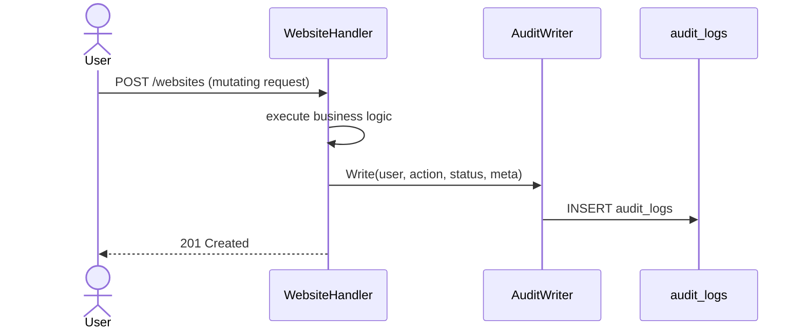
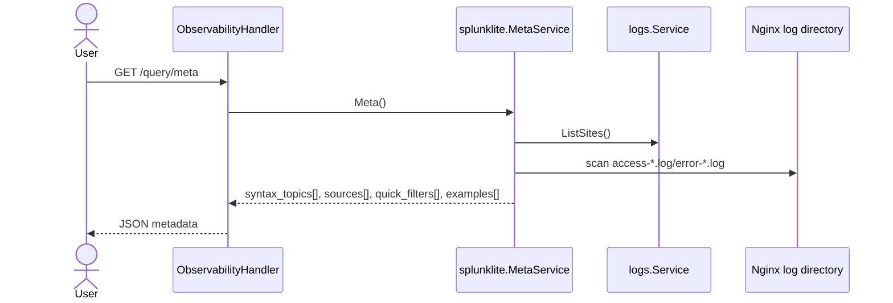
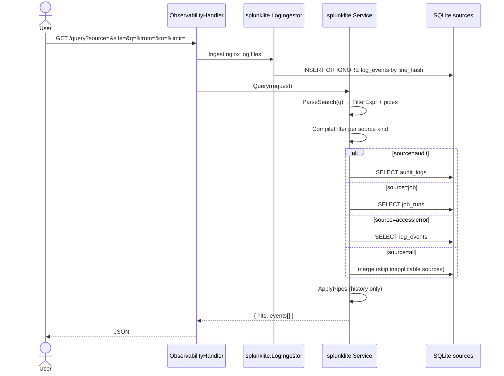

# Sequence: Splunk Lite

Query audit, job runs, and nginx log events — without deploying external Splunk.

**Status:** ✅ Implemented — `internal/observability/splunklite`

**Search syntax:** Splunk-style only ([log search guide](../guides/log-search.md)). Legacy `field:value` parser removed.

## Architecture

Single path: `ParseSearch` → `FilterExpr` AST → `CompileFilter` (SQL) or `EvalFilter` (live tail) → optional `ApplyPipes` (history).

## API

| Method | Path |
|--------|------|
| GET | `/api/v1/query/meta` |
| GET / POST | `/api/v1/query` |
| GET | `/api/v1/query/tail` |
| GET / POST | `/api/v1/query/saved` |
| PATCH / DELETE | `/api/v1/query/saved/{id}` |

## Write audit on mutation



## Backend-driven query metadata



The frontend renders sources, quick-filter chips, examples, and syntax help only from this response. Per-vhost nginx entries use IDs such as `access:example.com` and carry `{ "source": "access", "site": "example.com" }`.

## Search events



## Search syntax (summary)

| Feature | Example |
|---------|---------|
| Implicit AND | `404 GET` |
| Boolean | `error OR timeout`, `NOT failed` |
| Field | `status=404`, `action=login` |
| Range | `status>=300 status<400` (access HTTP status) |
| Wildcard | `status=3*` |
| Regex | `/timeout/`, `action=/^website\..*/` |
| Group | `status>=399 AND (curl OR status=200)` |
| Pipes | `\| head 50`, `\| sort -ts` |

Full tutorial: [guides/log-search.md](../guides/log-search.md).

**Audit fields:** `user`, `action`, `resource_type`, `resource_id`, `domain`, `status`, `message`

**Job fields:** `job_type`, `name`, `status`, `output`, `error`

**Access fields:** `site`, `status`/`status_code`, `message`/`preview` (raw line)

**Error logs:** primarily free-text on `message`/`preview` and `site`

## Example

```http
GET /api/v1/query?source=audit&q=action%3Dwebsite.*%20user%3Dadmin%40*%20status%3Dok&limit=50
```

```http
GET /api/v1/query?source=access&site=bangunsoft.com&q=status%3E%3D300%20status%3C400%20%7C%20head%2050
```

## Streaming historical search

`GET /api/v1/query` returns batch JSON by default. For progressive output, request a stream:

```bash
curl -N -H 'Accept: text/event-stream' 'https://host/api/v1/query?source=access&q=status%3D500&stream=sse'
```

SSE frames use a small envelope:

```text
data: {"type":"ingesting"}

data: {"type":"meta","hits":12}

data: {"type":"event","event":{...}}

data: {"type":"done"}
```

`stream=ndjson` or `Accept: application/x-ndjson` emits the same envelopes one JSON object per line.

## Live tail

`GET /api/v1/query/tail` parses the same filter AST and evaluates with `EvalFilter` in memory. Pipe commands are ignored.

## Breaking change

- Legacy `field:value` syntax removed — no compatibility shim
- Saved queries may need manual rewrite (see [log-search.md](../guides/log-search.md))

## Retention

| Table | Env | Default |
|-------|-----|---------|
| `audit_logs` | `AUDIT_RETENTION_DAYS` | 90 |
| `log_events` | `LOG_EVENTS_RETENTION_DAYS` | 14 |

Daily purge via `runRetentionPurge` in `internal/app/app.go`.

## Packages

| Path | Role |
|------|------|
| `internal/observability/splunklite/search.go` | ParseSearch lexer/parser |
| `internal/observability/splunklite/compile.go` | SQL compile |
| `internal/observability/splunklite/eval_filter.go` | Tail in-memory match |
| `internal/observability/splunklite/pipes.go` | head / sort |
| `internal/observability/splunklite/service.go` | Query engine |
| `internal/observability/splunklite/ingestor.go` | Nginx log ingest |
| `internal/observability/splunklite/meta.go` | Query UI metadata |
| `internal/delivery/http/handler/observability.go` | HTTP |

## GoSite implications

- `contracts.AuditWriter` — hook sensitive mutations (website create/delete, etc.)
- Saved queries in `saved_queries` for dashboard / ops presets
- Frontend Logs view uses `GET /query/meta` for source picker, chips, and help drawer
