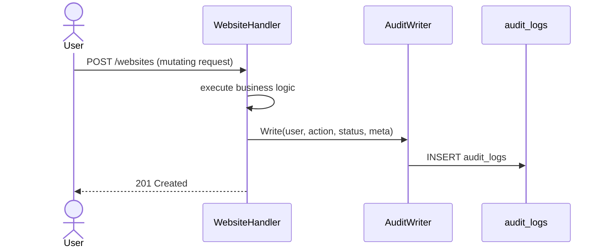
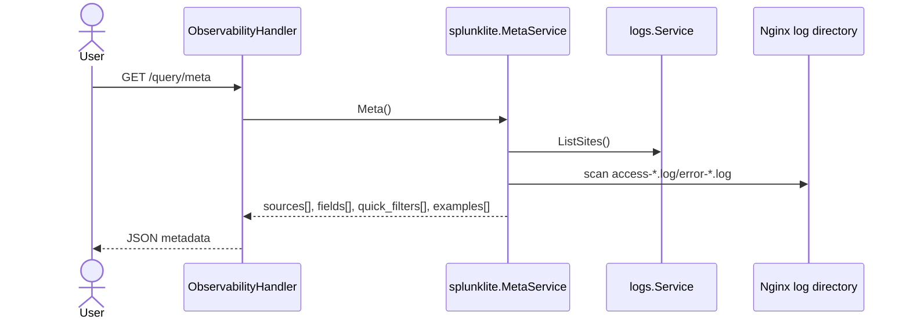
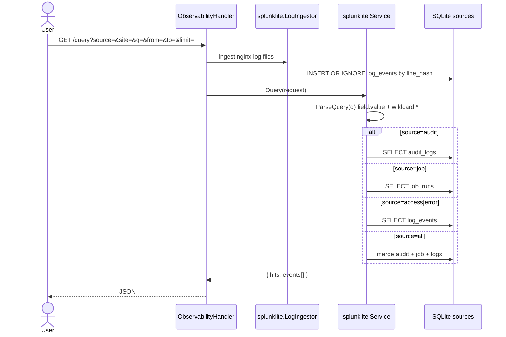

# Sequence: Splunk Lite

Query internal audit, job, and nginx log events without deploying Splunk.

**Routes:** `GET /api/v1/query/meta`, `GET /api/v1/query`, `POST /api/v1/query` (compat), `GET /api/v1/query/tail`, `GET/POST /api/v1/query/saved`

## Write audit on mutation



## Backend-driven query metadata



The frontend renders query sources only from this response. Per-vhost nginx entries use IDs such as `access:example.com` and carry the backend payload `{ "source": "access", "site": "example.com" }`.

## Search events



## Mini query syntax

| Token | Meaning |
|-------|---------|
| `field:value` | Exact match |
| `field:prefix*` | Wildcard (`*` → SQL LIKE) |
| space | AND (implicit) |

**Audit fields:** `user`, `action`, `resource_type`, `resource_id`, `domain`, `status`, `message`

**Job fields:** `type`, `name`, `status`, `output`, `error`

**Log fields:** `site`, `status`, `status_code`, `message`, `preview`

## Example

```json
GET /api/v1/query?source=audit&q=action%3Awebsite.*+user%3Aadmin%40*+status%3Aok&from=2026-06-01T00%3A00%3A00Z&to=2026-06-14T23%3A59%3A59Z&limit=50
```

## Streaming historical search

`GET /api/v1/query` returns batch JSON by default. For progressive output, request a stream:

```bash
curl -N -H 'Accept: text/event-stream' 'https://host/api/v1/query?source=access&q=status%3A500&stream=sse'
```

SSE frames use a small envelope:

```text
data: {"type":"ingesting"}

data: {"type":"meta","hits":12}

data: {"type":"event","event":{...}}

data: {"type":"done"}
```

`stream=ndjson` or `Accept: application/x-ndjson` emits the same envelopes one JSON object per line.

## Retention

| Table | Default retention |
|-------|-------------------|
| `audit_logs` | 90 days (`AUDIT_RETENTION_DAYS`) |
| `log_events` | 14 days (`LOG_EVENTS_RETENTION_DAYS`) |

## Implikasi GoSite

- `internal/observability/splunklite` — parser + query service
- `contracts.AuditWriter` — hook untuk semua mutasi sensitif
- Saved queries di `saved_queries` untuk preset dashboard / ops
