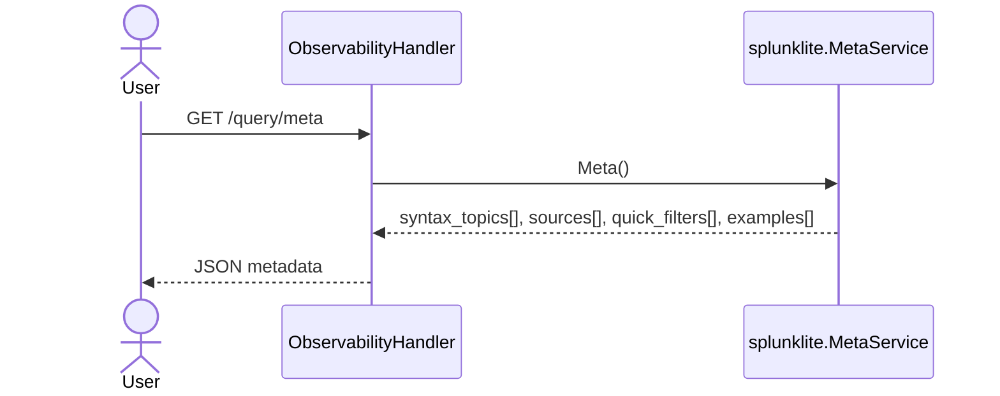
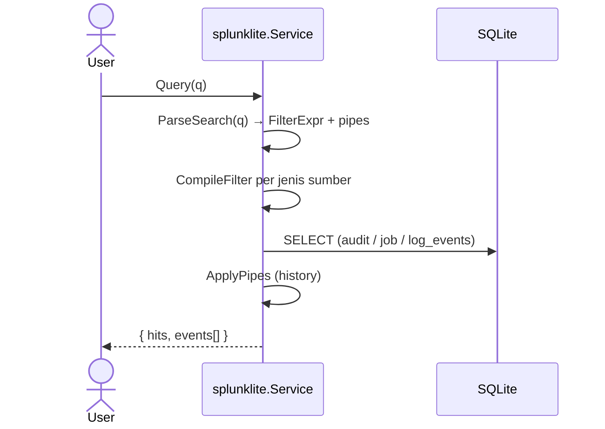

# Sequence: Splunk Lite

Query audit, job runs, dan nginx log events — tanpa deploy Splunk eksternal.

**Status:** ✅ Implemented — `internal/observability/splunklite`

**Sintaks:** Splunk-style saja ([panduan pencarian log](../guides/log-search_id.md)). Parser lama `field:value` dihapus.

## Arsitektur

Satu jalur: `ParseSearch` → AST `FilterExpr` → `CompileFilter` (SQL) atau `EvalFilter` (live tail) → `ApplyPipes` (history).

## API

| Method | Path |
|--------|------|
| GET | `/api/v1/query/meta` |
| GET / POST | `/api/v1/query` |
| GET | `/api/v1/query/tail` |
| GET / POST | `/api/v1/query/saved` |
| PATCH / DELETE | `/api/v1/query/saved/{id}` |

## Metadata query (backend-driven)

Frontend hanya merender sumber, chip filter cepat, contoh, dan bantuan sintaks dari respons ini.

## Pencarian event

## Sintaks (ringkas)

| Fitur | Contoh |
|-------|--------|
| AND implisit | `404 GET` |
| Boolean | `error OR timeout` |
| Field | `status=404`, `action=login` |
| Rentang | `status>=300 status<400` (access) |
| Wildcard | `status=3*` |
| Regex | `/timeout/`, `action=/^website\..*/` |
| Grup | `status>=399 AND (curl OR status=200)` |
| Pipe | `\| head 50`, `\| sort -ts` |

Tutorial lengkap: [guides/log-search_id.md](../guides/log-search_id.md).

## Breaking change

- Sintaks `field:value` tidak didukung
- Query tersimpan perlu ditulis ulang manual

## Retention

| Table | Env | Default |
|-------|-----|---------|
| `audit_logs` | `AUDIT_RETENTION_DAYS` | 90 |
| `log_events` | `LOG_EVENTS_RETENTION_DAYS` | 14 |

## Paket

| Path | Peran |
|------|------|
| `splunklite/search.go` | Parser |
| `splunklite/compile.go` | SQL |
| `splunklite/eval_filter.go` | Tail |
| `splunklite/pipes.go` | head / sort |
| `splunklite/service.go` | Query engine |
| `splunklite/meta.go` | Metadata UI |
