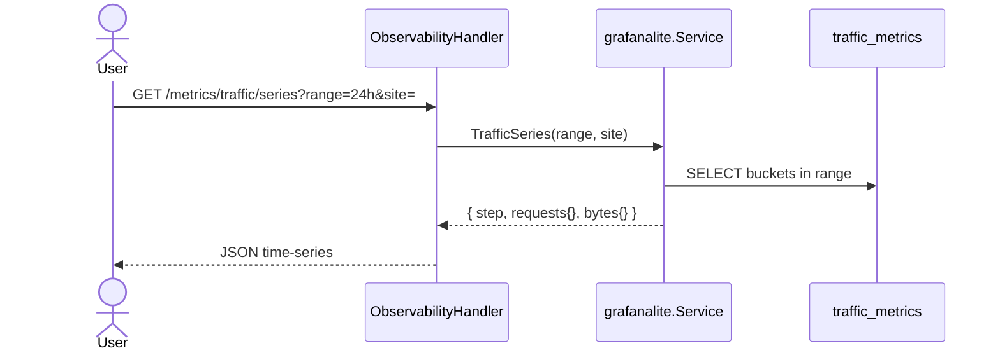

# Sequence: Grafana Lite

Pre-aggregated nginx traffic metrics for dashboard charts — replaces legacy full-file `accessTraffic()` scan.

**Status:** ✅ Implemented — `internal/observability/grafanalite`

## Collector (background)

```mermaid
sequenceDiagram
    participant S as gosite serve
    participant App as internal/app/app.go
    participant C as grafanalite.Collector
    participant FS as access logs
    participant OFF as metrics_offsets.json
    participant DB as traffic_metrics

    loop every 5 minutes
        S->>C: Collect()
        C->>OFF: load byte offsets
        C->>FS: read new lines since offset
        C->>C: parse status + bytes, bucket 5m
        C->>DB: UPSERT traffic_metrics
        C->>OFF: save new offsets
        C->>DB: purge buckets older than retention
    end
```

## Query series



## Bucket model

| Column | Meaning |
|--------|---------|
| `bucket_ts` | 5-minute floor UTC |
| `site` | Derived from log filename (`access-{domain}.log`) |
| `requests` | Line count in bucket |
| `bytes` | Sum of `$body_bytes_sent` |
| `s2xx`…`s5xx` | Status family counters |

**Offset file:** `{STORAGE}/gosite/metrics_offsets.json` — per-file byte offset for incremental tail.

## Endpoints

All under `/api/v1/metrics/traffic/*` (session required):

| Path | Params | Response |
|------|--------|----------|
| `/metrics/traffic/series` | `range`, `step`, `site` | Multi-series `[[iso8601, value], …]` |
| `/metrics/traffic/top-sites` | `range`, `limit` | Ranked sites |
| `/metrics/traffic/status-codes` | `range`, `site` | 2xx/3xx/4xx/5xx totals |
| `/metrics/traffic/summary` | `range` | Dashboard card totals |

Supported `range`: `1h`, `6h`, `24h`, `7d`.

## Log paths

| File | Site key |
|------|----------|
| `{STORAGE}/logs/access.log` | `default` |
| `{STORAGE}/logs/access-{domain}.log` | `{domain}` |

## Integrasi dashboard

- `GET /dashboard` → `traffic_summary` from `Summary(1h)`
- Traffic view Preact calls series/top-sites/status-codes endpoints
- Fallback: `GET /system/nginx-traffic` when buckets are empty

## Packages

| Path | Role |
|------|-------|
| `internal/observability/grafanalite/collector.go` | Incremental log parse |
| `internal/observability/grafanalite/service.go` | Query buckets |
| `internal/app/app.go` | `runMetricsCollector` ticker 5m |
| `internal/repository/sqlite/traffic_metrics.go` | UPSERT storage |
