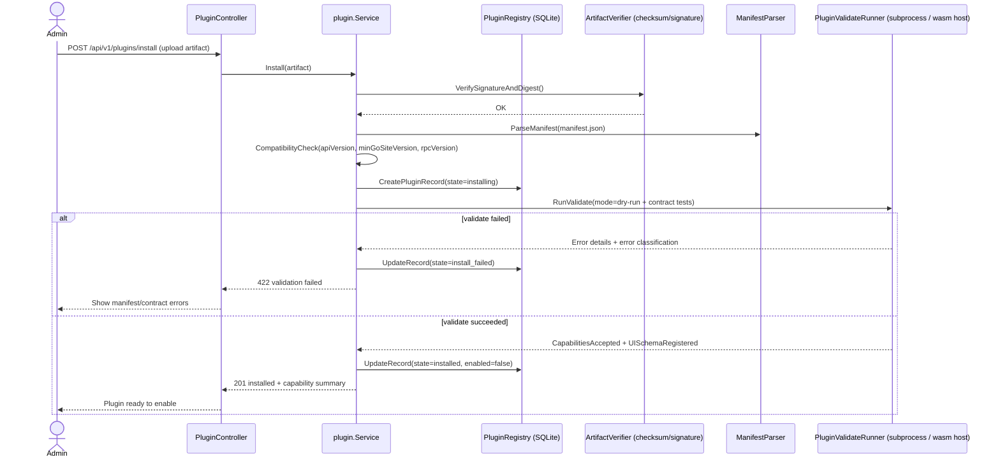
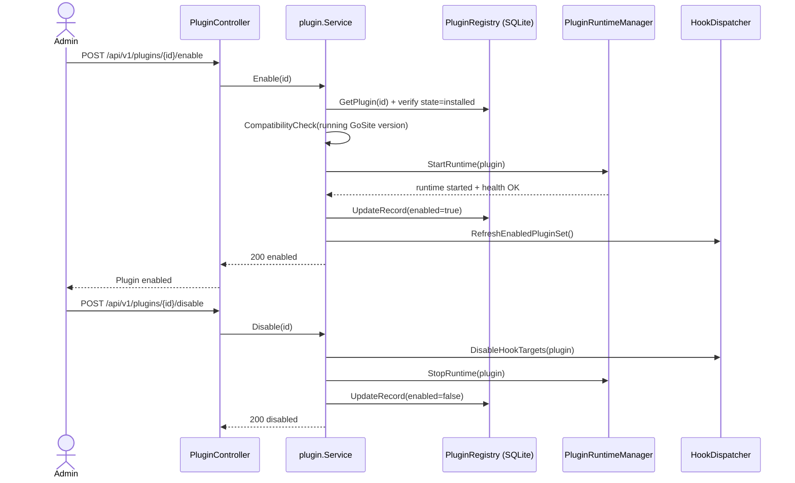

# Sequence: Plugin Installer & Compatibility (Go)

Design/RND for how GoSite should install, validate, enable/disable, and run “plugins” (in the spirit of Krakend behavior/extensibility) while keeping compatibility across GoSite upgrades.

**Status:** Partially implemented

Implemented as of the current code:

- P1 registry/lifecycle/API/UI: SQLite `plugin_versions`, install/enable/disable/switch/uninstall/purge, failure metadata, signature/keyring checks, startup reconcile, and admin UI.
- Phase A hook bus core: enabled-set dispatch, deterministic ordering, strict `*.before_*` blocking, lenient continuation, per-hook timeout, independent concurrent dispatch cap, circuit breaker, and audit logging for hook errors.
- Initial hook call sites: nginx reload, website create/enable/config change, SSL issue/manual renew, job run/failure, cron trigger, and Docker container actions.

Still pending:

- HashiCorp go-plugin gRPC runtime and reference plugin.
- Plugin config storage, encrypted secrets, config migration RPC, and UI config form renderer.
- Tier 0 webhook transport and scoped plugin tokens.
- Self-healing health/restart supervisor.
- Tier 2 WASM remains explicitly out of scope for this implementation wave.

## Goals

- Safe install/uninstall with rollback guarantees (no half-enabled plugins).
- Clear compatibility contract: versioning + declared capabilities.
- Runtime isolation: prefer subprocess (go-plugin) over `.so` ABI plugins.
- Plugin lifecycle is uniform for backend extensions and “UI contributions”.
- Self-healing behavior for enabled plugins (restart/disable on repeated failure).

## Plugin lifecycle state machine (explicit)

The plugin registry must behave as a **state machine** (not “a few booleans”) so recovery is deterministic.

Valid states and transitions:

```text
installing → installed | install_failed

installed → enabling → enabled | enable_failed
enabled → disabling → installed

install_failed → installing        (retry install same or new artifact)
enable_failed  → enabling | installed (retry enable or rollback to installed)
```

Atomicity expectations:

- **Registry writes are atomic** (single transaction) but runtime side effects are not.
- Any transition that starts/stops a runtime must have a **compensating action** and a “reconciler” on startup.

### Failure metadata (required for safe retries)

States like `install_failed` / `enable_failed` are not enough; the registry must store failure metadata so operators (and the system) can decide whether retry is safe.

Minimum recommended fields on a plugin-version record:

- `failure_class`: `validate_timeout | start_failed | hook_refresh_failed | db_failed | compensation_failed | stop_failed | fs_delete_failed | unknown`
- `failure_message`: short, user-facing summary
- `failure_at`: timestamp

Retry policy (default):

- Allow retry to `enabling` only if `failure_class != compensation_failed` and runtime is confirmed stopped.
- If `failure_class == compensation_failed`, require manual intervention (or reconciler success) before retry.

## Proposed plugin tiers (host capabilities)

This follows `docs/architecture/plugin-platform.md`:

1. **Tier 0**: HTTP webhooks + scoped API tokens (external services).
2. **Tier 1**: HashiCorp **go-plugin** (gRPC subprocess).
3. **Tier 2**: **WebAssembly** (Extism-style host, later).
4. **Tier 3**: Go stdlib `plugin` package (`.so`) — **not** for community.

For “reach compatibility”, GoSite should start with Tier 0 + Tier 1, and leave Tier 2 as a sandboxed path for community validators/transformers later.

## Install & validate flow (controller → registry → runtime)



### What is stored during install

- Plugin artifact (by digest) under `/storage/plugins/<id>/<version>/...`
- Manifest (immutable snapshot) + declared capabilities
- UI contribution definitions (as data, not arbitrary UI code)
- Optional config schema used to render safe forms in the panel

Install-time guardrails (defaults; configurable):

- **Disk space check** before persisting artifact (fail fast with a clear error).
- **Validate runner deadline**: `RunValidate()` must have a timeout; if it hits the deadline, mark `install_failed` with reason `validate_timeout`.

### Plugin identity & collision policy (required)

`plugin.id` must be globally unique in the registry. The install flow must explicitly reject collisions.

Recommended default:

- Use a **namespaced id**: `vendor/name` (e.g. `acme/slack-logger`)
- Enforce uniqueness at `CreatePluginRecord` (unique index on `(plugin_id, version)` and also on `(plugin_id, enabled)` depending on schema choice)
- If a different vendor tries to install an existing `plugin.id`, reject with `409 conflict` unless explicitly allowed by an “override” admin action.

## Enable / disable flow (runtime manager + hook dispatcher)



### Enable/disable rollback guarantees (no “half-enabled”)

Enable must be treated as a **multi-step operation** with compensating actions.

Default enable algorithm (conceptual):

1. `installed → enabling` (registry tx)
2. `StartRuntime(plugin)` (side effect)
3. `RefreshEnabledPluginSet()` (side effect)
4. `enabling → enabled` (registry tx)

Compensating actions:

- If step (2) succeeds but (3) fails, **StopRuntime(plugin)** and set `enable_failed` (or revert to `installed`).
- If step (3) succeeds but step (4) fails (DB issue), **StopRuntime(plugin)** then set `enable_failed` (so runtime does not become a zombie).

On service startup, a reconciler should:

- stop any runtime whose registry state is not `enabled`
- re-run `RefreshEnabledPluginSet()` from registry source of truth
- retry pending artifact cleanup: `WHERE state = 'installed' AND failure_class = 'fs_delete_failed'` (state reverts to `installed` on FS failure; `failure_class` is the signal, not a dedicated state)

Responsibility split (default):

- **Reconciler**: enforces registry truth at startup (stop zombies; refresh enabled set).
- **Self-healing**: handles “enabled but runtime crashed later” via health checks + restarts.

Disable should also be multi-step:

1. `enabled → disabling` (registry tx)
2. remove hook targets from dispatcher
3. stop runtime
4. `disabling → installed` (registry tx)

## Hook dispatch flow (service-layer lifecycle points)

GoSite uses a **hook dispatcher** at service-layer lifecycle points before irreversible side effects (nginx reload, job run, SSL issue).

```mermaid
sequenceDiagram
    participant Event as ServiceEvent (e.g. website.before_create)
    participant HD as HookDispatcher
    participant P1 as EnabledPlugin #1
    participant P2 as EnabledPlugin #2
    Event->>HD: Dispatch(eventName, payload)
    HD->>P1: CallHook(eventName, payload)
    P1-->>HD: HookResult (may include side-effects requests)
    HD->>P2: CallHook(eventName, payload)
    P2-->>HD: HookResult
    alt strict mode
        HD-->>Event: Fail if any hook returns hard error
    else lenient mode
        HD-->>Event: Continue; record hook errors + warnings
    end
```

### Hook dispatch defaults (order, timeout, strictness)

Defaults (host-configurable, but must be deterministic):

- **Order**: deterministic ordering by `plugin.id` ascending, then `plugin.version` descending (so a newer enabled version wins if duplicates exist).
- **Timeout**: per hook call deadline; on timeout treat as hook error with class `timeout`.
- **Strict vs lenient**:
  - Default: **lenient**
  - Host may declare certain events **strict** (e.g. `*.before_*` for irreversible operations).
  - Plugin may request strict handling in manifest, but **host is final authority**.

Decision tree (default):

- If strict event:
  - on first hard error/timeout → stop dispatch, return error to caller (do **not** call remaining plugins)
- If lenient event:
  - continue dispatching remaining plugins
  - record errors in audit/logs and apply circuit breaker if repeated

**Hook isolation** (`capabilities.hookIsolation`: `sequential` | `independent`):

- Plugin declares a preference in manifest; **host is final authority** and may override (same rule as strict/lenient).
- Default effective value: `sequential`.
- Concurrent dispatch is allowed only when effective `hookIsolation == independent` **and** the event is lenient.

Optimization (optional):

- In lenient mode with effective `hookIsolation == independent`, hooks may run concurrently up to `maxConcurrentHooks` (see host config below).

## Compatibility contract (manifest + runtime capabilities)

### Manifest: minimum required fields

Plugins declare a `manifest.json` (stored and parsed during install). Recommended fields:

```json
{
  "id": "acme/slack-logger",
  "name": "Acme Slack Logger",
  "version": "1.2.3",
  "tier": 1,
  "apiVersion": "gosite-plugin/1",
  "minGoSiteVersion": "2.3.0",
  "rpcVersion": "1",
  "configVersion": "2",
  "capabilities": {
    "hooks": ["logging.on_event", "nginx.before_reload"],
    "hookIsolation": "sequential",
    "uiSidebar": true,
    "configSchema": true,
    "loggingSink": true,
    "rulesAndRoles": "declarative"
  },
  "permissions": ["logs:read", "nginx:reload:read-only"],
  "entrypoints": {
    "validate": { "type": "go-plugin", "command": "plugin/validate" }
  },
  "artifact": {
    "sha256": "..."
  },
  "signatures": [
    { "keyId": "vendor-1", "sig": "..." }
  ]
}
```

### Compatibility checks (host side)

- `apiVersion` must match host major.
- `minGoSiteVersion <= currentGoSiteVersion`.
- `rpcVersion` must match (go-plugin contract version).
- Capabilities are validated against what the current GoSite build supports.
- `configVersion` (optional): schema version for plugin config; used during upgrade config migration.
- `artifact.sha256` is the lowercase hex SHA-256 digest of the exact uploaded artifact bytes. Production signatures are Ed25519 signatures over that digest string and are base64-encoded in `signatures[].sig`.

### UI contributions (sidebar items, configuration forms)

Plugins should not ship arbitrary UI/JS. Instead they provide **data-only UI contributions**:

- Sidebar entries: `{ "label": "...", "route": "/plugins/<id>/..." }`
- Configuration pages: JSON schema that renders safe forms (host-owned UI renderer)
- Token/rule/role templates (optional) in declarative form

If a plugin needs “scripting/tokenizer” power, prefer Tier 2 WASM later so the host can sandbox execution.

### Sidebar routes: who serves and what if disabled?

All `/plugins/<id>/...` routes must be served by the **host UI/router**, not by plugin-provided code.

Default behavior:

- If plugin is **enabled**: host renders the page using registered UI schema + data fetched from host APIs.
- If plugin is **disabled**: host renders a safe fallback screen (“Plugin disabled”) and offers enable action (if permitted).
- If plugin is **missing/uninstalled**: host renders 404 with a safe message; no route handler is ever delegated to plugin.

## Enable/disable + installer support mapping to requested compatibility areas

Below mapping answers your requirement set (hook/logger/extender/sidebar/config/scripting/tokenizer/custom logging/rule/role/automation/self-healing).

- **Custom program / hook provider / automation**: Tier 1 hook methods + (optional) jobs triggers via declarative event subscriptions.
- **Logger / custom logging**: manifest declares `loggingSink` capability; plugin receives structured events (not raw log files unless permission granted).
- **Extender**: hook results return “requests” (e.g., “add nginx snippet”, “add job pre-step”) constrained by permissions.
- **Enable / disable**: runtime manager maintains enabled set; dispatcher reads enabled plugins per event.
- **Installer & compatibility support**: install endpoint stores artifact by digest, parses manifest, runs `validate` contract before enabling.
- **Self-healing mechanic**:
  - host monitors health/heartbeats for Tier 1 subprocess
  - auto-restart with backoff for transient failures
  - disable plugin after repeated hard failures and surface reason in UI
- **Sidebar items**: data-only contributions (route + schema), rendered by host UI.
- **Rules / roles / tokenizer / scripting**:
  - “declarative” support via manifest templates immediately
  - “programmable” support via Tier 2 WASM later (sandboxed)

## Self-healing & automation details (Tier 1 go-plugin)

Recommended behavior for enabled Tier 1 plugins:

- Host calls plugin `Health()` periodically (or via streaming heartbeat).
- If health fails:
  1. restart subprocess (exponential backoff, capped)
  2. if `N` consecutive failures within window, mark plugin `enabled=false` and record last error class
  3. dispatcher fails closed/open depending on plugin hook strictness

To avoid cascading failures during host deploy:

- dispatcher timeouts per hook
- circuit breaker per plugin (disable temporarily on repeated timeouts)

Recommended defaults (host config; can be overridden):

```yaml
pluginRuntime:
  healthCheckInterval: 30s
  restartMaxAttempts: 5
  restartWindow: 10m
  restartBackoffInitial: 1s
  restartBackoffCap: 2m
  maxConcurrentHooks: 10
```

## Security model (minimum bar)

- Artifact verification: checksum + signature verification (vendor keyring).
- Capability-based permissions: plugin cannot call host actions outside declared permissions.
- Data contracts: plugin only receives typed payloads; host never exposes raw secrets.
- Runtime sandboxing:
  - Tier 0: scoped API tokens + egress restrictions
  - Tier 1: subprocess with restricted environment and OS-level limits (ulimits/cgroups)
  - Tier 2: WASM sandbox (later)

### Tier 1 network egress policy (explicit)

Tier 1 subprocess plugins can make outbound network calls unless restricted. The platform must define a policy:

- **Default (v1)**: document as “operator responsibility” (container/firewall policy), but still minimize payload secrets.
- **Recommended (future)**: run plugin subprocess inside a restricted network namespace / egress allowlist (deny-by-default).

### Plugin config secrets: encryption at rest

If plugin config forms can store credentials (API keys, tokens), config must support secrets safely:

- Config schema supports marking fields as **secret** (write-only in UI).
- Secrets are stored **encrypted at rest** (host-managed key), and are never returned in plaintext via APIs.
- Plugins receive secrets only when needed (e.g., during hook invocation) and only if permission grants it.

### Keyring onboarding (production requirement)

Artifact signatures only help if key onboarding is defined.

Minimum viable approach:

- Host maintains a **trusted vendor keyring** (admin-managed).
- Each key has: `vendor`, `keyId`, `publicKey`, `createdAt`, `revokedAt`.
- Install requires signature by a non-revoked key for that vendor (or explicit “allow unsigned” in dev mode).
- The signature payload is the lowercase hex SHA-256 digest string for the uploaded artifact; public keys and signatures are base64-encoded Ed25519 values.

## Success criteria for this RND

- Compatibility contract exists: versioning + capability schema + manifest fields.
- Install path validates before enable (fail fast).
- Enable path refreshes dispatcher + runs health checks.
- Self-healing behavior is specified (restart/disable thresholds).
- UI contributions are data-only (host renders).

## Open questions

- How much of config scripting should be Tier 0/1 vs Tier 2 (WASM) initially?
- Declarative “rules/roles” schema shape (RBAC vs ABAC) and where enforcement lives.
- Remaining design is mostly about “what to sandbox” (Tier 2) and the RBAC/rules model; core failure semantics are now defined by defaults above.

## Plugin update / upgrade flow (production requirement)

Upgrade must be first-class: install a new version without breaking the currently enabled one.

Rules (defaults):

- Multiple versions can be installed, but **only one version of a plugin id can be enabled** at a time.
- Upgrade is a “switch” operation with rollback.

```mermaid
sequenceDiagram
    actor Admin
    participant C as PluginController
    participant S as plugin.Service
    participant R as PluginRegistry
    participant RT as PluginRuntimeManager
    Admin->>C: POST /api/v1/plugins/{id}/upgrade (artifact vNext)
    C->>S: Install(vNext)
    S->>R: Record vNext as installed (enabled=false)
    Admin->>C: POST /api/v1/plugins/{id}/switch (to vNext)
    C->>S: SwitchEnabledVersion(id, vNext)
    Note over S: Validate config migration before touching runtimes
    S->>S: ValidateConfigMigration(vCurrent -> vNext)
    alt migration failed
        S-->>C: 422 migration failed (stay on vCurrent)
    else migration ok
    S->>R: installed(vCurrent)->disabling (tx)
    S->>RT: StopRuntime(vCurrent)
    alt stop failed
        S->>R: disabling->enabled (tx)
        S-->>C: 409 stop failed (abort switch; vCurrent remains enabled)
    else stopped
    S->>R: disabling->installed (tx)
    S->>R: installed(vNext)->enabling (tx)
    S->>RT: StartRuntime(vNext)
    alt start failed
        S->>R: enabling->enable_failed (vNext)
        S-->>C: 422 switch failed; vCurrent is now installed (not enabled) — re-enable vCurrent manually or retry switch
    else start ok
        S->>R: enabling->enabled
        S-->>C: 200 switched
    end
    end
    end
```

Config compatibility:

- Plugin may declare `configVersion` and provide an optional “migrate config” step during validate.
- If migration fails, switch is rejected and old version stays enabled.

### Switch failure UX (post-conditions)

After a failed switch where `StartRuntime(vNext)` fails:

| Record | State |
|--------|-------|
| vCurrent | `installed` (was disabled during switch; **not** auto re-enabled) |
| vNext | `enable_failed` |

Recovery (default):

- Admin may **re-enable vCurrent** immediately — `enable_failed` on vNext does **not** block re-enable of another installed version.
- Admin may retry switch to vNext after fixing the failure (or uninstall vNext).
- No separate “cancel failed switch” endpoint required; re-enable vCurrent is the explicit rollback action.

## Uninstall flow (production requirement)

Uninstall must be explicit, safe, and version-aware.

Defaults:

- A plugin **must be in a stable state** (`installed`, `install_failed`, or `enable_failed`) before uninstalling that version.
- Reject uninstall when state is in-flight: `enabling`, `disabling`, `uninstalling`, or `enabled` → `409 operation in progress` (or `409 must disable first` when `enabled`).
- Uninstall is per **(plugin.id, version)**; other installed versions are unaffected.
- Config/secrets are **soft-deleted by default** (retain for audit/rollback).

### Purge (optional, admin-only)

Hard-delete retained config/secrets after uninstall:

```
DELETE /api/v1/plugins/{id}/versions/{v}?purge=true
```

Only valid when record state is `uninstalled`. Returns `409` if version is not yet uninstalled.

```mermaid
sequenceDiagram
    actor Admin
    participant C as PluginController
    participant S as plugin.Service
    participant R as PluginRegistry
    participant RT as PluginRuntimeManager
    participant FS as /storage/plugins
    Admin->>C: DELETE /api/v1/plugins/{id}/versions/{v}
    C->>S: Uninstall(id, v)
    S->>R: Get(id,v)
    alt state in (enabled, enabling, disabling, uninstalling)
        S-->>C: 409 operation in progress
    else stable (installed, install_failed, enable_failed)
        S->>R: Mark state=uninstalling (tx)
        S->>RT: EnsureStopped(id,v)
        S->>FS: DeleteOrQuarantineArtifact(id,v)
        alt FS delete failed
            S->>R: uninstalling->installed (tx) + failure_class=fs_delete_failed
            S-->>C: 500 uninstall failed (artifact retained; retry or reconciler on startup)
        else FS ok
            S->>R: Mark state=uninstalled (tx) + soft-delete config/secrets
            S-->>C: 200 uninstalled
        end
    end
```

FS failure compensating action:

- Revert registry to `installed` so the version is not stuck in `uninstalling`.
- Set `failure_class = fs_delete_failed` on the record (state stays `installed`; reconciler detects via `failure_class`, not state).
- Startup reconciler retries quarantine/delete for `state = installed AND failure_class = fs_delete_failed` when artifact still exists on disk.
