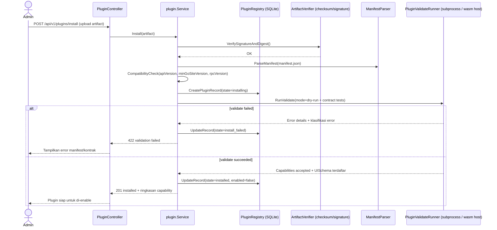
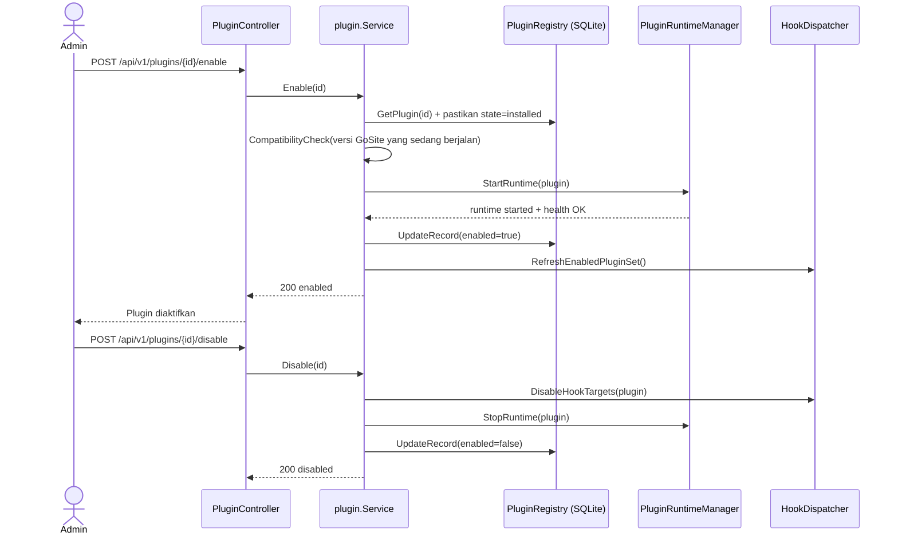

# Sequence: Plugin Installer & Compatibility (Go)

RND/Desain untuk bagaimana GoSite harus meng-install, memvalidasi, mengaktifkan/nonaktifkan, dan menjalankan “plugin” (gaya extensibility seperti Krakend) sambil menjaga kompatibilitas antar upgrade GoSite.

**Status:** Terimplementasi sebagian

Sudah ada di kode saat ini:

- P1 registry/lifecycle/API/UI: SQLite `plugin_versions`, install/enable/disable/switch/uninstall/purge, metadata failure, signature/keyring, startup reconcile, dan admin UI.
- Core hook bus Phase A: dispatch enabled-set, urutan deterministik, strict `*.before_*` yang bisa memblokir, lenient continuation, timeout per hook, batas concurrency untuk isolation `independent`, circuit breaker, dan audit logging untuk error hook.
- Call site hook awal: nginx reload, website create/enable/config change, SSL issue/manual renew, job run/failure, cron trigger, dan aksi container Docker.

Masih pending:

- Runtime HashiCorp go-plugin gRPC dan reference plugin.
- Storage config plugin, secret terenkripsi, RPC config migration, dan renderer form config di UI.
- Transport webhook Tier 0 dan scoped plugin token.
- Self-healing health/restart supervisor.
- Tier 2 WASM tetap out of scope untuk gelombang implementasi ini.

## Tujuan

- Install/uninstall yang aman dengan jaminan rollback (tidak ada plugin “setengah aktif”).
- Kontrak kompatibilitas yang jelas: versioning + deklarasi kemampuan (capabilities).
- Isolasi runtime: utamakan subprocess (go-plugin) dibanding plugin `.so` ABI.
- Lifecycle plugin seragam untuk backend extension dan “kontribusi UI”.
- Self-healing untuk plugin yang sudah aktif (restart/disable ketika gagal berulang).

## State machine lifecycle plugin (explicit)

Registry plugin harus diperlakukan sebagai **state machine** (bukan sekadar “boolean enabled”) agar recovery deterministik.

State dan transisi yang valid:

```text
installing → installed | install_failed

installed → enabling → enabled | enable_failed
enabled → disabling → installed

install_failed → installing          (retry install artifact yang sama/baru)
enable_failed  → enabling | installed (retry enable atau rollback ke installed)
```

Ekspektasi atomicity:

- **Write registry atomic** (1 transaksi), tapi side effect runtime tidak.
- Transisi yang start/stop runtime wajib punya **compensating action** dan “reconciler” saat startup.

### Failure metadata (wajib untuk retry aman)

State seperti `install_failed` / `enable_failed` belum cukup; registry perlu menyimpan metadata kegagalan agar sistem/operator bisa memutuskan apakah retry aman.

Minimum field yang direkomendasikan di record plugin-version:

- `failure_class`: `validate_timeout | start_failed | hook_refresh_failed | db_failed | compensation_failed | stop_failed | fs_delete_failed | unknown`
- `failure_message`: ringkasan singkat untuk UI
- `failure_at`: timestamp

Kebijakan retry (default):

- Retry ke `enabling` hanya jika `failure_class != compensation_failed` dan runtime dipastikan sudah stop.
- Jika `failure_class == compensation_failed`, butuh intervensi manual (atau reconciler sukses) sebelum retry.

## Model tier plugin (kemampuan host)

Ini mengikuti `docs/architecture/plugin-platform.md`:

1. **Tier 0**: Webhook HTTP + scoped API tokens (untuk integrasi eksternal).
2. **Tier 1**: HashiCorp **go-plugin** (gRPC subprocess).
3. **Tier 2**: **WebAssembly** (model Extism host, nantinya).
4. **Tier 3**: Go stdlib `plugin` package (`.so`) — **tidak** untuk community.

Untuk “reach compatibility”, GoSite sebaiknya mulai dari Tier 0 + Tier 1, lalu sisakan Tier 2 sebagai jalur sandbox untuk validator/transformer komunitas.

## Alur install & validasi (controller → registry → runtime)



### Data yang disimpan saat install

- Artifact plugin (berdasarkan digest) di `/storage/plugins/<id>/<version>/...`
- Snapshot manifest (immutable) + kemampuan yang dideklarasikan
- Definisi kontribusi UI (sebagai data, bukan arbitrary UI code)
- Optional config schema untuk render form aman di panel

Guardrails saat install (default; bisa dikonfigurasi):

- **Cek disk space** sebelum menyimpan artifact (fail fast dengan error yang jelas).
- **Deadline validate runner**: `RunValidate()` harus punya timeout; jika kena deadline, set `install_failed` dengan alasan `validate_timeout`.

### Identitas plugin & kebijakan collision (wajib)

`plugin.id` harus unik secara global di registry. Install flow wajib menolak collision secara eksplisit.

Default yang direkomendasikan:

- Gunakan **namespaced id**: `vendor/name` (contoh `acme/slack-logger`)
- Enforce keunikan saat `CreatePluginRecord` (unique index pada `(plugin_id, version)` dan juga constraint “hanya satu enabled per plugin_id”)
- Jika vendor berbeda mencoba install `plugin.id` yang sudah ada, tolak dengan `409 conflict` kecuali ada aksi admin “override”.

## Alur enable / disable (runtime manager + hook dispatcher)



### Jaminan rollback enable/disable (tidak ada “setengah aktif”)

Enable adalah operasi **multi-step** yang butuh compensating action.

Algoritma enable default (konseptual):

1. `installed → enabling` (tx registry)
2. `StartRuntime(plugin)` (side effect)
3. `RefreshEnabledPluginSet()` (side effect)
4. `enabling → enabled` (tx registry)

Compensating actions:

- Jika (2) sukses tapi (3) gagal, **StopRuntime(plugin)** dan set `enable_failed` (atau balik ke `installed`).
- Jika (3) sukses tapi (4) gagal (DB issue), **StopRuntime(plugin)** lalu set `enable_failed` (agar runtime tidak jadi zombie).

Saat service startup, reconciler harus:

- stop runtime apa pun yang state registry-nya bukan `enabled`
- jalankan ulang `RefreshEnabledPluginSet()` berdasarkan source of truth registry
- retry cleanup artifact yang tertunda: `WHERE state = 'installed' AND failure_class = 'fs_delete_failed'` (state kembali ke `installed` saat FS gagal; `failure_class` adalah sinyal, bukan state khusus)

Pembagian tanggung jawab (default):

- **Reconciler**: menegakkan kebenaran registry saat startup (stop zombie; refresh enabled set).
- **Self-healing**: menangani “enabled tapi runtime crash setelahnya” lewat health checks + restart.

Disable juga multi-step:

1. `enabled → disabling` (tx registry)
2. remove hook targets dari dispatcher
3. stop runtime
4. `disabling → installed` (tx registry)

## Alur hook dispatch (service-layer lifecycle points)

GoSite menggunakan **hook dispatcher** di titik lifecycle service-layer sebelum efek samping yang tidak bisa dibatalkan (mis. reload nginx, run job, gangguan SSL).

```mermaid
sequenceDiagram
    participant Event as ServiceEvent (mis. website.before_create)
    participant HD as HookDispatcher
    participant P1 as EnabledPlugin #1
    participant P2 as EnabledPlugin #2
    Event->>HD: Dispatch(eventName, payload)
    HD->>P1: CallHook(eventName, payload)
    P1-->>HD: HookResult (bisa memuat request side-effect)
    HD->>P2: CallHook(eventName, payload)
    P2-->>HD: HookResult
    alt strict mode
        HD-->>Event: Fail jika ada hook hard error
    else lenient mode
        HD-->>Event: Lanjut; catat hook error sebagai warning
    end
```

### Default hook dispatch (order, timeout, strictness)

Default (host-configurable, tapi wajib deterministik):

- **Order**: urut deterministik berdasarkan `plugin.id` ascending, lalu `plugin.version` descending (jika duplikasi id, versi baru menang).
- **Timeout**: deadline per hook call; timeout dianggap hook error dengan kelas `timeout`.
- **Strict vs lenient**:
  - Default: **lenient**
  - Host dapat menetapkan event tertentu sebagai **strict** (mis. `*.before_*` untuk operasi irreversible).
  - Plugin boleh minta strict di manifest, tapi **host tetap final**.

Decision tree default:

- Jika event strict:
  - hard error/timeout pertama → stop dispatch, kembalikan error ke caller (plugin lain **tidak** dipanggil)
- Jika event lenient:
  - lanjut dispatch ke plugin lain
  - catat error ke audit/log dan aktifkan circuit breaker kalau berulang

**Hook isolation** (`capabilities.hookIsolation`: `sequential` | `independent`):

- Plugin mendeklarasikan preferensi di manifest; **host tetap final** dan boleh override (aturan sama seperti strict/lenient).
- Default efektif: `sequential`.
- Dispatch paralel hanya jika efektif `hookIsolation == independent` **dan** event bersifat lenient.

Optimisasi (opsional):

- Di mode lenient dengan efektif `hookIsolation == independent`, hook boleh dijalankan paralel hingga `maxConcurrentHooks` (lihat host config di bawah).

## Kontrak kompatibilitas (manifest + kemampuan runtime)

### Manifest: field minimum yang dibutuhkan

Plugin mendeklarasikan `manifest.json` (dibaca saat install dan dijadikan snapshot).
Rekomendasi field:

```json
{
  "id": "acme/slack-logger",
  "name": "Acme Slack Logger",
  "version": "1.2.3",
  "tier": 1,
  "apiVersion": "gosite-plugin/1",
  "minGoSiteVersion": "2.3.0",
  "rpcVersion": "1",
  "configVersion": "2",
  "capabilities": {
    "hooks": ["logging.on_event", "nginx.before_reload"],
    "hookIsolation": "sequential",
    "uiSidebar": true,
    "configSchema": true,
    "loggingSink": true,
    "rulesAndRoles": "declarative"
  },
  "permissions": ["logs:read", "nginx:reload:read-only"],
  "entrypoints": {
    "validate": { "type": "go-plugin", "command": "plugin/validate" }
  },
  "artifact": { "sha256": "..." },
  "signatures": [
    { "keyId": "vendor-1", "sig": "..." }
  ]
}
```

### Cek kompatibilitas (di sisi host)

- `apiVersion` harus match dengan host major.
- `minGoSiteVersion <= GoSite versi saat ini`.
- `rpcVersion` harus match (versi kontrak go-plugin).
- Capabilities divalidasi terhadap fitur yang didukung GoSite build saat itu.
- `configVersion` (opsional): versi schema config plugin; dipakai saat migrasi config pada upgrade.
- `artifact.sha256` adalah digest SHA-256 lowercase hex dari byte artifact upload persis. Signature production adalah signature Ed25519 atas string digest tersebut dan di-base64 pada `signatures[].sig`.

### Kontribusi UI (sidebar items, konfigurasi form)

Plugin sebaiknya tidak mengirim arbitrary UI/JS. Sebagai gantinya plugin menyediakan **kontribusi UI berbasis data-only**:

- Sidebar entries: `{ "label": "...", "route": "/plugins/<id>/..." }`
- Konfigurasi pages: JSON schema untuk render form aman (host-owned UI renderer)
- Token/rule/role templates (opsional) dalam bentuk deklaratif

Jika plugin membutuhkan “scripting/tokenizer” power, arahkan ke Tier 2 WASM agar host bisa melakukan sandbox.

### Sidebar routes: siapa yang serve dan apa jika disabled?

Semua route `/plugins/<id>/...` harus di-handle oleh **host UI/router**, bukan oleh kode dari plugin.

Default behavior:

- Jika plugin **enabled**: host render halaman berdasarkan UI schema + data via host APIs.
- Jika plugin **disabled**: host render fallback aman (“Plugin disabled”) + opsi enable (jika diizinkan).
- Jika plugin **missing/uninstalled**: host render 404 dengan pesan aman; route handler tidak pernah didelegasikan ke plugin.

## Pemetaan enable/disable + installer support ke kebutuhan kompatibilitas

Pemetaan ini menjawab kebutuhanmu:
hook/logger/extender/sidebar/config/scripting/tokenizer/custom logging/rule/role/automation/self-healing.

- **Custom program / hook provider / automation**: Tier 1 hook methods + (opsional) trigger event via registrasi deklaratif.
- **Logger / custom logging**: capability deklaratif `loggingSink`; plugin menerima structured events (bukan akses raw log file kecuali ada izin eksplisit).
- **Extender**: hasil hook mengembalikan “request” untuk aksi terbatas (mis. tambah nginx snippet / tambah pre-step job) berdasarkan permissions.
- **Enable / disable**: runtime manager mengatur enabled set; dispatcher memanggil plugin sesuai event.
- **Installer & dukungan kompatibilitas**: endpoint install menyimpan artifact by digest, parse manifest, lalu menjalankan `validate` sebelum bisa di-enable.
- **Self-healing mechanic**:
  - host memonitor health/heartbeat untuk Tier 1 subprocess
  - auto-restart dengan exponential backoff untuk transient failure
  - disable plugin setelah hard failure berulang, lalu tampilkan alasan di UI
- **Sidebar items**: kontribusi data-only (route + schema), di-render oleh UI host.
- **Rules / roles / tokenizer / scripting**:
  - “declarative” bisa didukung via manifest template (lebih dulu)
  - “programmable” lewat Tier 2 WASM (sandboxed)

## Detail self-healing (Tier 1 go-plugin)

Perilaku yang direkomendasikan untuk plugin Tier 1 yang aktif:

- Host memanggil plugin `Health()` berkala (atau via heartbeat streaming).
- Jika health gagal:
  1. restart subprocess (exponential backoff, dibatasi)
  2. jika `N` kegagalan berurutan dalam window tertentu, set `enabled=false` dan simpan kelas error terakhir
  3. dispatcher memberlakukan strictness sesuai hook policy plugin

Untuk mencegah cascading failure saat deploy host:

- timeout per hook
- circuit breaker per plugin (disable sementara jika timeout/failed callback berulang)

Recommended defaults (host config; bisa dioverride):

```yaml
pluginRuntime:
  healthCheckInterval: 30s
  restartMaxAttempts: 5
  restartWindow: 10m
  restartBackoffInitial: 1s
  restartBackoffCap: 2m
  maxConcurrentHooks: 10
```

## Security model (minimum bar)

- Verifikasi artifact: checksum + signature verification (vendor keyring).
- Capability-based permissions: plugin hanya boleh melakukan aksi sesuai permissions yang dideklarasikan.
- Data contracts: host mengirim payload bertipe; host tidak mengekspos secret mentah.
- Runtime sandboxing:
  - Tier 0: scoped API tokens + pembatasan egress
  - Tier 1: subprocess dengan pembatasan environment dan OS-level limits (ulimits/cgroups)
  - Tier 2: WASM sandbox (nantinya)

### Kebijakan network egress Tier 1 (explicit)

Subprocess Tier 1 bisa melakukan outbound network call kecuali dibatasi. Platform harus punya policy:

- **Default (v1)**: dokumentasikan sebagai “tanggung jawab operator” (container/firewall policy), tapi payload secrets tetap diminimalkan.
- **Recommended (future)**: jalankan subprocess plugin dalam netns terbatas / egress allowlist (deny-by-default).

### Secret config plugin: encryption at rest

Karena config plugin bisa menyimpan credential (API keys, token), config harus aman:

- Config schema bisa menandai field sebagai **secret** (write-only di UI).
- Secret disimpan **encrypted at rest** (key dikelola host), dan tidak pernah dikembalikan plaintext lewat API.
- Plugin menerima secret hanya ketika diperlukan (mis. saat hook invocation) dan hanya jika permission mengizinkan.

### Keyring onboarding (kebutuhan produksi)

Signature hanya berguna jika onboarding key didefinisikan.

Minimum viable approach:

- Host menyimpan **trusted vendor keyring** (di-manage admin).
- Setiap key punya: `vendor`, `keyId`, `publicKey`, `createdAt`, `revokedAt`.
- Install mensyaratkan signature oleh key yang tidak revoked untuk vendor tersebut (atau “allow unsigned” khusus dev mode).
- Payload signature adalah string digest SHA-256 lowercase hex dari artifact upload; public key dan signature memakai base64 Ed25519.

## Success criteria untuk RND ini

- Kontrak kompatibilitas ada: versioning + schema capability + field manifest.
- Jalur install melakukan validasi sebelum enable (fail fast).
- Jalur enable merefresh dispatcher + menjalankan health check.
- Self-healing terdefinisi jelas (threshold restart/disable).
- Kontribusi UI bersifat data-only (host yang render).

## Open questions

- Seberapa besar porsi “config scripting” yang Tier 0/1 bisa tangani vs Tier 2 (WASM)?
- Bentuk skema deklaratif “rules/roles” (RBAC vs ABAC) dan enforcement-nya ada di mana.
- Sisa desain lebih banyak terkait “apa yang perlu disandbox” (Tier 2) dan model RBAC/rules; default failure semantics sudah ditetapkan di atas.

## Alur update / upgrade plugin (kebutuhan produksi)

Upgrade harus first-class: install versi baru tanpa memutus versi yang sedang enabled.

Rule (default):

- Banyak versi boleh terinstall, tapi **hanya satu versi per plugin id boleh enabled** pada saat yang sama.
- Upgrade adalah operasi “switch” dengan rollback.

```mermaid
sequenceDiagram
    actor Admin
    participant C as PluginController
    participant S as plugin.Service
    participant R as PluginRegistry
    participant RT as PluginRuntimeManager
    Admin->>C: POST /api/v1/plugins/{id}/upgrade (artifact vNext)
    C->>S: Install(vNext)
    S->>R: Record vNext as installed (enabled=false)
    Admin->>C: POST /api/v1/plugins/{id}/switch (to vNext)
    C->>S: SwitchEnabledVersion(id, vNext)
    Note over S: Validasi migrasi config sebelum menyentuh runtime
    S->>S: ValidateConfigMigration(vCurrent -> vNext)
    alt migration gagal
        S-->>C: 422 migration gagal (stay on vCurrent)
    else migration ok
    S->>R: installed(vCurrent)->disabling (tx)
    S->>RT: StopRuntime(vCurrent)
    alt stop gagal
        S->>R: disabling->enabled (tx)
        S-->>C: 409 stop gagal (abort switch; vCurrent tetap enabled)
    else stopped
    S->>R: disabling->installed (tx)
    S->>R: installed(vNext)->enabling (tx)
    S->>RT: StartRuntime(vNext)
    alt start failed
        S->>R: enabling->enable_failed (vNext)
        S-->>C: 422 switch gagal; vCurrent sekarang installed (bukan enabled) — re-enable vCurrent manual atau retry switch
    else start ok
        S->>R: enabling->enabled
        S-->>C: 200 switched
    end
    end
    end
```

Kompatibilitas config:

- Plugin bisa deklarasi `configVersion` dan (opsional) menyediakan step “migrate config” saat validate.
- Jika migration gagal, switch ditolak dan versi lama tetap enabled.

### UX kegagalan switch (post-conditions)

Setelah switch gagal karena `StartRuntime(vNext)` gagal:

| Record | State |
|--------|-------|
| vCurrent | `installed` (sudah di-disable saat switch; **tidak** auto re-enabled) |
| vNext | `enable_failed` |

Recovery (default):

- Admin boleh **re-enable vCurrent** segera — `enable_failed` pada vNext **tidak** memblokir re-enable versi installed lain.
- Admin boleh retry switch ke vNext setelah perbaikan (atau uninstall vNext).
- Tidak perlu endpoint “cancel failed switch” terpisah; re-enable vCurrent adalah aksi rollback eksplisit.

## Alur uninstall (kebutuhan produksi)

Uninstall harus eksplisit, aman, dan sadar versi.

Default:

- Plugin **wajib dalam state stabil** (`installed`, `install_failed`, atau `enable_failed`) sebelum uninstall versi tersebut.
- Tolak uninstall jika state in-flight: `enabling`, `disabling`, `uninstalling`, atau `enabled` → `409 operation in progress` (atau `409 harus disable dulu` jika `enabled`).
- Uninstall per **(plugin.id, version)**; versi lain yang installed tidak terpengaruh.
- Config/secrets **soft-delete dulu** (retain untuk audit/rollback).

### Purge (opsional, admin-only)

Hard-delete config/secrets yang di-retain setelah uninstall:

```
DELETE /api/v1/plugins/{id}/versions/{v}?purge=true
```

Hanya valid jika state record adalah `uninstalled`. Mengembalikan `409` jika versi belum di-uninstall.

```mermaid
sequenceDiagram
    actor Admin
    participant C as PluginController
    participant S as plugin.Service
    participant R as PluginRegistry
    participant RT as PluginRuntimeManager
    participant FS as /storage/plugins
    Admin->>C: DELETE /api/v1/plugins/{id}/versions/{v}
    C->>S: Uninstall(id, v)
    S->>R: Get(id,v)
    alt state in (enabled, enabling, disabling, uninstalling)
        S-->>C: 409 operation in progress
    else stabil (installed, install_failed, enable_failed)
        S->>R: Mark state=uninstalling (tx)
        S->>RT: EnsureStopped(id,v)
        S->>FS: DeleteOrQuarantineArtifact(id,v)
        alt FS delete gagal
            S->>R: uninstalling->installed (tx) + failure_class=fs_delete_failed
            S-->>C: 500 uninstall gagal (artifact dipertahankan; retry atau reconciler saat startup)
        else FS ok
            S->>R: Mark state=uninstalled (tx) + soft-delete config/secrets
            S-->>C: 200 uninstalled
        end
    end
```

Compensating action kegagalan FS:

- Revert registry ke `installed` agar versi tidak stuck di `uninstalling`.
- Set `failure_class = fs_delete_failed` pada record (state tetap `installed`; reconciler mendeteksi lewat `failure_class`, bukan state).
- Startup reconciler retry quarantine/delete untuk `state = installed AND failure_class = fs_delete_failed` jika artifact masih ada di disk.
