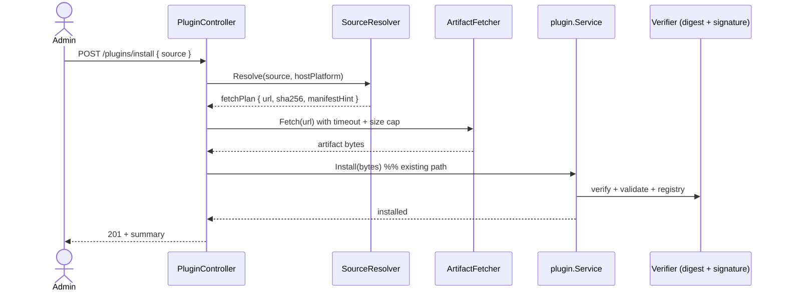
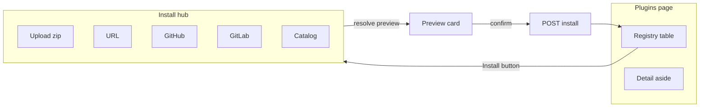

# Sequence: Plugin remote distribution (GitHub / GitLab / URL)

Extension to [19-plugin-installer.md](./19-plugin-installer.md). **Status:** Implemented (wave G — **v1.3.1**)

> Implementation checklist: [20-plugin-remote-distribution-impl.md](./20-plugin-remote-distribution-impl.md)

## Problem

Wave A–F delivers a safe **artifact installer**: admin uploads a signed zip (or posts base64 content), host verifies digest + signature, runs `Validate`, stores under `/storage/plugins/<id>/<version>/`.

That matches HashiCorp/Terraform’s “release binary” model but **not** how most package ecosystems distribute software:

| Ecosystem | Developer UX | Host receives |
|-----------|--------------|---------------|
| **Composer** | `composer require vendor/pkg` | Resolved tarball from Packagist/VCS |
| **npm** | `npm install pkg` | Registry tarball + lockfile |
| **pip** | `pip install pkg` | Wheel/sdist from PyPI or VCS |
| **PlatformIO** | `pio pkg install` / git URL | Archive or cloned lib |
| **Go modules** | `go get example.com/pkg@v1.2.3` | Module source → **local compile** |
| **GoSite today** | Build zip locally → upload in panel | Prebuilt zip bytes only |

**Gap:** no `gosite plugin add acme/hello@v1.0.0`, no “install from GitHub release”, no catalog discovery. Operators must manually build, sign, and upload — friction blocks community distribution.

## Product positioning: ecosystem vs curated

GoSite must choose what kind of plugin surface it is — the choice drives security defaults and publisher friction.

| Model | Examples | Publisher friction | Security posture |
|-------|----------|-------------------|------------------|
| **Open ecosystem** | WordPress, VSCode, npm, `go get` | Near zero — `git tag` or publish command | Permission prompts, capability limits, community trust |
| **Curated marketplace** | Terraform providers, enterprise app stores | High — signing, review, vendor onboarding | Signature, trusted vendor, approval workflow |

**Assessment conclusion (see [logs/gpt/20-review.md](../../logs/gpt/20-review.md)):**

- The **biggest risk to the plugin platform is not malware — it is no plugins.** Heavy signing onboarding (“Symbian-like”) can kill the community before it starts.
- GoSite plugins are **privileged control-plane extensions** (nginx, docker, SSL) — not npm libraries. Pure zero-friction without capability gates is also wrong.
- **Dual path:** support both ecosystem publishers and production operators without forcing one model on everyone.

**Target stance:**

```text
Community publishers  →  low friction (git tag, optional signature, build-on-install fallback)
Production operators  →  deterministic prebuilt release (digest pin, strict trust mode)
Both                  →  permission install prompt before activate (primary safety UX)
```

## Threat model & non-goals

Do not conflate three different concepts (external review):

```text
Integrity  ≠  Trust  ≠  Security
```

| Concept | What it guarantees | What it does **not** guarantee |
|---------|-------------------|-------------------------------|
| **Integrity** | Downloaded bytes = bytes publisher released (digest, signature over digest) | Plugin is safe or benign |
| **Trust** | Operator accepts publisher/repo | Publisher will not turn malicious |
| **Security** | Blast radius is bounded when plugin misbehaves | Plugin cannot misbehave |

**Signature proves:** `artifact_downloaded = artifact_publisher_uploaded`.  
**Signature does not prove:** source matches binary, publisher is honest, or code is safe.

If `source = malware`, `artifact = malware`, `signature = valid` — all checks pass. Distribution-layer controls cannot solve intentional publisher malice.

### In-scope threats (wave G)

| Threat | Mitigation |
|--------|------------|
| MITM / corrupt download | Pinned digest + HTTPS allowlist |
| Release asset swapped after publish | `release_integrity_failed` (digest ≠ index) |
| Operator installs from wrong URL | Resolve preview + provenance |
| Plugin requests excessive privileges | **Permission install prompt** (see UI) + capability enforcement at runtime |

### Out of scope (non-goals)

- Guaranteeing plugin code is malware-free
- Replacing antivirus or manual security audit
- Full SLSA attestation chain (L3 — future)
- Becoming a universal build system (Node, Rust, Python, …) in wave G

**Primary security investment after distribution:** capability enforcement, runtime isolation, resource limits — these reduce impact when a plugin is malicious, negligent, or compromised. Signature only helps with *who delivered* the bytes.

## Design principle (dual install path)

Tier **1** plugins ship **go-plugin subprocess binaries** (OS/arch-specific). Two valid ways to obtain bytes:

```text
Path A (prefer-release)   index/release asset  →  fetch zip  →  Install(bytes)
Path B (build)            git tag + builder      →  sandbox build  →  zip  →  Install(bytes)
```

Path A is **default for production** — fast, deterministic, no build-time network on host except fetch.  
Path B is **community-friendly fallback** — publisher pushes `git tag` only; no multi-arch zip matrix, no keyring required to publish.

Tier **0** (manifest-only webhooks) may install from lighter sources (raw `manifest.json` at a git tag).

```text
Remote reference  →  Resolver  →  artifact bytes  →  existing Install()
                     (release | build)
```

Reuse the entire lifecycle from sequence 19 after bytes are obtained.

### Install path resolution

When operator runs `gosite plugin install github:acme/slack@v1.2.3`:

| Step | Behaviour |
|------|-----------|
| 1 | Resolver reads `gosite.plugin.json` at tag |
| 2 | If release asset exists for host `GOOS/ARCH` → **prefer-release** (Path A) |
| 3 | Else if `build` contract present → **build** via Docker builder (Path B) |
| 4 | Else → `resolve_failed` with hint (“publish release or add build block”) |

Explicit overrides:

```bash
gosite plugin install github:acme/slack@v1.2.3 --prefer-release   # Path A only (prod default)
gosite plugin install github:acme/slack@v1.2.3 --build              # Path B only
```

API: `"installPath": "auto" | "release" | "build"` on `source` object (default `auto`).

## Target UX (north star)

```bash
# CLI (future)
gosite plugin install acme/slack-logger@1.2.3
gosite plugin install github:acme/gosite-plugin-slack@v1.2.3
gosite plugin install gitlab:group/plugin#v1.2.3

# API (future)
POST /api/v1/plugins/install
{
  "source": {
    "type": "github-release",
    "repo": "acme/gosite-plugin-slack",
    "tag": "v1.2.3",
    "asset": "gosite-slack-logger.zip"
  }
}

# Panel (future)
Install from URL | GitHub | GitLab | Upload zip (today)
```

## Manifest & repo metadata

### Inside artifact (unchanged)

`manifest.json` in the zip remains the runtime contract (`id`, `version`, `tier`, `capabilities`, `entrypoints`, signatures).

### At repo root (new, optional) — `gosite.plugin.json`

Discovery file committed next to source (like `composer.json` / `package.json`):

```json
{
  "id": "acme/slack-logger",
  "name": "Acme Slack Logger",
  "repository": "https://github.com/acme/gosite-plugin-slack",
  "distribution": {
    "apiVersion": "gosite-plugin-distribution/1",
    "build": {
      "language": "go",
      "entrypoint": "./cmd/plugin"
    },
    "releases": [
      {
        "version": "1.2.3",
        "minGoSiteVersion": "1.3.0",
        "sourceCommit": "abc123def456",
        "sourceRepository": "https://github.com/acme/gosite-plugin-slack",
        "buildTime": "2026-06-01T10:00:00Z",
        "assets": [
          {
            "name": "gosite-slack-logger.zip",
            "os": "linux",
            "arch": "amd64",
            "url": "https://github.com/acme/gosite-plugin-slack/releases/download/v1.2.3/gosite-slack-logger-linux-amd64.zip",
            "sha256": "…",
            "signatures": [{ "keyId": "acme-1", "sig": "…" }]
          },
          {
            "name": "gosite-slack-logger.zip",
            "os": "linux",
            "arch": "arm64",
            "url": "…",
            "sha256": "…"
          }
        ]
      }
    ]
  }
}
```

Resolver flow when user specifies `acme/slack-logger@1.2.3`:

1. Lookup catalog entry **or** user-provided `repository` URL
2. Fetch `gosite.plugin.json` at tag `v1.2.3` (or `main` + version field)
3. Pick asset matching host `GOOS/GOARCH`
4. Download zip → `Install(bytes)` **or** run Path B builder → zip → `Install(bytes)`

**`distribution.build` block (Path B):** narrow contract only — GoSite is **not** a universal build system. Wave G supports **Go + official builder image** only:

```json
"build": {
  "language": "go",
  "entrypoint": "./cmd/plugin",
  "goVersion": "1.22"
}
```

Optional publisher override: `"dockerfile": "./Dockerfile.gosite"` — must extend `gosite/builder:go` base. Node/Rust/Python deferred until ecosystem proves demand.

CI in plugin repos may publish release assets (Path A) **or** rely on tag + build block (Path B); both are valid.

### Source provenance (review round 2 — priority add)

Artifact **integrity** (signature + digest) is necessary but not sufficient. Supply-chain attacks often look like: clean source, compromised CI, malicious release binary.

Add optional fields per release in `gosite.plugin.json` (and store on registry row after install):

| Field | Purpose |
|-------|---------|
| `sourceCommit` | Git commit SHA the artifact was built from |
| `sourceRepository` | Canonical repo URL at build time |
| `buildTime` | ISO8601 UTC (informational) |
| `ciWorkflow` | Optional URI to workflow run (future attestation hook) |

Preview card and registry **Distribution** aside show: “Built from commit `abc123` on `acme/gosite-plugin-slack`”. Does not auto-verify source today — **Level 2 trust** (see below). Operators can manually compare to GitHub tag.

### `apiVersion` evolution

Plugin runtime manifest uses `apiVersion: gosite-plugin/1` (sequence 19). Distribution index uses `gosite-plugin-distribution/1`.

**Policy:** host **MAY** support multiple `apiVersion` / `rpcVersion` values concurrently during transitions. Install rejects unknown majors; warns on deprecated minors. Document supported matrix in host release notes — avoid locking the ecosystem to a single parser version.

## Install flow (remote)



### New failure classes

| `failure_class` | Meaning |
|-----------------|--------|
| `resolve_failed` | Bad ref, unknown repo, no matching asset |
| `fetch_failed` | Network, 404, timeout |
| `fetch_digest_mismatch` | Downloaded bytes ≠ pinned sha256 from index |
| `release_integrity_failed` | Index promised digest A; release asset bytes changed (re-upload same tag) — distinct from corrupt download |
| `fetch_too_large` | Over `PLUGIN_FETCH_MAX_BYTES` |
| `platform_unsupported` | No asset for host `GOOS/ARCH` (resolve returns `supportedPlatforms`) |
| `auth_token_expired` | `GITHUB_TOKEN` / `GITLAB_TOKEN` rejected (401/403) on fetch, reinstall, or update check — distinct from generic `fetch_failed` |
| `resolve_stale` | Install used resolve snapshot but digest/commit changed (TOCTOU) — **fail install**; operator must re-resolve manually |

Downstream failures remain `validate_timeout`, `install_failed`, etc.

**UI copy for `release_integrity_failed`:** “Release asset changed since index was published. Contact vendor or pin a new release.”

## Source types (phased)

| Phase | `source.type` | Resolves to | Notes |
|-------|---------------|-------------|-------|
| **G1** | `url` | HTTPS GET → zip | Pinned `sha256` required; domain allowlist |
| **G2** | `github-release` | GitHub API + **`gosite.plugin.json` at tag** → pinned asset URL | Release API is transport only; **no** `gosite*.zip` glob as primary selector |
| **G3** | `gitlab-release` | GitLab API + **`gosite.plugin.json` at tag** | Private repos via host-stored token |
| **G4** | `catalog` | Curated index on `catalog.gosite.dev` or bundled JSON | Search UI, semver ranges |
| **G5** | `git-ref` | Raw `manifest.json` at tag (tier 0 only) | Lightweight webhook plugins |
| **G6** | — | `gosite plugin` CLI wrapping install API | Same `source` JSON as panel |
| **G2b** | `github-build` / `gitlab-build` | Git tag → **Docker builder** sandbox → zip | Community path; `distribution.build` contract |

**Out of scope for G1–G5:** semver range resolution (`^1.2.0`), transitive plugin dependencies, arbitrary VCS protocols (`ssh://` without hardened keys).

### Asset selection rule (review: avoid filename heuristics)

GitHub/GitLab releases may ship multiple zips (`-debug`, `-dev`, etc.). **Do not** rely on `gosite*.zip` glob as the long-term selector.

| Priority | Source |
|----------|--------|
| 1 (required G2+) | `gosite.plugin.json` → `distribution.releases[].assets[]` matched by `version` + host `GOOS/ARCH` + pinned `sha256` |
| 2 (legacy fallback) | Explicit `asset` name in install request (operator picks from API list) |
| 3 (discouraged) | Filename pattern — dev-only, logs warning |

GitHub release metadata is **transport**; `gosite.plugin.json` is **distribution source of truth**.

## Security (minimum bar)

Remote fetch amplifies risk — defaults must be strict:

1. **Allowlist** — `PLUGIN_INSTALL_ALLOWED_HOSTS` (e.g. `github.com`, `gitlab.com`, `objects.githubusercontent.com`, `*.githubusercontent.com`)
2. **Pinned digest** — index or install request must include `sha256`; host rejects mismatch. **Digest is source of truth**, not URL (URLs rot; see provenance).
3. **Signatures** — Ed25519 over digest via vendor keyring (sequence 19); **required in strict mode** for Path A; optional in community mode for Path B
4. **Redirects** — follow redirects up to `PLUGIN_FETCH_MAX_REDIRECTS` (default 3); **re-validate final URL host against allowlist after each hop** (GitHub often redirects `github.com` → `objects.githubusercontent.com` — same registrable domain is insufficient)
5. **Size & timeout** — `PLUGIN_FETCH_MAX_BYTES` (default 64MiB), `PLUGIN_FETCH_TIMEOUT` (default 120s)
6. **Secrets** — `GITHUB_TOKEN` / `GITLAB_TOKEN` host-level for private repos; never passed to plugins
7. **Audit** — log `source`, `resolved_url`, `resolved_digest`, `plugin_id`, `version` on install

Scoped egress for tier-1 **runtime** remains separate (sequence 19 deferred item).

### Trust levels (what we verify)

| Level | Model | Wave |
|-------|--------|------|
| **L1 — Artifact** | Signed zip + pinned digest (current) | G1–G2 MVP |
| **L2 — Source link** | `sourceCommit` + repo in index; operator-visible provenance | G2+ (fields in index) |
| **L3 — Attestation** | SLSA-style CI attestation bound to digest | Future; not scheduled |

Goal: production uses prebuilt release (Path A); community publishers can ship with `git tag` only (Path B). L2 `sourceCommit` links artifact to source for operator review — not auto-verified in wave G.

### Operator trust modes (security vs UX)

One-size security policy does not fit all deployments. Make policy **configurable** — but **do not** make production accidentally permissive:

| Mode | `PLUGIN_TRUST_MODE` | Default for | Behaviour |
|------|---------------------|-------------|-----------|
| **Strict** | `strict` | **Production** (recommended) | Digest required; signature required for Path A; unknown vendor blocked |
| **Community** | `community` | Self-hosted / hobby | Signed preferred; unsigned Path A shows **warning** + confirm; Path B build allowed without signature |
| **Dev** | `dev` | Localhost / lab only | `PLUGIN_ALLOW_UNSIGNED=true`; all paths allowed |

Panel shows active mode in Settings → Plugins. Preview card reflects mode (block vs warn).

**Publisher onboarding:** Path B + community mode — no keyring step required to publish first plugin. Path A + strict mode — signing expected (Terraform-style vendors).

### Vendor key rotation

When vendor rotates keys (`acme-1` revoked, `acme-2` active):

| Policy | Behaviour |
|--------|-----------|
| **Install-time trust (default)** | Plugins installed while key was valid **remain trusted**; signature verified at install, stored `signing_key_id` on version row |
| **Revoked-key warning** | Registry shows badge if installed version was signed with a **since-revoked** key; operator may reinstall or disable |
| **Strict enterprise option** | `PLUGIN_REJECT_REVOKED_KEY_INSTALLS` blocks **new** installs signed with revoked keys only (does not auto-disable running plugins) |

Document in keyring UI: “Revoking a key does not stop enabled plugins; it blocks new installs signed with that key.”

## API sketch

### Install (extended)

```http
POST /api/v1/plugins/install
Content-Type: application/json

{
  "source": {
    "type": "github-release",
    "repo": "acme/gosite-plugin-slack",
    "tag": "v1.2.3",
    "asset": "gosite-slack-logger-linux-amd64.zip"
  }
}
```

Multipart upload **unchanged** for air-gapped / manual installs.

### Resolve-only (dry run)

```http
POST /api/v1/plugins/install/resolve
```

Returns a **lightweight** preview — must **not** download the full artifact zip.

| Field | How obtained |
|-------|----------------|
| `plugin_id`, `version`, `tier`, hooks, permissions | From `gosite.plugin.json` at tag, or embedded `manifest` block in that file |
| `sha256`, `size`, `url` | From distribution index asset entry for host platform |
| `signed`, `keyId` | Verify signature over digest using keyring (no zip fetch) |
| `minGoSiteVersion` | Index or manifest snapshot |
| `supportedPlatforms` | `[{os,arch}, …]` from index when host platform has no match — enables clear UI error |
| `sourceCommit`, `sourceRepository` | From index (L2 provenance display) |

Optional small release assets (publisher convention):

- `gosite.plugin.json` at repo tag (preferred)
- `manifest-dist.json` — manifest snapshot only (~2 KB) attached to GitHub release for preview without parsing full index

Install step (`POST /install`) performs the actual zip fetch + existing `Install(bytes)` path.

### Resolve → Install TOCTOU

Resolve preview may be minutes old. Between **Resolve** and **Install**, release asset or index digest may change.

| Policy | Behaviour |
|--------|-----------|
| **Do not auto re-resolve** on mismatch | Safer — operator explicitly re-runs Resolve |
| **Install re-validates** pinned `sha256` / index at fetch time | Mismatch → `release_integrity_failed` or `resolve_stale` |
| **Optional** `resolveToken` | Short-lived id (e.g. 15 min TTL) binding preview fields; expired token → `resolve_stale` |

UI copy: “Release changed since preview. Click **Resolve** again.”

**Path B:** install records **actual** `resolved_commit` from shallow clone — not tag name alone (tags are mutable via force-push).

### Catalog (G5)

```http
GET /api/v1/plugins/catalog?q=slack
GET /api/v1/plugins/catalog/acme/slack-logger
```

---

## Admin panel UX (primary surface)

Remote distribution is **operator-facing first**. CLI (G6) wraps the same APIs; the panel is where most installs, previews, and update decisions happen. This section extends the existing [`Plugins.tsx`](../../web/src/views/Plugins.tsx) view — not a greenfield app.

### Current UI baseline (v1.3.0)

| Area | Today | Gap |
|------|-------|-----|
| **Page** | Single `/plugins` registry + stats + detail aside | No browse/install hub |
| **Install modal** | Tabs: **Artifact** (file) · **Manifest JSON** (paste) | No URL / GitHub / GitLab / catalog |
| **Registry table** | Versions, state, capabilities, enable/disable/switch | No provenance (`source`, release URL) |
| **Detail aside** | Hooks, permissions, UI routes | No “update available”, no install log |
| **Contribution routes** | `/plugins/{id}/…` disabled fallback + enable CTA | OK — keep host-owned |
| **Keyring** | API only (`plugin_extra.go`) | No admin UI for vendor keys |
| **Settings** | — | No GitHub/GitLab token status for private repos |

Remote install must **not** replace upload — air-gapped operators keep **Artifact** tab unchanged.

### Information architecture

```text
/plugins                          ← registry (default tab)
/plugins/install                  ← install hub (new route or full-page modal)
/plugins/catalog                  ← search curated index (G5)
/plugins/catalog/:vendor/:name    ← plugin detail + versions + Install
/settings/plugins                 ← tokens, allowlist read-only, remote install toggle (admin)
```

Alternative (smaller diff): keep one `/plugins` page, expand **Install** into a **wide wizard modal** with left nav (Upload · URL · GitHub · GitLab · Catalog). Recommended for G1–G2; split routes when Catalog (G5) grows.



### Install hub — source pickers

Each source is a **form + shared preview step** (calls `POST /install/resolve` before commit).

#### 1) Upload artifact (unchanged)

- File input + optional SHA-256
- Same as today; default tab for air-gapped

#### 2) Direct URL (G1)

| Field | Validation |
|-------|------------|
| HTTPS URL | Required; host checks allowlist server-side |
| SHA-256 | Required in v1 (no trust-on-first-use) |
| Display name | Optional; filled from manifest after resolve |

UX: **Resolve** → preview card → **Install**. Disable Install until resolve succeeds.

#### 3) GitHub (G2)

| Field | Behaviour |
|-------|-----------|
| Repository | `owner/repo` with inline validation |
| Version | Combobox populated from releases API |
| Asset | Read-only after resolve — from `gosite.plugin.json` for host arch (not manual glob pick) |
| Private repo | Banner if 404: “Configure GitHub token in Settings → Plugins” |

**Quality-of-life**

- Paste full URL `https://github.com/acme/foo/releases/tag/v1.2.3` → parser fills repo + tag
- “Latest stable” quick pick (highest non-prerelease tag)
- Link out to release page (new tab)

#### 4) GitLab (G3)

Same layout as GitHub with project path `group/subgroup/project` and GitLab-specific asset names.

#### 5) Catalog (G5)

- Search box + category chips (integrations, nginx, observability, …)
- Card grid: name, vendor, short description, tier badge, signed badge
- Card → detail drawer: README excerpt (sanitized markdown), versions table, **Install** per version
- Empty state: “Submit your plugin” → docs link `plugins/_templates/docs/PUBLISH.md`

#### 6) Manifest JSON (today)

Keep for tier-0 experiments and support; label as **Advanced**. Not the primary remote path.

### Resolve preview card (shared)

Shown after **Resolve**, before **Install**:

```text
┌─────────────────────────────────────────────────────────┐
│ acme/slack-logger  v1.2.3          tier 1   signed ✓   │
│ Hooks: nginx.before_reload, job.on_failure (3 total)   │
│ Permissions requested:                                  │
│   • docker:manage                                       │
│   • filesystem:write (/var/log)                         │
│ Min GoSite: 1.3.0          Host: 1.3.0 ✓               │
│ Install path: release (signed ✓)  ·  or: build        │
│ Asset: gosite-slack-linux-amd64.zip   4.2 MiB          │
│ SHA-256: abc123…  [copy]                                │
│ Source: github-release · acme/gosite-plugin-slack@v1.2.3│
│ ⚠ Another version enabled — install will NOT auto-switch │
└─────────────────────────────────────────────────────────┘
        [ Cancel ]  [ Install ]
```

Rules:

- **Permission prompt (required)** — list every capability/permission from manifest; operator must acknowledge before **Install** completes. More valuable than “Signed by Acme Inc” for non-developer operators. Separate from **Activate** (install ≠ enable) — permissions shown again on **Enable** if capabilities changed between install and activate.
- **Block Install** if `minGoSiteVersion` incompatible (show upgrade host CTA)
- **Block Install** if `platform_unsupported` — list `supportedPlatforms` (“This host is linux/amd64; plugin provides linux/arm64 only”)
- **Warn** (non-blocking) if unsigned and `PLUGIN_ALLOW_UNSIGNED=false` would fail — preview reflects keyring check via resolve endpoint
- **Warn** if same `plugin_id` already has a different version **enabled** — clarify install ≠ switch
- Long fetch: progress state “Downloading… validating…” or “Building in sandbox…” with cancel (build job id — G2b)

### Permission install prompt (primary safety UX)

External review: invest more in **permission prompts** than deeper PKI. Sequence 19 declares `capabilities` in manifest; wave G must surface them at install time.

**When shown:** after Resolve, before Install commit; again before Enable/Switch if not yet acknowledged for this version.

**Content:**

```text
This plugin will be able to:
  ✓ Read nginx configuration
  ✓ Restart docker containers
  ✗ Modify SSL certificates (not requested)

Signed by: Acme (key acme-1) — or: Unsigned (community mode)
Built from: commit abc123 @ github.com/acme/slack-plugin

[ ] I understand these permissions
        [ Cancel ]  [ Install ]
```

**Rules:**

- Group permissions by risk tier (read < write < manage < host-critical)
- Highlight host-critical caps (`nginx:modify`, `docker:manage`, `ssl:issue`) in warning colour
- Unsigned + host-critical caps → extra confirm sentence in community mode
- Store `permissions_ack_at` on version row (audit)
- **Enable** blocked until install-time ack recorded (or re-ack on capability diff — see algorithm below)

**Capability diff algorithm (re-ack):**

Compare normalized capability sets from manifest (`capabilities` + declared permissions) between **last acked version** and **target version**:

| Change | Re-ack required? |
|--------|------------------|
| Any **new** capability added (set difference on target) | **Yes** — e.g. v1 `logs:read` → v2 adds `docker:manage` |
| Capability **removed** | No — show info banner only |
| Same capability, **scope string changed** (e.g. path prefix) | **Yes** — treat as new grant |
| Rename only (deprecated alias → canonical, same effective access) | No — if host maintains alias map in manifest parser |

Implementation: `needsReAck = !targetCaps.IsSubsetOf(ackedCaps) || anyScopeChanged(acked, target)`.

**Runtime enforcement (seq 19+ — higher priority than prompt):** prompt is UX; host must **deny** hook/API calls for capabilities not declared in manifest. Unsigned plugin with strong enforcement is safer than signed plugin with weak enforcement (external review round 4).

This is the main operator-facing control — not the keyring badge alone.

### Registry & detail enhancements

**Table columns (add)**

| Column | Source |
|--------|--------|
| Source | `github` / `gitlab` / `url` / `upload` icon + short ref |
| Provenance | `tag` or truncated URL on hover |

**Row actions (add)**

- **Reinstall** — same resolved source (needs stored provenance on version row)
- **Check for updates** (G5+) — compare latest release tag vs installed

**Detail aside (add)**

- **Distribution** card: source type, repo, tag, resolved URL, installed digest, `resolved_commit` (Path B)
- **Update available** badge when catalog/release resolver reports newer signed version
- **Install log** card — ordered steps with timestamps (see below)

### Install operation log

Persist per install attempt (version row or `plugin_operations` side table). Shown in detail aside when operator reports “install failed”.

```text
10:00:01  resolve          ok   github:acme/slack@v1.2.3
10:00:02  fetch            ok   4.2 MiB from objects.githubusercontent.com
10:00:05  verify_digest    ok   sha256 abc…
10:00:06  verify_signature ok   key acme-1
10:00:08  validate         ok   tier 1 subprocess probe
10:00:09  registry         ok   plugin_versions row created
10:00:09  done
```

Path B build steps: `clone` → `build_start` → `build_complete` → `verify_digest` → …

Failed step records `failure_class` + message; UI highlights first failed step. API: `GET /api/v1/plugins/{id}/versions/{version}/install-log`.

### Settings → Plugins (new section)

Host admin only (not plugin config):

| Setting | UI control |
|---------|------------|
| Remote install enabled | Toggle (`PLUGIN_REMOTE_INSTALL`) |
| GitHub token | Password field + “test connection” |
| GitLab token | Same |
| Allowed hosts | Read-only list from env (explain in help text) |
| Allow unsigned (dev) | Read-only badge from env |

Never echo token values back; show “configured ✓ / not set”.

### Keyring admin (new sub-view)

Route: `/plugins/keyring` or tab on Plugins page.

**Trusted vendor** model (review: key list alone is hard for operators):

```text
Vendor profile (e.g. "Acme", "HashiCorp", "GoSite Official")
  ├── display name + homepage (optional)
  ├── keys[]: keyId, publicKey, createdAt, revokedAt
  └── trust level: official | community | unverified
```

UI:

- Table grouped by **vendor** (not flat key list)
- **Add key** under vendor: paste `publicKey` base64 + `keyId`
- **Revoke** with confirm
- Preview card shows: “Signed by **Acme** (key acme-1) — vendor trusted ✓”
- Link to signing docs in `plugins/_templates/docs/SIGNING.md`

Install rejects signatures from revoked keys (new installs) or unknown vendors per **trust mode** (strict vs community vs dev).

### Plugin contribution pages (unchanged contract)

Per sequence 19: `/plugins/{id}/…` routes stay **host-rendered**. Remote install only changes how the artifact arrives — not contribution routing.

Disabled plugin screen keeps: explanation + **Enable** if permitted.

### Config forms (existing)

When `capabilities.configSchema` is set, config UI already lives on contribution routes. Remote install plan does **not** add arbitrary plugin HTML — only data-driven forms + secrets (write-only fields).

### Error & empty states (UI copy map)

| API / state | Panel message |
|-------------|----------------|
| `resolve_failed` | “Could not find that repo, tag, or asset.” |
| `fetch_failed` | “Download failed — check network or token.” |
| `auth_token_expired` | “GitHub/GitLab token expired — update in Settings → Plugins.” |
| `resolve_stale` | “Release changed since preview — click Resolve again.” |
| `fetch_digest_mismatch` | “Downloaded file does not match SHA-256.” |
| `release_integrity_failed` | “Release asset changed since index was published. Contact vendor or use a new tag.” |
| `platform_unsupported` | “No build for this server. Available: linux/arm64, …” |
| `plugin signature required` | “Unsigned plugin — add vendor key, switch to community mode, or enable dev mode.” |
| `failure_class=validate_timeout` | Registry row + retry **Install** with same source |
| Remote disabled | Install hub hides URL/GitHub/GitLab/Catalog; show upload only + info banner |

### Loading & accessibility

- Resolve and install buttons show spinner; disable double-submit
- Comboboxes keyboard-navigable (tags, assets)
- Monospace for digests, repo paths, plugin ids
- `aria-live` on resolve errors

### Frontend implementation map

| Piece | File / module |
|-------|----------------|
| Install hub wizard | `web/src/views/PluginsInstall.tsx` or expand `InstallModal` |
| Source forms | `web/src/views/plugins/install/*.tsx` |
| Preview card | `web/src/components/PluginInstallPreview.tsx` |
| Catalog grid | `web/src/views/PluginsCatalog.tsx` (G5) |
| Keyring table | `web/src/views/PluginsKeyring.tsx` |
| Settings section | `web/src/views/Settings.tsx` (plugins block) |
| API client | `web/src/api/endpoints.ts` — `resolve`, `installSource`, `catalog`, `keyring` |
| Types | `web/src/api/types.ts` — `InstallSource`, `ResolvePlan`, `Provenance` |

### UI delivery phases

| Phase | Panel deliverable |
|-------|-------------------|
| **G1** | Install hub · URL tab · resolve preview · provenance column |
| **G2** | GitHub tab · tag picker · asset from index (read-only) · paste URL parser |
| **G3** | GitLab tab · settings token fields |
| **G4** | `/plugins/catalog` · search · update-available badge |
| **G5** | Tier-0 git-ref manifest path (advanced) |
| **G6** | — (CLI only) |
| **G1b** | Keyring sub-view · trusted vendor grouping |
| **G1c** | Permission prompt · capability ack · Enable gate |

**Recommended UI MVP:** G1 + G2 + keyring + provenance in registry — matches “install from GitHub like npm” without catalog infrastructure.

---

## CLI (secondary, G6)

Optional automation for scripts and SSH sessions — **same** `source` JSON as the panel.

```bash
gosite plugin search slack
gosite plugin install acme/slack-logger@1.2.3
gosite plugin install github:acme/gosite-plugin-slack@v1.2.3 \
  --prefer-release                    # Path A only (production default)
gosite plugin install github:acme/gosite-plugin-slack@v1.2.3 \
  --build                             # Path B only (Docker builder)
```

Shares resolver package with HTTP handler. Not required for first remote-install ship.

## Edge cases & runtime guarantees

Explicit behaviour so operators are not surprised:

| Scenario | Behaviour |
|----------|-----------|
| **Release asset re-uploaded** (same tag, different bytes) | `release_integrity_failed` at install — digest ≠ index |
| **Upstream repo deleted / vendor banned** | **Installed + enabled plugins keep running** (local artifact + registry); reinstall/update/resolve fails until new source |
| **Catalog `plugin_id` collision** | Catalog enforces **plugin id ownership** — one canonical vendor per `id`; new submission rejected or requires admin override |
| **Publisher ownership transfer** (repo sold) | Open — see [Publisher migration](#publisher-migration-open) |
| **GOOS/ARCH mismatch** | Resolve fails with `platform_unsupported` + `supportedPlatforms` list |
| **Git tag force-pushed** (Path B) | Same tag, different commit on reinstall — new `resolved_commit` stored; operator sees commit diff in install log |
| **Concurrent install + switch** | Second request gets `409 operation_in_progress` (see locking) |

### Publisher migration (open)

If `acme/slack-logger` changes legal owner or repo org, who is the canonical publisher? npm/PyPI see this often. Deferred options:

- Catalog `publisher_id` immutable; repo URL updates require admin attestation
- New `plugin_id` for new owner (breaking; safest)
- Signed “ownership transfer” document in catalog (heavy)

Record as open question until catalog (G4) ships.

## Lifecycle operation locking

Sequence 19 defines per-version **state machine** (`installed` → `enabled` → …). Remote install adds long-running fetch/build steps. Without locking, concurrent API calls can corrupt state.

**Rule:** one in-flight **lifecycle operation** per `plugin_id` (covers all versions of that plugin).

| Operation | Holds lock |
|-----------|------------|
| `install` | `plugin_id` |
| `enable` / `disable` / `switch` | `plugin_id` |
| `uninstall` | `plugin_id` |
| G2b `build` job | `plugin_id` (includes fetch + validate) |

| Concurrent request | Response |
|--------------------|----------|
| Same `plugin_id`, op already running | `409 Conflict` + `failure_class=operation_in_progress` |
| Different `plugin_id` | Allowed in parallel |

Implementation: in-process mutex per `plugin_id` (single-host v1) or DB advisory lock / `plugin_operations` row with `status=running` (multi-instance future).

UI: disable Install/Enable/Switch buttons while operation pending; show “Another operation is in progress for this plugin.”

CLI and panel share the same lock — duplicate `install acme/slack` from both surfaces serializes or rejects.

## Backend implementation map

| Component | Package / file | Responsibility |
|-----------|--------------|----------------|
| `SourceResolver` | `internal/service/plugin/resolver/` | Parse `source`, return `FetchPlan` |
| `ArtifactFetcher` | `internal/service/plugin/fetch/` | HTTP client, limits, redirect policy |
| `GitHubResolver` | `…/resolver/github.go` | Releases API, asset selection |
| `GitLabResolver` | `…/resolver/gitlab.go` | Project releases / packages API |
| `SourceBuilder` | `…/build/docker.go` | G2b: clone + `gosite/builder:go` container → zip bytes |
| `BuildJob` | `…/build/job.go` | Async build status; **remove container** after install; retain builder **image** in cache |
| `PluginOpLock` | `…/lock.go` | Per-`plugin_id` mutex / advisory lock for lifecycle ops |
| `Install` | `service.go` | Accept `[]byte` only (unchanged core) |
| Handler | `handler/plugin.go` | JSON `source` branch before `readInstallInput` |
| Config | `config.go` | `PLUGIN_FETCH_*`, `PLUGIN_BUILD_*`, `PLUGIN_INSTALL_ALLOWED_HOSTS`, `PLUGIN_TRUST_MODE`, tokens |
| Registry metadata | migration `007_plugin_provenance.sql` | See provenance schema below |
| Templates | `plugins/_templates/` | Add `.gitea/` / `.github/workflows/release.yml` example |
| Docs | `plugins/_templates/docs/PUBLISH.md` | How to publish releases |

### Provenance schema (migration 007)

Store on `plugin_versions` (or side table). **Digest is canonical identity**; URL is audit metadata only.

| Column | Purpose |
|--------|---------|
| `source_type` | `upload` \| `url` \| `github-release` \| `gitlab-release` \| `github-build` \| `catalog` |
| `source_ref` | Stable ref: `acme/foo@v1.2.3`, raw URL, catalog id |
| `resolved_url` | Last fetch URL (may change if publisher moves release) |
| `resolved_digest` | SHA-256 promised by index at resolve time |
| `artifact_digest` | SHA-256 of bytes actually installed (= `artifact_digest` today) |
| `signing_key_id` | Key used at install (for revoked-key badge) |
| `source_commit` | From index `sourceCommit` (Path A) or **actual clone SHA** (Path B) — `resolved_commit` |
| `builder_image_digest` | Path B only — digest of `gosite/builder:go` image used at build time |
| `source_repository` | From index at install time |
| `install_path` | `release` \| `build` — how bytes were obtained |
| `permissions_ack_at` | Operator acknowledged capability prompt |
| `permissions_acked_caps` | JSON snapshot of capabilities at ack time (for diff algorithm) |

Reinstall, update check, and audit use `(plugin_id, version, artifact_digest)` — not URL.

### Install log schema (migration 007b or JSON column)

| Column | Purpose |
|--------|---------|
| `install_log` | Ordered steps: `{step, at, status, detail?, failure_class?}[]` |
| Or `plugin_operations` table | One row per attempt; steps as child rows — better for long builds |

## Update policy (Install · Activate · Update)

Sequence 19 already separates **install** (registry record) from **enable/switch** (runtime). Remote distribution makes this visible in the panel:

| Operator action | API | Runtime effect |
|-----------------|-----|----------------|
| **Install** | `POST /install` | New version row → `installed`; downloads artifact |
| **Activate** | `POST /enable` or `POST /switch` | Starts subprocess + hook targets |
| **Update** | `POST /install` (new version) then optional **Activate** | Panel offers: “Install only” vs “Install and switch” (two-step default) |
| **Rollback** | `POST /switch` to older installed version | No re-fetch if artifact still on disk |

**Default (safe):** remote **Install** never auto-activates. Preview card warns when another version is enabled.

**Update available** (G5 UI): compare installed `artifact_digest` + catalog/latest `gosite.plugin.json` release entry — offer **Install update** (fetch) separate from **Switch to new version**.

## Phased delivery

| Phase | Deliverable | Depends on |
|-------|-------------|------------|
| **G1** | `source.type=url` + allowlist + pinned sha256 + provenance columns | — |
| **G2** | GitHub resolver + **`gosite.plugin.json` at tag** + auto prefer-release + panel GitHub tab | G1 fetcher |
| **G2b** | Docker builder (Path B) + `distribution.build` contract + `--build` override | G2 resolver |
| **G3** | GitLab resolver + same index contract + GitLab tab + Settings tokens | G1 |
| **G4** | Catalog API + `/plugins/catalog` + update-available badge | G2 |
| **G5** | Tier-0 `git-ref` manifest-only install | G1 |
| **G6** | `gosite plugin` CLI | G2 |
| **G1c** | Permission install prompt + `permissions_ack_at` + Enable gate | G1 resolve |
| **G1b** | Keyring admin UI + trusted vendor grouping + provenance in registry | G1 |

**Recommended first ship:** G1 + G2 + G1c — remote install with permission UX. G1b (keyring UI) for strict/enterprise; G2b when community publishers need tag-only publish.

### G2b Docker builder (Path B — community)

Isolated build — **not** bare `go build` on the host process:

```text
git clone (shallow, tag → record resolved_commit)
  → gosite/builder:go container (network limited, CPU/mem/timeout capped)
  → zip artifact matching sequence 19 layout
  → remove build container (always attempt)
  → retain gosite/builder:go image in local cache (do not rm image)
  → Install(bytes)
```

| Constraint | Env / default |
|------------|---------------|
| Languages | **Go only** in G2b (official builder image) |
| Build contract | `distribution.build` in `gosite.plugin.json` |
| **Timeout** | `PLUGIN_BUILD_TIMEOUT` (default 600s) |
| **Memory** | `PLUGIN_BUILD_MEMORY_MB` (default 2048) |
| **CPU** | `PLUGIN_BUILD_CPU_LIMIT` (default 2.0 cores) |
| Network | Egress allowlist inside container (module proxy only) |
| Cost | Heavy only when operator installs; idle host unaffected |
| Reproducibility | Pin `goVersion` + `go.sum` in repo; warn in preview if `go.sum` missing |
| Signature | Not required in community mode for Path B |
| **Cleanup failure** | If `docker rm` fails after successful install → **warning only** + log; install remains `installed`. Background janitor retries container removal. |
| **Image cache** | Keep `gosite/builder:go` (+ base golang layers) between installs; prune only via admin/maintenance job — avoids 100MB+ re-pull per plugin |

**Highest implementation risk (external review):** Path B concentrates git tag mutability, resource quotas, cleanup, timeout, and reproducibility. Ship G1+G2+G1c before G2b unless community publish is blocking.

Do **not** expand into Node/Rust/Python builders until ecosystem demand is proven — avoids GoSite becoming a general build system.

## Developer publishing workflow (target)

Two valid publisher paths — choose based on audience:

### Path A — Release artifact (production / strict)

```text
plugin repo
  ├── gosite.plugin.json      # distribution index + release assets
  ├── manifest.json           # copied into zip at build
  ├── .github/workflows/release.yml
  │     go build → zip → sign (optional in community) → gh release upload
  └── plugins/_templates-style Makefile
```

Mental model: **GoReleaser** / Terraform providers — `git tag → CI produces zip → host prefer-release`.

### Path B — Tag only (community)

```text
plugin repo
  ├── gosite.plugin.json      # distribution.build block (go entrypoint)
  ├── manifest.json
  └── git tag v1.2.3          # no release zip required
```

Host builds on first install via G2b Docker builder. Publisher skips multi-arch zip matrix and keyring onboarding.

## Comparison to `go get`

| | `go get` | GoSite remote install |
|--|----------|------------------------|
| Input | module path + version | `source` ref or catalog id |
| Default bytes | module source → local compile | **prefer-release** zip, else Docker build (G2b) |
| Publisher steps | `git tag` | Path A: tag + CI zip · Path B: `git tag` only |
| Trust | checksum DB + module proxy | digest + optional signature + **permission prompt** |
| Use case | libraries in Go code | privileged control-plane hooks |

## Design review notes

External review ([logs/gpt/20-review.md](../../logs/gpt/20-review.md)) — incorporated above:

| Feedback | Resolution |
|----------|------------|
| Signed zip → `Install()` (not `go get` build) | Kept — core principle |
| Resolver / Fetcher / Install separation | Kept |
| Resolve preview before install | Kept; resolve must stay **lightweight** (no full zip download) |
| `resolved_digest` + digest as truth | Added to provenance schema |
| Asset glob too loose | `gosite.plugin.json` required G2+; glob demoted to legacy fallback |
| Redirect / CDN domains | Allowlist check **after** redirect hops |
| Keyring UX | Trusted **vendor** profiles grouping keys |
| G7 host build | Renamed G× experimental; not scheduled |
| Install vs Activate vs Update | New **Update policy** section |
| Ship `gosite.plugin.json` early | G2/G3 require it; was incorrectly deferred to G4 |
| **Round 2** — `sourceCommit` / build provenance in index | L2 trust fields + registry columns |
| **Round 2** — `release_integrity_failed` | New failure class + UI copy |
| **Round 2** — Trust modes strict/community/dev | `PLUGIN_TRUST_MODE` table |
| **Round 2** — Vendor key rotation | Install-time trust + revoked-key badge |
| **Round 2** — Repo deleted | Installed plugins keep running; doc explicit |
| **Round 2** — `supportedPlatforms` on resolve | Platform mismatch UX |
| **Round 2** — Catalog plugin id ownership | G4 requirement |
| **Round 2** — apiVersion multi-support policy | Documented |
| **Round 3** — Integrity ≠ Trust ≠ Security | Threat model section |
| **Round 3** — Ecosystem vs curated positioning | Product positioning section |
| **Round 3** — Dual path prefer-release + build | Install path resolution; G2b Docker builder |
| **Round 3** — Permission install prompt | G1c; primary safety UX |
| **Round 3** — Strict default for prod, community opt-in | Trust modes table updated |
| **Round 3** — No keyring required for Path B publish | Community publisher friction reduced |
| **Round 3** — Narrow Go-only build contract | `distribution.build`; not universal build system |
| **Round 4** — Per-plugin operation locking | `409 operation_in_progress`; extends seq 19 state machine |
| **Round 4** — Build resource limits | `PLUGIN_BUILD_TIMEOUT`, `MEMORY_MB`, `CPU_LIMIT` |
| **Round 4** — Container vs image cleanup | Remove container; cache builder image |
| **Round 4** — Cleanup failure | Warning only if install succeeded |
| **Round 4** — Path B provenance | `resolved_commit`, `builder_image_digest` |
| **Round 4** — Resolve TOCTOU | Fail install; no auto re-resolve; optional `resolveToken` TTL |
| **Round 4** — `auth_token_expired` | Distinct from `fetch_failed` |
| **Round 4** — Capability diff algorithm | `permissions_acked_caps` snapshot + re-ack rules |
| **Round 4** — Install operation log | Step timeline in UI + API |
| **Round 4** — Implementation risk rank | #1 Path B, #2 concurrency, #3 runtime capability enforcement |

### Implementation risk ranking (review round 4)

Resolver, GitHub/GitLab flow, provenance, and install UX are mature enough to ship. Production bugs are most likely from:

1. **Path B (G2b)** — tag mutability, quotas, cleanup, timeouts
2. **Concurrent lifecycle ops** — install/switch/uninstall without per-plugin lock
3. **Capability enforcement at runtime** — prompt alone is insufficient; host must deny undeclared access

## Success criteria

- [ ] Install tier-1 plugin from public GitHub release without manual upload
- [ ] Digest + signature verification identical to upload path
- [ ] **Resolve** returns preview from index/manifest only — no full zip download
- [ ] GitHub install uses `gosite.plugin.json` at tag (not filename glob)
- [ ] Provenance stores `artifact_digest` + `resolved_digest`; reinstall works without URL
- [ ] **Update flow:** install new version without auto-switch; explicit activate step
- [ ] **Trust modes:** strict recommended for production; community explicit opt-in
- [ ] **Permission prompt:** capabilities listed and acknowledged before install; Enable gated
- [ ] **Dual path:** prefer-release when asset exists; fallback to G2b build when `build` block present
- [ ] G2b build runs in isolated container; cleaned up after install; builder image cached
- [ ] Per-plugin lock: concurrent install+switch returns `409 operation_in_progress`
- [ ] Install log visible in panel with step-level failure
- [ ] TOCTOU: digest change between resolve and install → `resolve_stale` / `release_integrity_failed`, no silent re-resolve
- [ ] Path B stores `resolved_commit` + `builder_image_digest`
- [ ] Expired GitHub/GitLab token → `auth_token_expired` with settings CTA
- [ ] Capability re-ack when new permission added between versions
- [ ] Preview shows `sourceCommit` when present in index
- [ ] `release_integrity_failed` distinguishable from network corrupt download
- [ ] Resolve returns `supportedPlatforms` on arch mismatch
- [ ] Private GitHub repo works with host `GITHUB_TOKEN`
- [ ] Panel + API document breaking nothing for zip upload
- [ ] Template repo publishes release with one `git tag` push
- [ ] **Panel:** Install hub with resolve preview before commit
- [ ] **Panel:** GitHub tab — repo, tag, asset pickers without hand-editing JSON
- [ ] **Panel:** Registry shows source/provenance; keyring manageable in UI
- [ ] **Panel:** Remote sources hidden when `PLUGIN_REMOTE_INSTALL=false`

## Open questions

1. **Central catalog** — first-party only vs community submissions (signing required)?
2. **Semver ranges** — defer until catalog; start with exact `@version` only
3. **Monorepo** — `source.path` for zip inside repo (e.g. `plugins/acme/hello/dist/…`)?
4. **Air-gapped** — disable remote install via `PLUGIN_REMOTE_INSTALL=false`
5. **Update channel** — “check for updates” compares digest + catalog/latest index (see Update policy)
6. **Vendor trust tiers** — who can mark a vendor `official` vs `community`?
7. **Publisher migration** — repo sold / org transfer; new `plugin_id` vs catalog attestation
8. **Revoked signing key** — auto-disable installed plugins vs warn-only (default: warn-only)
9. **Default install path** — `auto` vs site-wide `PLUGIN_INSTALL_PATH_DEFAULT` (`release` | `build` | `auto`)
10. **Build reproducibility** — warn vs block when `go.sum` missing in Path B repo
11. **Multi-instance locking** — advisory lock vs in-process mutex when GoSite scales horizontally
12. **Capability runtime enforcement** — track as seq 19/21 follow-up; prompt (G1c) is not sufficient alone

## References

- [19-plugin-installer.md](./19-plugin-installer.md) — lifecycle, manifest, signatures
- [plugin-platform.md](../architecture/plugin-platform.md) — tiers
- [plugins/_templates/](../../plugins/_templates/) — build/sign today
- HashiCorp release workflow (terraform providers)
- GitHub REST: [Get a release by tag](https://docs.github.com/en/rest/releases/releases)
