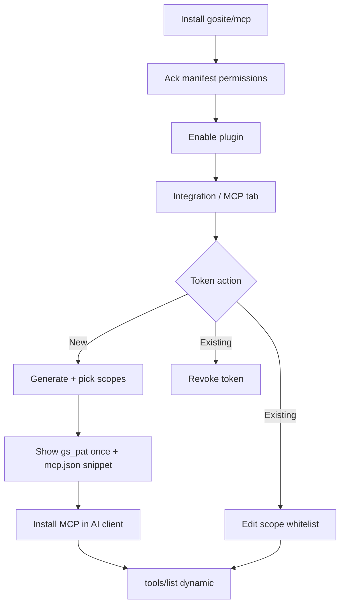
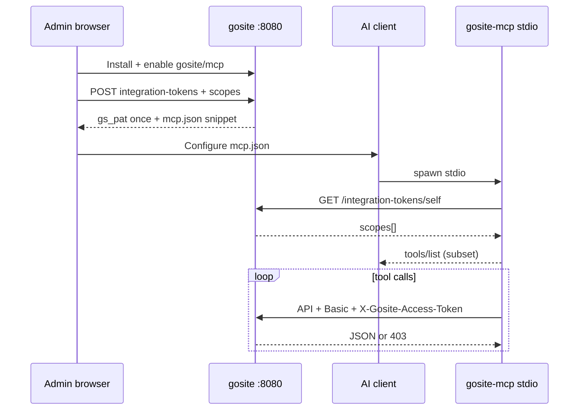

# Sequence: MCP plugin & integration access tokens

Extension of [19-plugin-installer.md](./19-plugin-installer.md) and [20-plugin-remote-distribution.md](./20-plugin-remote-distribution.md).

**Status:** Design — not implemented

**Research:** `research/gosite-mcp-plugin/` (gitignored; blueprint frozen 2026-06-17)

## Runtime context

GoSite runs **two independent listeners** in one container — they do not proxy to each other. See [overview.md](../architecture/overview.md).

| Listener | Port | MCP relevance |
|----------|------|---------------|
| `gosite serve` | `:8080` (prod may publish `1100→8080`) | **MCP clients call here** — REST `/api/v1`, embedded SPA |
| `nginx` | `:80` / `:443` | **Website edge only** — hosted site traffic; not in the panel/MCP auth path |

Panel users and MCP HTTP clients reach **`gosite` on `:8080` directly**. Nginx manages vhosts (`site.d` / `active.d`, reload, repair) but **does not terminate panel or API traffic**. Optional HTTP Basic Auth is **Gin middleware** on `/api/v1`, not an nginx front door.

## Problem

Operators want AI clients (Cursor, Claude Desktop, OpenClaw, etc.) to call GoSite imperatively — list websites, test nginx, inspect jobs — without clicking the panel.

Hosting panels in the wild ship **external MCP servers** that wrap REST (Portainer, Coolify). GoSite has no MCP surface today. Storing **panel email/password** in `mcp.json` would grant a full session cookie with weak per-agent revoke and no tool scoping.

## Goals

- Official path: catalog plugin **`gosite/mcp`** (Tier 1) + optional community stdio server (`@gosite/mcp`).
- **Machine auth:** panel HTTP Basic (optional, Gin) + **plugin access token** (`gs_pat_*`) — never panel password in MCP env.
- **Operator flow:** install plugin → generate token → **select scope whitelist** → copy to AI client → dynamic `tools/list`.
- Token lifecycle: **generate**, **edit scopes**, **revoke** (multiple tokens per plugin).
- Implement seq 19 deferred **scoped plugin API tokens** for MCP first; generalize to tier-0 webhooks later.

## Non-goals (wave 1)

- Host-native Gin `/mcp` Streamable HTTP route (P6c is a later wave).
- OAuth 2.1 MCP resource server.
- Tier 2 WASM MCP.
- Replacing OpenAPI with MCP-only API surface.

## Prior art

| Product | Pattern |
|---------|---------|
| [Portainer MCP](https://github.com/portainer/portainer-mcp) | External stdio/HTTP; gate token + per-user API key |
| [Coolify MCP](https://github.com/StuMason/coolify-mcp) | External stdio; long-lived API token in env |
| GoSite seq 19 | Manifest `permissions` + install ack — runtime enforcement deferred until this sequence |

**Decision:** external stdio MCP (like Coolify) + **host-issued scoped tokens** (like Portainer keys). Reject host-native `/mcp` on panel port for wave 1.

## Operator flow (locked)

```text
1. Install plugin gosite/mcp       → permissions_ack (manifest ceiling)
2. Enable plugin                   → Integration / MCP tab visible
3. Generate access token           → label, optional expiry
4. Select scope whitelist          → subset of manifest permissions
5. (Later) Edit scope whitelist    → PATCH scopes on existing token
6. Copy gs_pat_* once              → mcp.json / Cursor MCP settings
7. AI client spawns MCP stdio      → tools/list = scoped subset only
```



**Manifest `permissions`** = hard ceiling. Token `scopes[]` ⊆ manifest. Canonical scope strings: [plugin-permissions.md](../reference/plugin-permissions.md).

## Authentication model

See also [03-authentication.md](./03-authentication.md) and [overview.md](../architecture/overview.md).

### Humans (unchanged)

| Layer | Mechanism | Credential |
|-------|-----------|------------|
| 1 — Panel API gate | `middleware.BasicAuth` on `gosite :8080` when `AUTH_ENABLE=true` | `AUTH_USER` / `AUTH_PASS` |
| 2 — Session | `middleware.RequireSession` | `gosite_session` cookie after login |

### Machines — MCP / integrations (new)

| Layer | Credential |
|-------|------------|
| 1 — Panel API gate | Same Gin Basic Auth when enabled |
| 2 — Integration | `X-Gosite-Access-Token: gs_pat_…` |

```http
Authorization: Basic <AUTH_USER:AUTH_PASS>   # when AUTH_ENABLE=true; Gin on :8080
X-Gosite-Access-Token: gs_pat_...
```

When `AUTH_ENABLE=false`, only the access token header is required for machine clients.

**Rejected for production:** `GOSITE_EMAIL` / `GOSITE_PASSWORD` in MCP env. Dev-only escape hatch: `GOSITE_INSECURE_SESSION=1` (undocumented in official examples).

### Token format

- Prefix: `gs_pat_` (GoSite Plugin Access Token)
- Entropy: ≥32 random bytes (base64url or hex)
- Storage: SHA-256 hash only; plaintext shown **once** at create
- Multiple tokens per plugin (labels: `cursor-laptop`, `ci-bot`, …)

### Middleware

```text
RequireSessionOrAccessToken:
  if valid X-Gosite-Access-Token:
    load token → scopes, plugin_id, created_by
    require plugin enabled
    enforce scope for handler
  else:
    RequireSession (existing)
```

## Integration token API (P6-host-auth)

Session required for admin CRUD. Access token required for introspection.

| Method | Path | Auth | Body / response |
|--------|------|------|-----------------|
| `POST` | `/api/v1/plugins/{id}/integration-tokens` | Session | `{ "label", "scopes": [], "expires_at"? }` → `{ "token": "gs_pat_…" }` once |
| `GET` | `/api/v1/plugins/{id}/integration-tokens` | Session | List metadata + scopes (no secrets) |
| `PATCH` | `/api/v1/plugins/{id}/integration-tokens/{tokenId}` | Session | `{ "scopes": [] }` — edit whitelist |
| `DELETE` | `/api/v1/plugins/{id}/integration-tokens/{tokenId}` | Session | Revoke |
| `GET` | `/api/v1/integration-tokens/self` | Access token | `{ "plugin_id", "scopes", "expires_at", "label" }` |

Validation: `scopes[]` ⊆ manifest `permissions` for the installed plugin version on create and patch.

### Database (proposed)

Table `plugin_access_tokens`:

| Column | Notes |
|--------|-------|
| `id` | UUID |
| `plugin_version_id` | FK |
| `label` | Operator-defined |
| `token_hash` | SHA-256 |
| `scopes_json` | JSON array |
| `created_by_user_id` | FK users |
| `created_at`, `expires_at`, `revoked_at` | |
| `last_used_at` | Optional |

Recommended: auto-revoke all tokens when plugin is disabled or uninstalled.

### UI (plugin contribution)

Route: `/plugins/gosite/mcp/integration` (host-rendered; data from plugin UI schema).

| Action | UX |
|--------|-----|
| **Generate** | Label + expiry; multi-select scopes grouped read / write / manage; default pre-check read-only only |
| **Edit scopes** | Same picker on existing row; save → PATCH |
| **Revoke** | Confirm → immediate 401 |
| **Copy setup** | One-time token + sample `mcp.json` snippet |

Token admin endpoints are **session-only** (CSRF-safe, same-origin).

### Audit events

- `integration_token.created`, `integration_token.scopes_updated`, `integration_token.revoked`
- `integration_token.used` — token id, route, correlation id, client IP (never the secret)

## Scope ↔ MCP tool mapping

| Scope | MCP tool | OpenAPI area (indicative) |
|-------|----------|---------------------------|
| `system:read` | `system` | health, version |
| `websites:read` | `websites` (read) | list/get sites |
| `websites:write` | `websites` (mutate) | create/update/delete |
| `nginx:read` | `nginx` | test config |
| `nginx:manage` | `nginx` | reload |
| `docker:read` | `docker` | list, logs |
| `docker:manage` | `docker` | restart, stop |
| `jobs:read` | `jobs` | list, status |
| `plugins:read` | `plugins` | list installed meta |

**Dynamic `tools/list`:** MCP server registers only tools whose required scope(s) are on the token. The agent must not see tools outside the whitelist.

On startup, MCP binary calls `GET /api/v1/integration-tokens/self` with `X-Gosite-Access-Token`, then builds the tool registry. Host remains source of truth on every API call (403 if scope missing after edit).

## MCP client configuration

```json
{
  "mcpServers": {
    "gosite": {
      "command": "npx",
      "args": ["-y", "@gosite/mcp"],
      "env": {
        "GOSITE_URL": "https://panel.example.com:8080",
        "GOSITE_BASIC_USER": "admin",
        "GOSITE_BASIC_PASS": "admin",
        "GOSITE_ACCESS_TOKEN": "gs_pat_..."
      }
    }
  }
}
```

| Env | When | Maps to |
|-----|------|---------|
| `GOSITE_URL` | Always | Base URL, no trailing slash |
| `GOSITE_BASIC_USER` / `GOSITE_BASIC_PASS` | `AUTH_ENABLE=true` | `AUTH_USER` / `AUTH_PASS` |
| `GOSITE_ACCESS_TOKEN` | Always (prod) | Token from plugin UI |

Install plugin in the AI client does **not** auto-register — operator copies config manually (wave 1).

## Official plugin manifest (`gosite/mcp`)

```json
{
  "id": "gosite/mcp",
  "name": "GoSite MCP",
  "version": "0.1.0",
  "tier": 1,
  "apiVersion": "gosite-plugin/1",
  "minGoSiteVersion": "1.4.0",
  "rpcVersion": "1",
  "capabilities": {
    "mcpServer": true,
    "uiSidebar": true,
    "configSchema": false
  },
  "permissions": [
    "system:read",
    "websites:read",
    "websites:write",
    "nginx:read",
    "nginx:manage",
    "docker:read",
    "docker:manage",
    "jobs:read",
    "plugins:read"
  ],
  "entrypoints": {
    "validate": { "type": "go-plugin", "command": "plugin/validate" },
    "runtime":  { "type": "go-plugin", "command": "plugin/gosite" },
    "mcp":      { "type": "stdio", "command": "plugin/mcp" }
  },
  "ui": {
    "sidebar": [
      { "label": "MCP Integration", "route": "/plugins/gosite/mcp/integration" }
    ]
  }
}
```

`entrypoints.mcp` is consumed by docs and optional host launcher; AI clients spawn `plugin/mcp` directly via `mcp.json`.

## Architecture



### Runtime split (P6b)

| Binary | Role |
|--------|------|
| `plugin/gosite` | Optional go-plugin hooks (Tier 1 lifecycle) |
| `plugin/mcp` | MCP stdio entrypoint (`modelcontextprotocol/go-sdk`, spec `2025-11-25`) |

**Host access (preferred):** narrow `pluginhostapi` RPC — capability context injected, no HTTP secrets in subprocess.

**Fallback:** loopback HTTP with token from encrypted config or env.

## Delivery waves

```text
P6-host-auth  →  tokens DB, middleware, API, UI, OpenAPI, audit
       ↓
P6a           →  this doc + community @gosite/mcp template (stdio)
       ↓
P6b           →  official catalog plugin + plugins/_templates/tier1-mcp/
       ↓
P6c           →  Streamable HTTP MCP (TLS, Origin, PLUGIN_MCP_ALLOWED_HOSTS)
```

### P6-host-auth — gates

| ID | Deliverable | Done when |
|----|-------------|-----------|
| H1 | Migration `plugin_access_tokens` | CRUD in repository |
| H2 | Token API (create, list, PATCH scopes, revoke, self) | OpenAPI + handler tests |
| H3 | `RequireSessionOrAccessToken` + per-route scopes | Integration tests on 2+ routes |
| H4 | Plugin UI: generate, edit scopes, revoke, mcp.json copy | E2E manual checklist |
| H5 | Audit events | Splunk-lite queryable |

### P6a — documentation + external server

| ID | Deliverable |
|----|-------------|
| A1 | Publish operator guide (this sequence) |
| A2 | `@gosite/mcp` or `gosite-mcp` repo — stdio, go-sdk |
| A3 | Token-only `mcp.json` examples |
| A4 | Tool guidelines: consolidated actions, read-first, map to `api/openapi.yaml` |

### P6b — official plugin

| ID | Deliverable |
|----|-------------|
| B1 | `plugins/_templates/tier1-mcp/` |
| B2 | Catalog artifact `gosite/mcp` signed + remote install |
| B3 | Dynamic `tools/list` from introspection |
| B4 | MVP tools: `system`, `websites` (read), `nginx` (test), `docker` (list), `jobs` (list) |
| B5 | `mcp.tool.call` audit with correlation id |
| B6 | Tests: stdio handshake + token auth + one read tool |

### P6c — HTTP remote (blocked)

Prerequisites: P6-host-auth + dedicated listener + TLS + MCP Origin validation + `PLUGIN_MCP_ALLOWED_HOSTS`.

Same `gs_pat_*` model — not cookie session.

## MVP tool catalog

Consolidated tools (Coolify-style), one tool per domain with `action` parameter where needed:

| Tool | Default scope | Mutations |
|------|---------------|-----------|
| `system` | `system:read` | None |
| `websites` | `websites:read` | Requires `websites:write` |
| `nginx` | `nginx:read` / `nginx:manage` | Test vs reload |
| `docker` | `docker:manage` | Restart requires same scope |
| `jobs` | `jobs:read` | None in MVP |
| `plugins` | `plugins:read` | None in MVP |

Mutating tool invocations must fail closed at MCP layer (pre-check scope) and API layer (middleware).

## Security notes

| Threat | Mitigation |
|--------|------------|
| Token in `mcp.json` | Scoped + revocable + optional TTL; not a panel password |
| Stolen MCP subprocess | Minimum scopes; audit; revoke; prefer host RPC in P6b |
| Scope escalation via PATCH | Server validates ⊆ manifest permissions |
| CSRF on token admin | Session-only mutations |
| Undeclared tool bypass | Dynamic `tools/list` + route scope enforcement |

## Relationship to seq 19

| Seq 19 item | This sequence |
|-------------|---------------|
| Scoped plugin API tokens (deferred) | **P6-host-auth implements** for MCP |
| Manifest `permissions` + ack | Ceiling for token scopes |
| Egress policy | Unchanged — separate concern |
| `permissions_acked_caps` | Source for scope picker max set |

## Open questions

- Token rotation UX: revoke + new vs re-issue secret on same row
- MCP re-introspect interval after scope edit (lazy on 403 vs periodic poll)
- Official artifact in `gosite` monorepo vs separate `gosite-mcp` repo for Path A distribution
- go-sdk adoption timeline for MCP spec 2026-07-28 GA

## References

- [plugin-permissions.md](../reference/plugin-permissions.md)
- [overview.md](../architecture/overview.md)
- [plugin-platform.md](../architecture/plugin-platform.md)
- [03-authentication.md](./03-authentication.md)
- [19-plugin-installer.md](./19-plugin-installer.md)
- [api/openapi.yaml](../../api/openapi.yaml)
- MCP spec transports: https://modelcontextprotocol.io/specification/2025-11-25/basic/transports
- Go SDK: https://github.com/modelcontextprotocol/go-sdk
