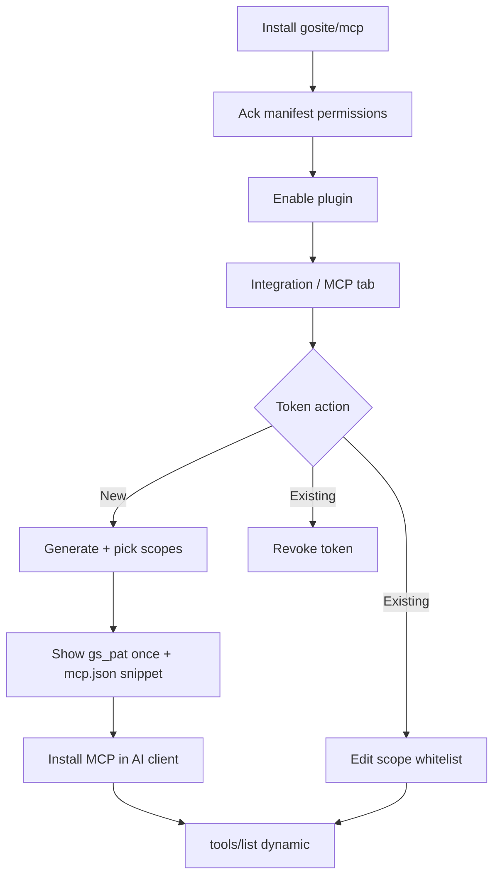

# Sequence: MCP plugin & integration access tokens

Extension of [19-plugin-installer.md](./19-plugin-installer.md) and [20-plugin-remote-distribution.md](./20-plugin-remote-distribution.md).

**Status:** Design — P6-host-auth **implemented** (P6a community repo external; P6c blocked)

**Research:** `research/gosite-mcp-plugin/` (gitignored; blueprint frozen 2026-06-17)

> **Implementation tracker:** [21-plugin-mcp-impl.md](./21-plugin-mcp-impl.md) · [WAVE-PLUGIN-P6.md](../implementation/WAVE-PLUGIN-P6.md)

## Document map

| Topic | Location | Update when |
|-------|----------|-------------|
| Sequence index (this file) | `sequences/21-plugin-mcp.md` | Goals, waves, decisions change |
| Implementation gates | `sequences/21-plugin-mcp-impl.md`, `implementation/WAVE-PLUGIN-P6.md` | PR progress, checkbox status |
| Machine auth & middleware | [architecture/plugin-integration-auth.md](../architecture/plugin-integration-auth.md) | Auth layers, token format, security |
| Token API, DB, lifecycle | [reference/integration-tokens.md](../reference/integration-tokens.md) | Routes, schema, switch reconciliation |
| MCP tools & manifest | [reference/mcp-tools.md](../reference/mcp-tools.md) | Tool catalog, re-introspect, `gosite/mcp` manifest |
| Operator `mcp.json` setup | [guides/mcp-operator.md](../guides/mcp-operator.md) | UX, env vars, troubleshooting |
| Scope registry | [reference/plugin-permissions.md](../reference/plugin-permissions.md) | New scopes, route mapping |
| OpenAPI contract | `api/openapi.yaml` | New/changed HTTP paths |

See [DOCS-MAINTENANCE.md](../DOCS-MAINTENANCE.md) for layer model and release checklist.

## Problem

Operators want AI clients (Cursor, Claude Desktop, OpenClaw, etc.) to call GoSite imperatively — list websites, test nginx, inspect jobs — without clicking the panel.

Hosting panels in the wild ship **external MCP servers** that wrap REST (Portainer, Coolify). GoSite has no MCP surface today. Storing **panel email/password** in `mcp.json` would grant a full session cookie with weak per-agent revoke and no tool scoping.

## Goals

- Official path: catalog plugin **`gosite/mcp`** (Tier 1) + optional community stdio server (`@gosite/mcp`).
- **Machine auth:** panel HTTP Basic (optional, Gin) + **plugin access token** (`gs_pat_*`) — never panel password in MCP env.
- **Operator flow:** install plugin → generate token → **select scope whitelist** → copy to AI client → dynamic `tools/list`.
- Token lifecycle: **generate**, **edit scopes**, **revoke** (multiple tokens per plugin).
- Implement seq 19 deferred **scoped plugin API tokens** for MCP first; generalize to tier-0 webhooks later.

## Non-goals (wave 1)

- Host-native Gin `/mcp` Streamable HTTP route (P6c is a later wave).
- OAuth 2.1 MCP resource server.
- Tier 2 WASM MCP.
- Replacing OpenAPI with MCP-only API surface.

## Prior art

| Product | Pattern |
|---------|---------|
| [Portainer MCP](https://github.com/portainer/portainer-mcp) | External stdio/HTTP; gate token + per-user API key |
| [Coolify MCP](https://github.com/StuMason/coolify-mcp) | External stdio; long-lived API token in env |
| GoSite seq 19 | Manifest `permissions` + install ack — runtime enforcement deferred until this sequence |

**Decision:** external stdio MCP (like Coolify) + **host-issued scoped tokens** (like Portainer keys). Reject host-native `/mcp` on panel port for wave 1.

## Operator flow (locked)

Summary — full guide: [mcp-operator.md](../guides/mcp-operator.md).

```text
1. Install plugin gosite/mcp       → permissions_ack (manifest ceiling)
2. Enable plugin                   → Integration / MCP tab visible
3. Generate access token           → label, optional expiry
4. Select scope whitelist          → subset of manifest permissions
5. (Later) Edit scope whitelist    → PATCH scopes on existing token
6. Copy gs_pat_* once              → mcp.json / Cursor MCP settings
7. AI client spawns MCP stdio      → tools/list = scoped subset only
```



**Manifest `permissions`** = hard ceiling. Token `scopes[]` ⊆ manifest. Canonical scope strings: [plugin-permissions.md](../reference/plugin-permissions.md).

## Delivery waves

```text
P6-host-auth  →  tokens DB, middleware, API, UI, OpenAPI, audit
       ↓
P6a           →  operator guide + community @gosite/mcp template (stdio)
       ↓
P6b           →  official catalog plugin + plugins/_templates/tier1-mcp/
       ↓
P6c           →  Streamable HTTP MCP (TLS, Origin, PLUGIN_MCP_ALLOWED_HOSTS) — blocked
```

| Wave | Doc focus | Tracker |
|------|-----------|---------|
| P6-host-auth | [integration-tokens.md](../reference/integration-tokens.md), [plugin-integration-auth.md](../architecture/plugin-integration-auth.md) | H1–H5 in [21-plugin-mcp-impl.md](./21-plugin-mcp-impl.md) |
| P6a | [mcp-operator.md](../guides/mcp-operator.md) | A1–A4 |
| P6b | [mcp-tools.md](../reference/mcp-tools.md) | B1–B6 |
| P6c | [mcp-tools.md#p6c--http-remote-blocked](../reference/mcp-tools.md#p6c--http-remote-blocked) | — |

## Relationship to seq 19

| Seq 19 item | This sequence |
|-------------|---------------|
| Scoped plugin API tokens (deferred) | **P6-host-auth implements** for MCP |
| Manifest `permissions` + ack | Ceiling for token scopes |
| Version `switch` | Triggers scope reconciliation on active tokens — [integration-tokens.md](../reference/integration-tokens.md#version-switch-reconciliation) |
| Egress policy | Unchanged — separate concern |
| `permissions_acked_caps` | Source for scope picker max set |

## Decisions (locked 2026-06-17)

| Topic | Decision |
|-------|----------|
| Token rotation | Revoke old + create new (new UUID). No re-issue secret on same row. |
| Token FK | `plugin_id` (`vendor/name`), not `plugin_version_id` — tokens survive version switch |
| Disable vs uninstall | Disable suspends (401, record kept); uninstall hard-revokes |
| Manifest shrink on switch | Auto-truncate scopes; hard-revoke if empty; emit `scopes_truncated` then `revoked` on hard-revoke path |
| Switch reconciliation timing | After switch fully committed (`enabled` written); never during transition or failed switch |
| Re-introspect retry | Retry once only if tool still in rebuilt registry after 403/401 |
| `last_used_at` vs audit dedup | `last_used_at` updates every call; 60s dedup is audit-log noise control only |
| Re-introspect | Lazy on 403/401 + on-demand on `tools/list`; no periodic poll; scope add needs restart; conditional retry — [mcp-tools.md](../reference/mcp-tools.md#re-introspect-policy-locked) |
| Token expiry mid-session | Lazy invalidation on first 401 — expected behavior |
| Artifact location | Official tier-1 plugin in monorepo (`plugins/gosite/mcp/`); community `@gosite/mcp` stdio in separate repo |
| go-sdk / MCP spec | P6a: experimental pre-GA (`2025-11-25`); P6b: hold until ~2 weeks post GA (`2026-07-28`); transport abstraction in template |
| Audit `used` volume | Per-call with 60s dedup per `token_id+route` |
| Label uniqueness | Optional per `plugin_id`; audit always uses token UUID |

## References

- [plugin-integration-auth.md](../architecture/plugin-integration-auth.md)
- [integration-tokens.md](../reference/integration-tokens.md)
- [mcp-tools.md](../reference/mcp-tools.md)
- [mcp-operator.md](../guides/mcp-operator.md)
- [plugin-permissions.md](../reference/plugin-permissions.md)
- [overview.md](../architecture/overview.md)
- [plugin-platform.md](../architecture/plugin-platform.md)
- [03-authentication.md](./03-authentication.md)
- [19-plugin-installer.md](./19-plugin-installer.md)
- [api/openapi.yaml](../../api/openapi.yaml)
