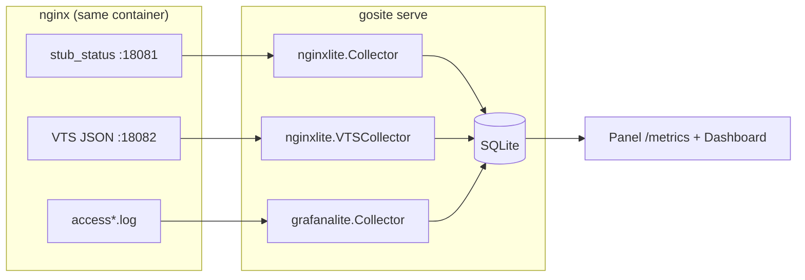
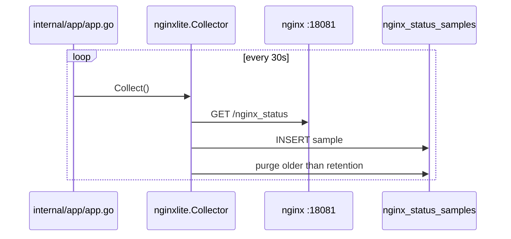

# Sequence: Nginx metrics (stub_status + VTS)

Real-time nginx performance metrics without Prometheus/Grafana — co-located collector on the same VM/container as GoSite.

**Status:** ✅ Implemented — `internal/observability/nginxlite`

**Research:** `research/nginx-monitoring-without-prometheus/brief.md` (gitignored)

**Impl tracker:** [WAVE-SA-8](../implementation/WAVE-SA-8.md)

## Observability stack (three layers)

| Layer | Package | Source | Granularity | UI |
|-------|---------|--------|-------------|-----|
| Traffic (historical) | `grafanalite` | Access log tail | 5m buckets | `/metrics` tab **Traffic** |
| Connections (real-time) | `nginxlite` stub_status | `127.0.0.1:18081` | 30s samples | `/metrics` tab **Nginx**, Dashboard |
| Per-vhost / upstream | `nginxlite` VTS | `127.0.0.1:18082` | 30s snapshots | `/metrics` tab **Nginx** (VTS tables) |

Log-based traffic unchanged — see [18-grafana-lite.md](./18-grafana-lite.md).

## Architecture



## Wave 1 — stub_status

### Nginx config

`config/nginx/custom.d/stub-status.conf` — localhost only:

```nginx
server {
    listen 127.0.0.1:18081;
    location /nginx_status {
        stub_status;
        allow 127.0.0.1;
        deny all;
    }
}
```

### Collector



**Sample fields:** `active`, `reading`, `writing`, `waiting`, `accepts`, `handled`, `requests` (cumulative).

**Rates (query time):** between consecutive samples, `request_rate_per_sec` = Δrequests/Δtime, `accept_rate_per_sec` = Δaccepts/Δtime, `handled_rate_per_sec` = Δhandled/Δtime. `dropped_connections` = `accepts − handled` from the latest sample.

**Counter reset:** if any cumulative counter decreases vs the previous sample (nginx restart/reload), rates are `null` and `counter_reset: true` — never emit a fake zero rate.

**Collector failure:** poll error → log + skip insert (no zero sample). Next successful poll resumes the series.

**Retention:** `nginx_status_samples` and VTS tables share `LOG_EVENTS_RETENTION_DAYS` (default **14**). At ~2880 rows/day (30s interval), expect ~40k stub_status rows at default retention.

### API

| Method | Path | Query | Response |
|--------|------|-------|----------|
| GET | `/metrics/nginx/current` | — | Latest sample + rates + `dropped_connections` + `counter_reset` |
| GET | `/metrics/nginx/series` | `range` | `active`, `reading`, `writing`, `waiting`, `request_rate` series (`null` rate after counter reset) |

Supported `range`: `1h`, `6h`, `24h`, `7d` (step `30s`).

### UI

- **Traffic** (`/metrics`) → tab **Nginx** (when `ui/meta.nginx.stub_status.enabled`)
- **Dashboard** → optional `nginx_status` row when samples exist

### Storage

| Table | Migration |
|-------|-----------|
| `nginx_status_samples` | `009_nginx_status_samples.sql` |

## Wave 2 — VTS

### Custom nginx image

Official `nginx:1.30.2` does not ship VTS. Production image runs `docker/nginx-vts/build.sh` during `docker build`:

1. Clone `nginx-module-vts`
2. Re-run `./configure` with stock `nginx -V` flags + `--add-module`
3. Replace `/usr/sbin/nginx`

Dockerfile sets `ENV GOSITE_NGINX_VTS_URL=http://127.0.0.1:18082/status/format/json`.

### Nginx config

`config/nginx/custom.d/vts.conf`:

```nginx
vhost_traffic_status_zone shared:gosite_vts:32m;

server {
    listen 127.0.0.1:18082;
    location /status {
        vhost_traffic_status_display;
        vhost_traffic_status_display_format json;
        allow 127.0.0.1;
        deny all;
    }
}
```

Per-site templates (`config/webconfig/site.conf`, `site-proxy.conf`) include `vhost_traffic_status;` on the HTTPS `server` block so `serverZones` populate per domain.

> **Note:** `proxy_pass` to a raw URL (no `upstream {}` block) may not produce `upstreamZones` peers. Server-zone metrics per domain still work after traffic flows.

### Collector

Same 30s ticker as stub_status (`runNginxVTSCollector` in `internal/app/app.go`). Parses VTS JSON → inserts rows into `nginx_vts_server_samples` and `nginx_vts_upstream_samples`.

### API

| Method | Path | Query | Response |
|--------|------|-------|----------|
| GET | `/metrics/nginx/vts/status` | — | `{ enabled, hint? }` |
| GET | `/metrics/nginx/vts/servers` | `limit` | Ranked server zones (latest snapshot) |
| GET | `/metrics/nginx/vts/upstreams` | `limit` | Ranked upstream peers (latest snapshot) |

### UI

Traffic → **Nginx** tab → cards **VTS server zones** and **VTS upstream peers** when `ui/meta.nginx.vts.enabled`.

### Storage

| Table | Migration |
|-------|-----------|
| `nginx_vts_server_samples` | `010_nginx_vts_samples.sql` |
| `nginx_vts_upstream_samples` | `010_nginx_vts_samples.sql` |

## Environment

| Variable | Default (production image) | Effect |
|----------|----------------------------|--------|
| `GOSITE_NGINX_STUB_STATUS_URL` | `http://127.0.0.1:18081/nginx_status` | stub_status collector URL; empty disables |
| `GOSITE_NGINX_VTS_URL` | `http://127.0.0.1:18082/status/format/json` | VTS collector URL; empty disables |
| `LOG_EVENTS_RETENTION_DAYS` | `14` | Purge age for `nginx_status_samples` and VTS tables |
| `APP_ENV=local` | both empty unless env set explicitly | Avoids collector noise without nginx |

`GET /ui/meta` exposes `nginx.stub_status` and `nginx.vts` capability flags for the Preact shell.

## Dashboard integration

`GET /dashboard` response may include:

```json
{
  "nginx_status": {
    "available": true,
    "active": 12,
    "reading": 1,
    "writing": 3,
    "waiting": 8,
    "accepts": 50200,
    "handled": 50200,
    "requests": 120400,
    "dropped_connections": 0,
    "request_rate_per_sec": 4.25,
    "accept_rate_per_sec": 1.1,
    "handled_rate_per_sec": 1.1,
    "counter_reset": false
  }
}
```

Omitted when no stub_status samples yet.

## Security

- Status endpoints bind `127.0.0.1` only — never on :80/:443
- Panel API routes require session (+ basic auth when enabled)
- Plugin scope `metrics:read` covers traffic + nginx metrics endpoints

## Packages

| Path | Role |
|------|------|
| `internal/observability/nginxlite/stub_status.go` | Parse stub_status text |
| `internal/observability/nginxlite/collector.go` | stub_status poll |
| `internal/observability/nginxlite/vts.go` | Parse VTS JSON |
| `internal/observability/nginxlite/vts_collector.go` | VTS poll |
| `internal/observability/nginxlite/service.go` | Query API |
| `internal/repository/sqlite/nginx_status.go` | stub_status persistence |
| `internal/repository/sqlite/nginx_vts.go` | VTS persistence |
| `internal/delivery/http/handler/observability.go` | HTTP handlers |
| `web/src/views/Metrics.tsx` | Traffic + Nginx tabs |

## Verification

```bash
# In running container
curl -s http://127.0.0.1:18081/nginx_status
curl -s http://127.0.0.1:18082/status/format/json | head

go test ./internal/observability/nginxlite/...
```

## Related

- [04-dashboard.md](./04-dashboard.md) — `nginx_status` on dashboard snapshot
- [18-grafana-lite.md](./18-grafana-lite.md) — log-based traffic (complementary)
- [15-logs.md](./15-logs.md) — raw log tail
- `api/openapi.yaml` — canonical HTTP contract (Metrics tag)
