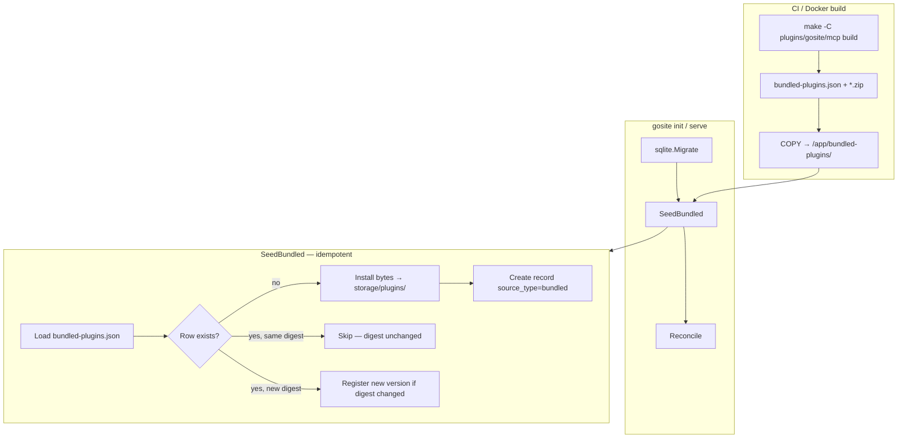
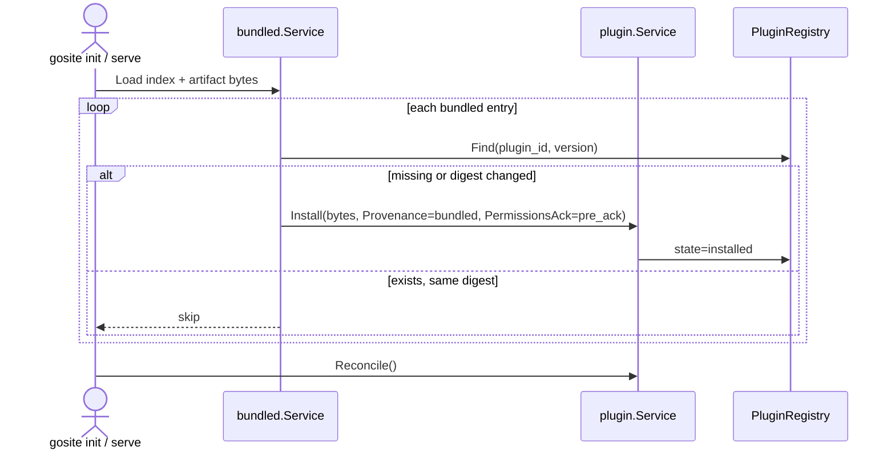

# Sequence: Built-in plugins (ship with GoSite, disabled by default)

Extension of [19-plugin-installer.md](./19-plugin-installer.md), [20-plugin-remote-distribution.md](./20-plugin-remote-distribution.md), and [21-plugin-mcp.md](./21-plugin-mcp.md).

**Status:** Design — not implemented

> **Implementation tracker:** [23-builtin-plugins-impl.md](./23-builtin-plugins-impl.md) · [WAVE-PLUGIN-B.md](../implementation/WAVE-PLUGIN-B.md)

## Document map

| Topic | Location | Update when |
|-------|----------|-------------|
| Sequence index (this file) | `sequences/23-builtin-plugins.md` | Goals, waves, decisions change |
| Implementation gates | `sequences/23-builtin-plugins-impl.md`, `implementation/WAVE-PLUGIN-B.md` | PR progress, checkbox status |
| Plugin lifecycle | [19-plugin-installer.md](./19-plugin-installer.md) | Shared state machine |
| Remote / catalog install | [20-plugin-remote-distribution.md](./20-plugin-remote-distribution.md) | Path A/B vs Path C (bundled) |
| MCP operator flow | [guides/mcp-operator.md](../guides/mcp-operator.md) | Step 0 auto-install |
| Plugin platform ADR | [plugin-platform.md](../architecture/plugin-platform.md) | Phase P7 |

See [DOCS-MAINTENANCE.md](../DOCS-MAINTENANCE.md) for layer model and release checklist.

## Problem

Sequences 19–21 deliver a full plugin platform: registry, remote install, and `gosite/mcp` as an official tier-1 plugin in `plugins/gosite/mcp/`. **None of that registers plugins automatically.**

Today:

```text
gosite init / serve → Reconcile() → registry empty → panel shows "No plugins installed"
```

Operators who expect **GoSite MCP** (seq 21) must manually build, upload, or install from GitHub/catalog — even though the plugin source ships in the monorepo and the Docker image already contains the host binary.

**Gap:** no **Path C** — plugins **included in the GoSite release**, pre-registered as `installed`, **disabled by default**.

| Install path | Source | Operator friction |
|--------------|--------|-------------------|
| Path A (seq 20) | GitHub release zip | Build CI, signing, fetch |
| Path B (seq 20) | Git tag + Docker builder | Network build on host |
| **Path C (this seq)** | **Bundled in image / binary** | **Enable only** |

## Goals

- Official plugins ship inside every GoSite release (Docker image minimum).
- On first boot / upgrade, host **seeds** registry rows — state `installed`, **not** `enabled`.
- Reuse seq 19 `Install(bytes)` + lifecycle; no parallel boolean flags.
- First built-in: **`gosite/mcp`** (unblocks seq 21 operator flow without manual install).
- Extensible index for future official plugins (observability, etc.).

## Non-goals (wave B)

- Auto-enable bundled plugins in production (`PLUGIN_BUNDLED_AUTO_ENABLE` dev-only).
- Replacing remote install or catalog for community plugins.
- Embedding tier-2 WASM or unsigned community artifacts.
- Built-in plugins that bypass manifest permissions or enable without operator ack (except pre-ack for `gosite/*` official ids).

## Design principles

| Principle | Decision |
|-----------|----------|
| Lifecycle | Seq 19 state machine — `installed` → `enabling` → `enabled` |
| Default state | `installed`, `enabled=false` |
| Trust | `source_type=bundled` — host-trusted; no external vendor signature required |
| Uninstall | Allowed; **Restore bundled** action or reconcile re-seed when `restorable` |
| Host upgrade | New bundled digest → new version row `installed`; **no auto-switch** |
| UI | **Built-in** badge; empty state points to enable, not upload |
| Scope wave 1 | `gosite/mcp` only; index pattern for more official plugins |

## Architecture



**Separation of concerns** (same as seq 20):

- **Build** — plugin Makefile + Docker multi-stage
- **Index** — `bundled-plugins.json` (lightweight manifest, not full zip)
- **Seed** — reuse `Install(bytes)` with bundled provenance
- **Reconcile** — existing startup path; does **not** auto-enable

## Bundled index

Package: `internal/service/plugin/bundled/` (pattern: `catalog/service.go` with `go:embed` + path override).

```json
{
  "apiVersion": "gosite-plugin-bundled/1",
  "plugins": [
    {
      "plugin_id": "gosite/mcp",
      "artifact": "gosite-mcp.zip",
      "permissions_pre_ack": true,
      "restorable": true
    }
  ]
}
```

| Field | Purpose |
|-------|---------|
| `artifact` | Zip filename relative to bundled directory |
| `permissions_pre_ack` | Set `permissions_ack_at` at seed for official plugins |
| `restorable` | Show **Restore bundled** after uninstall; reconcile may re-seed |

Env: `PLUGIN_BUNDLED_PATH` (default `/app/bundled-plugins` in image; embed fallback for single-binary dev).

## Provenance: `source_type=bundled`

Extend provenance schema (migration 009):

| Column | Seed value |
|--------|------------|
| `source_type` | `bundled` |
| `source_ref` | `gosite@<AppVersion>` |
| `install_path` | `bundled` |
| `signing_key_id` | `gosite-official` (optional) |
| `source_repository` | monorepo URL (informational) |

**Trust policy:**

- `verifyArtifact()` skips external signature for `source_type=bundled`, **or**
- Host ships `gosite-official-1` in default keyring and signs bundled zips at build time.

Bundled plugins are **not** exempt from `minGoSiteVersion` or capability validation.

## Seed flow



**Hooks:**

1. `bootstrap.Init()` — after migrate (first boot)
2. Start of `plugin.Service.Reconcile()` — catch-up after image upgrade

**Idempotency:**

```text
FOR each entry in bundled index:
  IF NOT exists(plugin_id, version) OR artifact digest changed:
    Install(bytes) → installed
  ELIF state=uninstalled AND restorable:
    optional re-seed (policy: restore on reconcile OR manual API)
  ELSE skip
```

**Never** call `Enable()` during seed — disabled by default.

## Build & packaging

**Dockerfile** (`gobuilder` stage):

```dockerfile
RUN make -C plugins/gosite/mcp build vet
COPY plugins/gosite/mcp/dist/gosite-mcp.zip /out/bundled-plugins/
COPY internal/service/plugin/bundled/index.json /out/bundled-plugins/bundled-plugins.json
```

Runtime image:

```dockerfile
COPY --from=gobuilder /out/bundled-plugins /app/bundled-plugins
ENV PLUGIN_BUNDLED_PATH=/app/bundled-plugins
```

**Local dev:** root `Makefile` target `bundled-plugins` — build official plugins → `dist/bundled-plugins/`.

## Host configuration

| Env | Default | Purpose |
|-----|---------|---------|
| `PLUGIN_BUNDLED_ENABLED` | `true` | Disable all seeding (air-gap without bundled) |
| `PLUGIN_BUNDLED_PATH` | `/app/bundled-plugins` | Override bundled directory |
| `PLUGIN_BUNDLED_AUTO_ENABLE` | `false` | Dev only — auto-enable official plugins after seed |

`PLUGIN_BUNDLED_AUTO_ENABLE=true` only when `APP_ENV != production`.

## Admin panel UX

| Area | Change |
|------|--------|
| Empty state | "Built-in plugins available — enable **GoSite MCP** to get started" |
| Registry badge | **Built-in** when `source_type=bundled` |
| Detail aside | Source: `Bundled with GoSite v<AppVersion>` |
| Uninstall confirm | Hint: **Restore bundled** available |
| Disabled route | Unchanged seq 19 fallback + Enable CTA |
| Settings → Plugins | Read-only row: bundled seeding enabled/disabled |

### Restore bundled

```http
POST /api/v1/plugins/{id}/restore-bundled
```

Re-runs seed for one `plugin_id` from bundled index. Returns `409` if not `restorable` or bundled disabled.

Alternative: reconcile auto-restore when `restorable=true` and no installed version exists — document chosen policy in impl.

## Upgrade policy (host version bump)

| Scenario | Behaviour |
|----------|-----------|
| Host 1.4.0 → 1.5.0, MCP 0.1.0 → 0.2.0 | Seed creates `0.2.0` as `installed`; `0.1.0` remains |
| `0.1.0` enabled | **No** auto-switch — banner "Built-in update available" |
| Operator uninstalls `0.2.0` | Restore or reconcile re-seed if `restorable` |

Bundled version = `manifest.version` in zip (not `AppVersion`). Coupling via `minGoSiteVersion`.

## Uninstall & restore

| Action | Built-in behaviour |
|--------|-------------------|
| Disable | Same as any plugin |
| Uninstall | Allowed — artifact removed, row `uninstalled` |
| Restore | `POST .../restore-bundled` or reconcile re-seed |
| Purge | Admin-only; restore requires re-seed |

## Relationship to seq 19 / 20 / 21

| Sequence | Impact |
|----------|--------|
| **19** | Reuse `Install` + state machine; `source_type=bundled`; no bypass |
| **20** | Catalog/remote remain for community; bundled = Path C |
| **21** | MCP visible after seed; operator skips manual install |

**Revised seq 21 operator flow:**

```text
0. (automatic) gosite/mcp seeded on init          ← new
1. Enable plugin
2. Generate access token + scope whitelist
3. Copy mcp.json → AI client
```

Update [mcp-operator.md](../guides/mcp-operator.md) when B2 ships.

## Delivery waves

```text
B1  →  bundled package, SeedBundled, migration, Dockerfile
  ↓
B2  →  gosite/mcp first built-in + UI badges + operator doc
  ↓
B3  →  upgrade diff seed, restore API, audit
  ↓
B4  →  optional: second official plugin, catalog "bundled" flag
```

| Wave | Focus | Tracker |
|------|-------|---------|
| **B1** | Infrastructure | [23-builtin-plugins-impl.md](./23-builtin-plugins-impl.md) |
| **B2** | `gosite/mcp` + panel | same |
| **B3** | Upgrade + restore | same |
| **B4** | Later official plugins | deferred |

## Risks & mitigations

| Risk | Mitigation |
|------|------------|
| Image size (+5–15 MiB per tier-1) | One official plugin in B2; multi-arch in CI |
| GOOS/ARCH mismatch | Platform-specific build in Docker stage |
| Seed race with remote install | Per-`plugin_id` op lock (seq 20) |
| Install vs enable confusion | UI copy + operator guide |
| Strict trust mode rejects unsigned | `bundled` exempt in `verifyArtifact` |

## Success criteria

- [ ] Fresh `gosite init` → registry has `gosite/mcp` `installed`, not `enabled`
- [ ] Panel `/plugins` lists MCP without manual upload/GitHub
- [ ] Enable → Integration tab + token API work (seq 21)
- [ ] Image upgrade registers new bundled version; no auto-switch
- [ ] Uninstall → restore bundled available
- [ ] `PLUGIN_BUNDLED_ENABLED=false` → no seed (air-gap)
- [ ] Remote catalog install of `gosite/mcp` still works as upgrade alternative
- [ ] Audit event `plugin.bundled_seeded` queryable in Splunk-lite

## Open questions

1. **Reconcile auto-restore** vs manual-only `restore-bundled` API?
2. **Pre-ack scope** — all `gosite/*` ids or per-index flag only?
3. **Catalog entry** — add `"bundled": true` to skip redundant remote install CTA?
4. **Single-binary** — `go:embed` all platform zips vs ship linux/amd64 only in image?

## References

- [19-plugin-installer.md](./19-plugin-installer.md)
- [20-plugin-remote-distribution.md](./20-plugin-remote-distribution.md)
- [21-plugin-mcp.md](./21-plugin-mcp.md)
- [plugin-platform.md](../architecture/plugin-platform.md)
- [plugins/gosite/mcp/](../../plugins/gosite/mcp/)
- [mcp-operator.md](../guides/mcp-operator.md)
