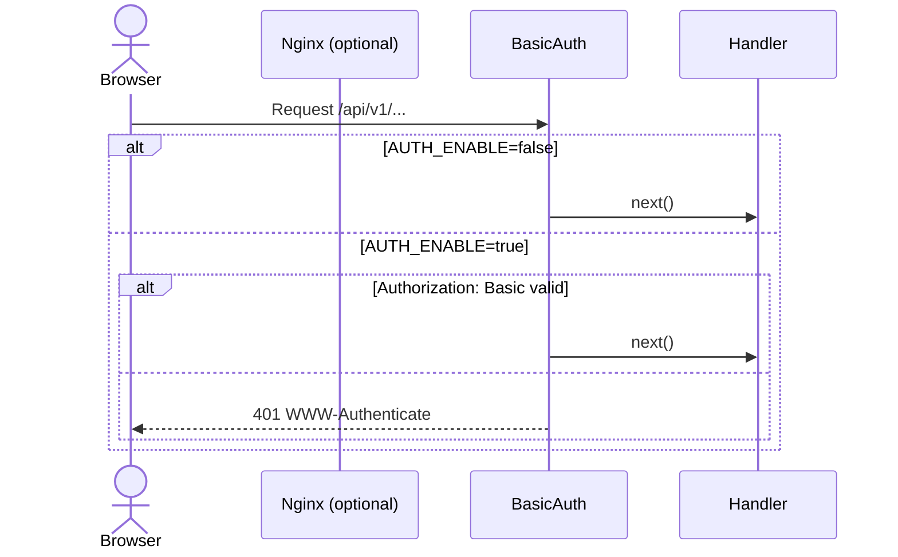
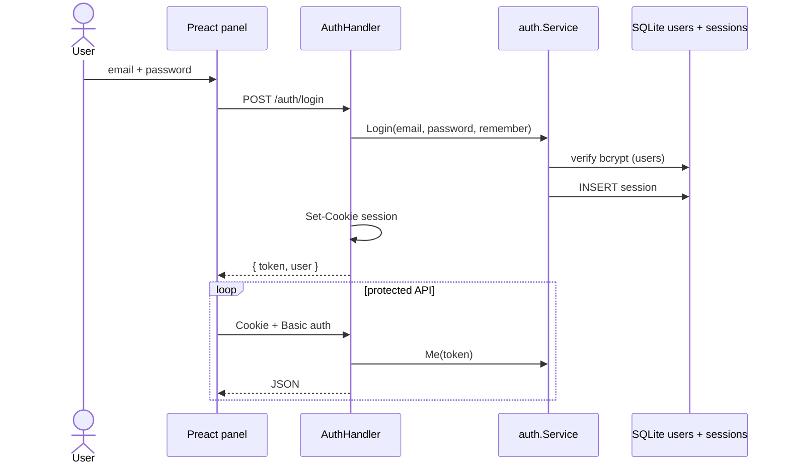

> **Bahasa Indonesia:** [Authentication-id](Authentication-id)

Dua lapisan: **HTTP Basic Auth** (edge) dan **session panel** (SQLite).

## GoSite (implementation)

### 1. HTTP Basic Auth (opsional)

**Middleware:** `middleware.BasicAuth` — semua `/api/v1/*`

| Env | Default |
|-----|---------|
| `AUTH_ENABLE` | `true` |
| `AUTH_USER` / `AUTH_PASS` | `admin` / `admin` |

### 2. Login & session

**Routes:** `/api/v1/auth/*`

| Method | Path | Auth |
|--------|------|------|
| GET | `/auth/login` | Public — metadata lockscreen, hints |
| POST | `/auth/login` | Public |
| POST | `/auth/logout` | Session |
| GET | `/auth/me` | Session |
| GET | `/auth/lockscreen` | Session |
| POST | `/auth/lock` | Session |
| POST | `/auth/unlock` | Session — re-auth password |

Session stored in SQLite (`sessions` table) with HTTP-only cookie. Lockscreen state in-memory (`auth.Lockscreen`).

Default seed: `admin@demo.com` / `123456`.

### Protected routes

Semua `/api/v1/*` kecuali `GET/POST /auth/login` dan `GET /auth/login` metadata membutuhkan:

1. Basic auth (when enabled)
2. Session cookie valid (`middleware.RequireSession`)

---

## Code

| Paket | Role |
|-------|-------|
| `internal/service/auth` | Login, logout, me, lock/unlock |
| `internal/delivery/http/middleware` | BasicAuth, RequireSession |
| `internal/repository/sqlite` | users, sessions |
