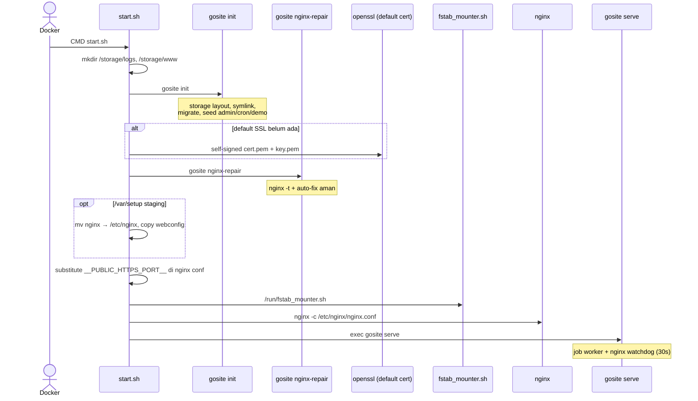

> **English:** [Container-startup](Container-startup)

Proses saat container GoSite pertama kali (atau restart) dijalankan.

**Entrypoint:** `config/start.sh` → nginx + `gosite serve`

## GoSite (implementasi saat ini)

### Proses runtime

| Proses | Command | Catatan |
|--------|---------|---------|
| nginx | `nginx -c /etc/nginx/nginx.conf` | Di-start dari `start.sh`; reload/restart via Go |
| gosite | `gosite serve` | PID 1; watchdog start ulang nginx jika mati |

Cron job renewal & manual run dikelola **job worker** di dalam proses `gosite serve`, bukan proses PHP terpisah.

### `gosite init` (bootstrap)

| Langkah | Output |
|---------|--------|
| `createStorageLayout` | `/storage/webconfig`, `site.d`, `active.d`, `logs`, … |
| `copyTemplatesIfMissing` | Template dari image → storage |
| `createSymlinks` | `/etc/nginx` → `/storage/nginx`, `/etc/letsencrypt` → `/storage/webconfig/ssl`, `/www` → `/storage/www` |
| `sqlite.Migrate` | Schema `db.sqlite` |
| `seedAdminIfEmpty` | User demo |
| `seedDefaultCronIfEmpty` | `certbot renew --post-hook 'nginx -s reload'` |
| `seedDemoIfNeeded` | Website demo (jika `DEMO_SEED=true`) |

### Boot nginx repair

`gosite nginx-repair` dijalankan **setelah** default SSL dibuat agar fallback repair bisa mengarahkan vhost ke cert default. Lihat [nginx-repair.md](Nginx-auto-repair-id).

---

## Invariant produksi

- Struktur `/storage` kompatibel dengan deploy BangunSite lama
- Symlink `/etc/letsencrypt` → `/storage/webconfig/ssl` — path yang sama dipakai Certbot dan placeholder Gosite
