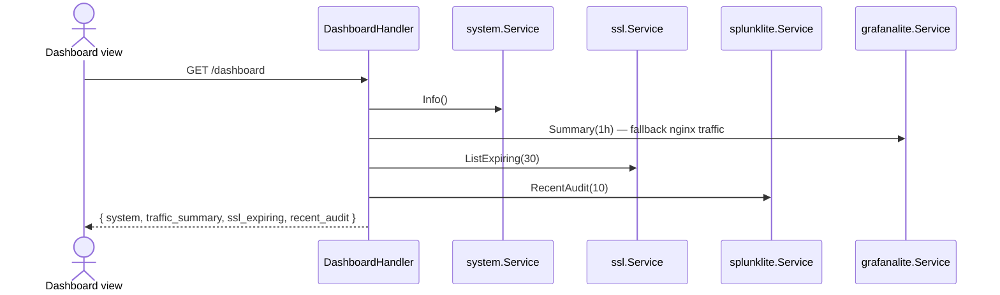

> **English:** [Dashboard](Dashboard)

Dashboard menggabungkan snapshot server, traffic, SSL expiry, dan audit feed.

## GoSite (implementasi)

### Initial load — aggregated dashboard

**API:** `GET /api/v1/dashboard` (session required)

Response sections:

| Key | Sumber |
|-----|--------|
| `system` | CPU, memory, storage (`/proc`, `df`) |
| `traffic_summary` | Grafana Lite `Summary(1h)` atau fallback `system.NginxTraffic` |
| `ssl_expiring` | Cert expiry ≤ 30 hari |
| `recent_audit` | 10 audit log terakhir |

### Polling detail (opsional)

Frontend dapat memanggil endpoint granular untuk chart live:

| Method | Path | Data |
|--------|------|------|
| GET | `/system/info` | CPU, memory, storage |
| GET | `/system/network` | `/proc/net/dev` |
| GET | `/system/disk-io` | disk I/O stats |
| GET | `/system/nginx-traffic` | Parse access log per site |

Semua endpoint di grup **protected** — wajib session (+ basic auth jika enabled).

### Traffic metrics (Grafana Lite)

Chart traffic memakai pre-aggregated buckets — lihat [18-grafana-lite.md](Observability-id).

Collector berjalan setiap 5 menit di background (`internal/app/app.go`).

---

## Kode

| Paket | Peran |
|-------|-------|
| `internal/delivery/http/handler/dashboard.go` | Aggregator |
| `internal/service/system` | Host metrics |
| `internal/observability/grafanalite` | Traffic buckets |
