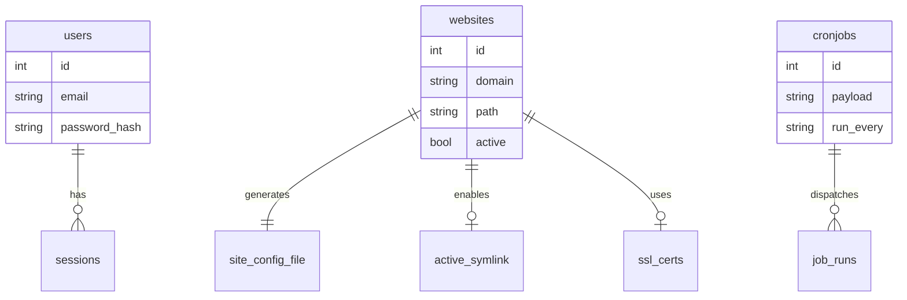
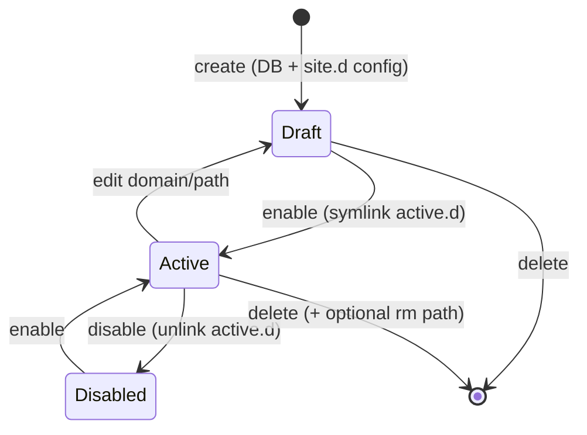

> **Bahasa Indonesia:** [Domain-model-id](Domain-model-id)

Entities and filesystem artifacts the Go backend must understand.

## Database entities (SQLite)

### `users`

| Column | Type | Notes |
|--------|------|-------|
| id | int | PK |
| name | string | Display name |
| email | string | Login identifier |
| password | string | bcrypt hash |
| timestamps | | created_at, updated_at |

Default seed: `admin@demo.com` / `123456`

### `websites`

| Column | Type | Notes |
|--------|------|-------|
| id | int | PK |
| name | string | Display label |
| domain | string | nginx `server_name` |
| path | string | document root (`/www/...`) |
| ssl | bool | SSL enabled flag (legacy) |
| config | text | Extra config (rarely used) |
| active | bool | Site enabled (`active.d` symlink) |
| timestamps | | |

### `cronjobs`

| Column | Type | Notes |
|--------|------|-------|
| id | int | PK |
| name | string | Label |
| payload | string | Shell command |
| run_every | string | `min` \| `hour` \| `day` \| `month` |
| executed_at | datetime | Last run |
| timestamps | | |

Default seed: Let's Encrypt renewal — `certbot renew --post-hook 'nginx -s reload'`

### `settings`

Key-value store (migrations exist; minimally used in legacy).

### `job_runs` (GoSite)

| Column | Type | Notes |
|--------|------|-------|
| id | int | PK |
| job_type | string | `certbot`, `cron`, … |
| name | string | Label (e.g. domain) |
| status | string | `pending`, `running`, `ok`, `failed`, `cancelled` |
| output | text | Command + stdout/stderr |
| error | text | Failure message |
| timestamps | | |

Certbot and manual cron runs share the same worker (`internal/infra/job/worker.go`). Output is streamed via SSE.

### `jobs` / `failed_jobs` (legacy Laravel)

## Filesystem artifacts (not in DB)

### Per-domain nginx vhost

- **Draft:** `/storage/webconfig/site.d/{domain}.conf`
- **Active:** `/storage/webconfig/active.d/{domain}.conf` → symlink to `site.d/`
- **Template:** `/storage/webconfig/site.conf` with placeholders `<domain>`, `<path>`, `<ssl_cert>`, `<ssl_key>`

### Per-domain SSL

- Default: `/storage/webconfig/ssl/live/default/cert.pem` + `key.pem` (self-signed at boot)
- Website create placeholder: `/storage/webconfig/ssl/live/{domain}/cert.pem` + `key.pem`
- Let's Encrypt (after certbot): `live/{domain}/fullchain.pem`, `privkey.pem` (+ symlinks to `archive/`)
- **Symlink:** `/etc/letsencrypt` → `/storage/webconfig/ssl` (created by `gosite init`)

Certbot refuses to create a lineage when `live/{domain}/` already exists as a Gosite placeholder. The SSL service runs `prepareForCertbot` before enqueue (see [sequences/08-website-ssl.md](SSL-and-Certbot)).

### Per-domain nginx logs

- Access: `/storage/logs/access-{domain}.log`
- Error: `/storage/logs/error-{domain}.log`
- Global: `access.log`, `error.log`

## Conceptual relationships

## State: website lifecycle

## Business validation (must be preserved)

| Rule | Legacy check |
|------|--------------|
| Domain format | `FILTER_VALIDATE_DOMAIN` |
| Unique path | Must not be used by another website |
| Safe path | `Disk::validatePath()` — block traversal/illegal chars |
| Path not a file | `is_file($path)` rejected |
| Nginx config | `nginx -t` before reload; rollback on failure |
| PHP/FPM config | `php -nc` / `php-fpm -t` before save |
| Login | Rate limit 5× / 60 seconds per IP |
| File execute | Minimum permission 775 |

## Relevant environment variables

| Var | Default | Effect |
|-----|---------|--------|
| `AUTH_ENABLE` | false | HTTP Basic Auth in front of login |
| `AUTH_USER` / `AUTH_PASS` | admin/admin | Basic auth credentials |
| `ENABLE_LOCKSCREEN` | false | Auto-lock session |
| `LOCK_AFTER` | 300 | Idle seconds before lock |
| `WEB_PATH` | /www | File manager root & default site |
| `MAIL_NOTIFICATION` | true | Email on sensitive actions |
| `DB_DATABASE` | /storage/db.sqlite | SQLite path |
