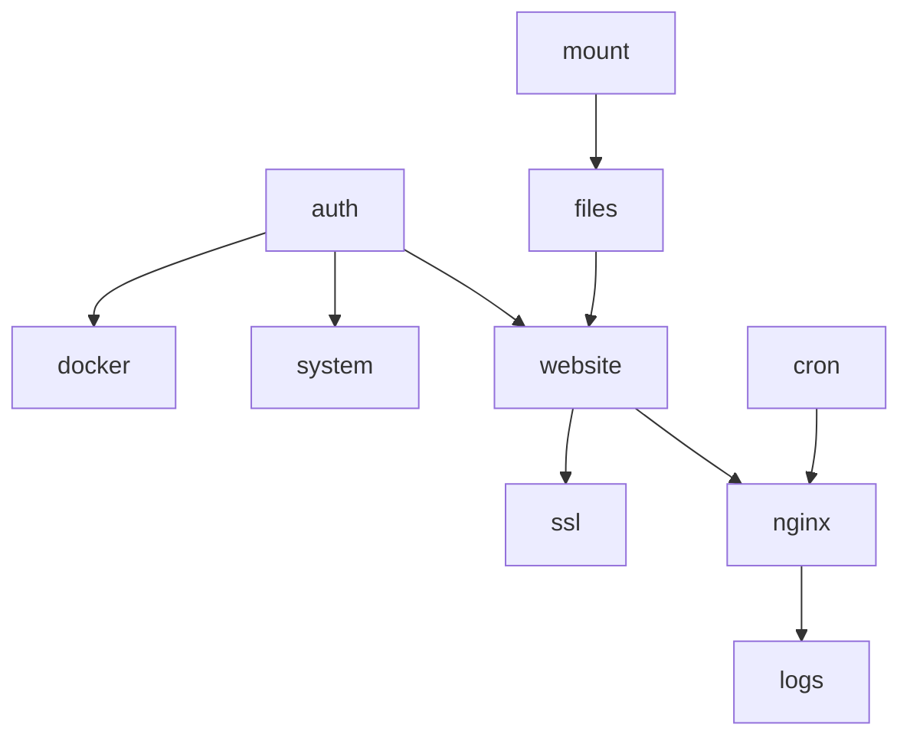

> **Bahasa Indonesia:** [Migration-id](Migration-id)

## Migration

Migration support documents for BangunSite → GoSite.

| File | Contents |
|------|----------|
| [backend-modules.md](Migration) | Go packages, implementation phases, dependencies |

## Status

| Area | Documentation | Go implementation |
|------|---------------|-------------------|
| Sequence diagrams | ✅ 18 modules | ✅ |
| API inventory + OpenAPI | ✅ | ✅ |
| Domain model | ✅ | ✅ |
| Nginx auto-repair | ✅ | ✅ |
| Certbot + SSE | ✅ | ✅ |

## Suggested steps

1. Deploy the latest image (`make up`) and verify the production stack
2. Review [api-inventory.md](API-reference) against handler implementation
3. Update the wiki via `make wiki-export` after `docs/` changes

---

## Backend Modulees — Go implementationSite

Package layout and Laravel → Go migration status.

## Actual package structure

```text
gosite/
├── cmd/gosite/              # serve | init | migrate | nginx-repair
├── api/openapi.yaml         # REST contract
├── internal/
│   ├── app/                 # RunServe, RunNginxRepair
│   ├── bootstrap/           # init, demo seed, symlinks
│   ├── config/
│   ├── delivery/http/       # handler, router, middleware, frontend embed
│   ├── infra/
│   │   ├── nginx/           # runner, service, repair, templates
│   │   ├── job/             # worker, SSE stream
│   │   ├── commander/
│   │   └── docker/
│   ├── observability/       # splunklite, grafanalite
│   ├── repository/sqlite/
│   └── service/             # auth, website, ssl, cron, files, …
├── web/                     # Preact SPA
├── config/                  # nginx, webconfig, start.sh
└── docs/
```

## Layers

```
handler/     → HTTP, binding, status code
service/     → business rules, validation, orchestration
repository/  → SQLite
infra/       → nginx, job worker, exec, filesystem
```

## Phase status

### Phase 0 — Foundation ✅

| Task | Package |
|------|-------|
| `gosite init`, storage symlinks | `internal/bootstrap` |
| SQLite migrate | `internal/repository/sqlite` |
| Health | `handler/health` |
| Auth session + basic auth | `internal/service/auth` |

### Phase 1 — Website & nginx ✅

| Task | Package |
|------|-------|
| Website CRUD + validate (no disk on validate) | `internal/service/website` |
| Enable/disable + reload | `website` + `infra/nginx` |
| Nginx edit global/default/site | `handler/nginx`, `handler/website` |
| **Nginx auto-repair** | `infra/nginx/repair.go` |

### Phase 2 — SSL & ops ✅ (core)

| Task | Package |
|------|-------|
| SSL manual | `internal/service/ssl` |
| Certbot job + SSE + prepareForCertbot | `ssl` + `infra/job` |
| Docker, logs | `service/docker`, `service/logs` |

### Phase 3 — Advanced ✅

| Task | Package |
|------|-------|
| File manager | `service/files` |
| Mount manager | `service/mount` |
| Cron scheduler + worker SSE | `service/cron`, `infra/job` |
| Splunk Lite, Grafana Lite | `observability/*` |
| DB viewer | `service/database` |

### Tidak ported / deprecated

| Komponen | Notes |
|----------|---------|
| PHP settings / FPM | Not relevant without PHP panel |
| Laravel Queue | Replaced by `job_runs` + worker |
| Go TLS proxy :8080 | API + SPA di `gosite serve`; nginx edge |

## Production compatibility

At cutover:

1. Stop container bangunsite
2. Mount the same `./data`
3. Start gosite — reads `db.sqlite`, `site.d/`, `active.d/` existing
4. Nginx config format **unchanged**
5. Rollback: start legacy bangunsite if needed

## Per-module testing

Each sequence should have at minimum:

- [ ] Unit tests for use cases (validation, state transitions)
- [ ] Integration tests with tmp dir (nginx -t mock)
- [ ] API JSON schema contract tests

## Dependency graph



Implementation follows the topological order above.
