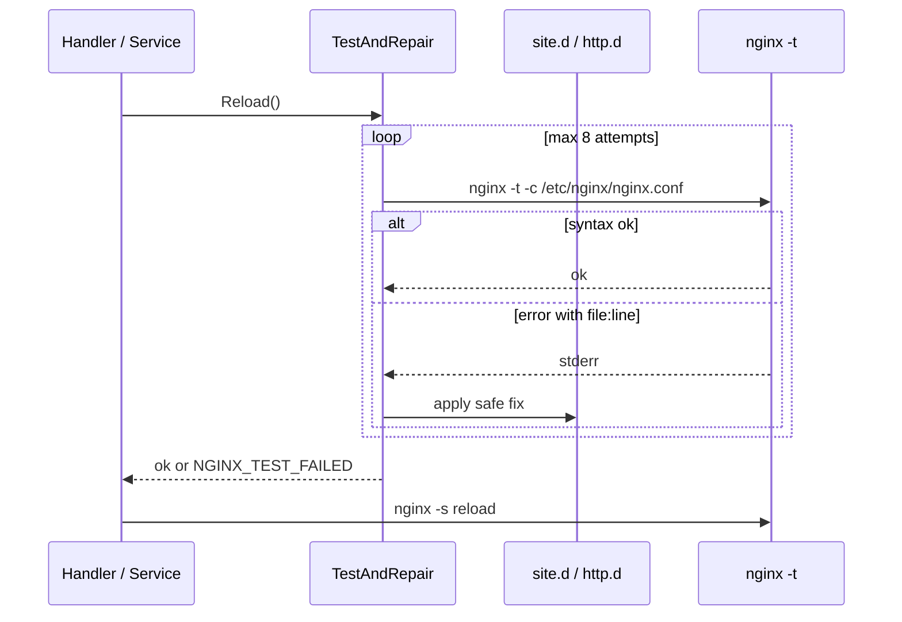

> **English:** [Nginx-auto-repair](Nginx-auto-repair)


GoSite menjalankan `nginx -t` **sebelum setiap reload** dan, jika gagal, mencoba perbaikan otomatis yang aman berdasarkan pesan error (file + baris). Ini mencegah panel atau boot meninggalkan nginx dalam keadaan config rusak.

## Kapan dijalankan

| Trigger | Lokasi kode |
|---------|-------------|
| `POST /api/v1/nginx/reload` | `internal/infra/nginx/service.go` → `Reload()` |
| Toggle website, update nginx config, SSL manual, dll. | Semua pemanggil `nginx.Service.Reload()` |
| Boot container | `config/start.sh` → `gosite nginx-repair` |
| Manual | `gosite nginx-repair` |

Alur reload:



## File yang boleh diperbaiki

Hanya path di bawah prefix yang dikelola Gosite:

- `/storage/webconfig/site.d/`
- `/storage/webconfig/active.d/` (symlink diselesaikan ke `site.d`)
- `/storage/webconfig/` (template, ssl)
- `/storage/nginx/`
- `/etc/nginx/` (global, `http.d/`, `custom.d/`)

File di luar prefix **tidak** diubah — repair berhenti dan error dikembalikan ke caller.

## Strategi perbaikan

| Pola error nginx | Perbaikan | Contoh |
|------------------|-----------|--------|
| `cannot load certificate` / `BIO_new_file() failed` | Ganti `ssl_certificate` + `ssl_certificate_key` di server block ke default self-signed | Cert hilang setelah hapus placeholder LE |
| `no "ssl_certificate" is defined for the "listen ... ssl"` | Sisipkan directive SSL default setelah baris `listen` | Server block HTTPS tanpa cert |
| `unknown directive` | Komentari baris (`# gosite-repair: ...`) | Directive modul tidak ter-load |
| `unknown "var" variable` | Komentari baris | Variable tidak didefinisikan |
| `invalid number of arguments` | Komentari baris | Typo directive |
| `directive is not allowed here` | Komentari baris | Directive di context salah |
| `duplicate listen options` | Komentari baris `listen` duplikat | Konflik listen 443 antar server |

Default certificate:

```
/storage/webconfig/ssl/live/default/cert.pem
/storage/webconfig/ssl/live/default/key.pem
```

Dibuat di boot oleh `start.sh` (openssl self-signed) jika belum ada.

## Batasan (sengaja)

- **Tidak** memperbaiki brace tidak seimbang, upstream down, atau error DNS
- **Tidak** menghapus baris — hanya mengomentari agar jejak tetap ada
- SSL fallback = **self-signed default**, bukan Let's Encrypt
- Maksimal **8** iterasi repair per satu pemanggilan

## Logging

CLI `gosite nginx-repair` mencetak setiap aksi:

```text
gosite nginx-repair: /storage/webconfig/site.d/example.com.conf:24 missing ssl certificate file -> use default self-signed certificate
gosite nginx-repair: applied 1 fix(es), configuration ok
```

## Hubungan dengan Validate website

`POST /websites/validate` **tidak** menulis ke `site.d`. Test vhost memakai file temporer:

1. Render template ke `/tmp/nginx-site-test-{domain}-{nano}.conf`
2. Clone `webconfig/nginx.conf`, ganti include `site.d/*.conf` → path temp **absolut**
3. `nginx -t -c /tmp/nginx-test-{nano}.conf`
4. Hapus file temp

Lihat [sequences/07-website-nginx-config.md](Website-nginx-config-id)).

## Kode

| File | Peran |
|------|-------|
| `internal/infra/nginx/repair.go` | Parse error, strategi fix |
| `internal/infra/nginx/service.go` | `TestAndRepair()`, `Reload()` |
| `internal/app/nginx_repair.go` | Wiring CLI |
| `config/start.sh` | Hook boot |
