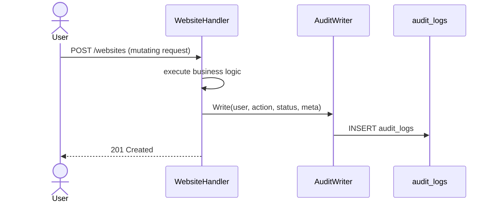
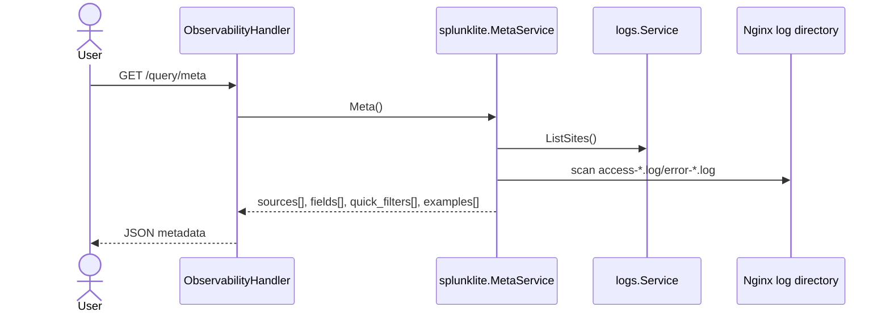
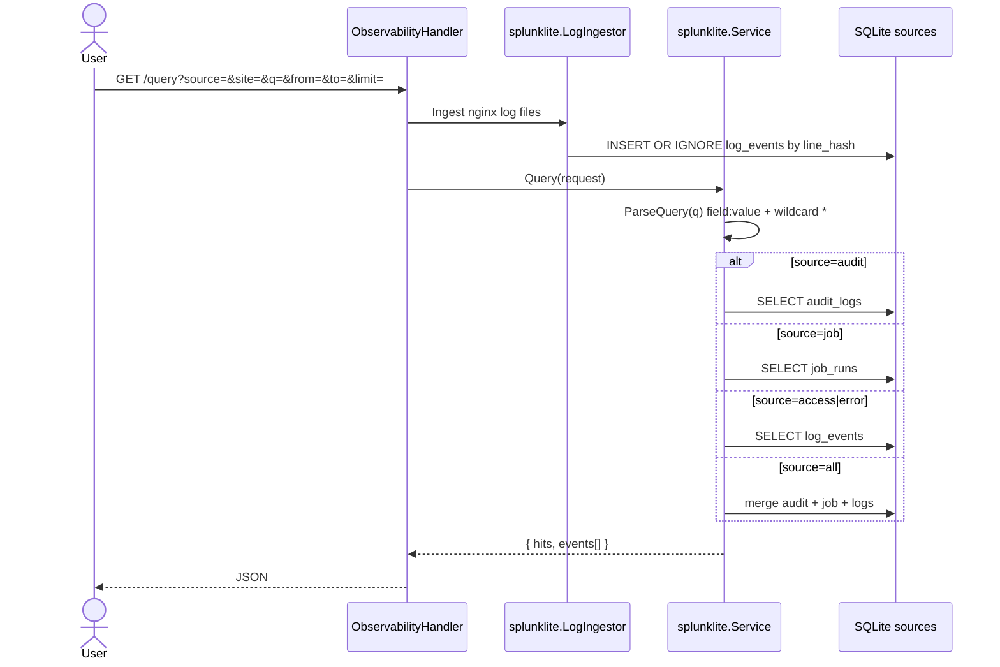
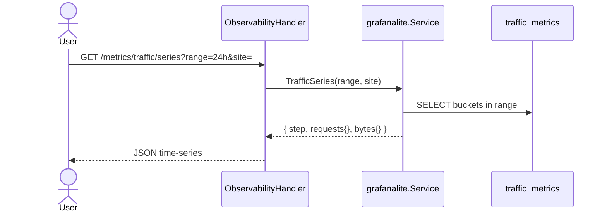

> **Bahasa Indonesia:** [Observability-id](Observability-id)

## Sequence: Splunk Lite

Query audit, job runs, and nginx log events — without deploying external Splunk.

**Status:** ✅ Implemented — `internal/observability/splunklite`

## Architecture

## API

| Method | Path |
|--------|------|
| GET | `/api/v1/query/meta` |
| GET / POST | `/api/v1/query` |
| GET | `/api/v1/query/tail` |
| GET / POST | `/api/v1/query/saved` |
| PATCH / DELETE | `/api/v1/query/saved/{id}` |

## Write audit on mutation



## Backend-driven query metadata



The frontend renders query sources only from this response. Per-vhost nginx entries use IDs such as `access:example.com` and carry the backend payload `{ "source": "access", "site": "example.com" }`.

## Search events



## Mini query syntax

| Token | Meaning |
|-------|---------|
| `field:value` | Exact match |
| `field:prefix*` | Wildcard (`*` → SQL LIKE) |
| space | AND (implicit) |

**Audit fields:** `user`, `action`, `resource_type`, `resource_id`, `domain`, `status`, `message`

**Job fields:** `type`, `name`, `status`, `output`, `error`

**Log fields:** `site`, `status`, `status_code`, `message`, `preview`

## Example

```json
GET /api/v1/query?source=audit&q=action%3Awebsite.*+user%3Aadmin%40*+status%3Aok&from=2026-06-01T00%3A00%3A00Z&to=2026-06-14T23%3A59%3A59Z&limit=50
```

## Streaming historical search

`GET /api/v1/query` returns batch JSON by default. For progressive output, request a stream:

```bash
curl -N -H 'Accept: text/event-stream' 'https://host/api/v1/query?source=access&q=status%3A500&stream=sse'
```

SSE frames use a small envelope:

```text
data: {"type":"ingesting"}

data: {"type":"meta","hits":12}

data: {"type":"event","event":{...}}

data: {"type":"done"}
```

`stream=ndjson` or `Accept: application/x-ndjson` emits the same envelopes one JSON object per line.

## Retention

| Table | Env | Default |
|-------|-----|---------|
| `audit_logs` | `AUDIT_RETENTION_DAYS` | 90 |
| `log_events` | `LOG_EVENTS_RETENTION_DAYS` | 14 |

Purge harian via `runRetentionPurge` di `internal/app/app.go`.

## Packages

| Path | Role |
|------|-------|
| `internal/observability/splunklite/service.go` | Query engine |
| `internal/observability/splunklite/ingestor.go` | Nginx log ingest |
| `internal/observability/splunklite/meta.go` | Query UI metadata |
| `internal/delivery/http/handler/observability.go` | HTTP |

## Implikasi GoSite

- `contracts.AuditWriter` — hook mutasi sensitif (website create/delete, dll.)
- Saved queries in `saved_queries` for dashboard / ops presets
- Frontend Logs view uses `GET /query/meta` for the source picker

---

## Sequence: Grafana Lite

Pre-aggregated nginx traffic metrics for dashboard charts — replaces legacy full-file `accessTraffic()` scan.

**Status:** ✅ Implemented — `internal/observability/grafanalite`

## Collector (background)

```mermaid
sequenceDiagram
    participant S as gosite serve
    participant App as internal/app/app.go
    participant C as grafanalite.Collector
    participant FS as access logs
    participant OFF as metrics_offsets.json
    participant DB as traffic_metrics

    loop every 5 minutes
        S->>C: Collect()
        C->>OFF: load byte offsets
        C->>FS: read new lines since offset
        C->>C: parse status + bytes, bucket 5m
        C->>DB: UPSERT traffic_metrics
        C->>OFF: save new offsets
        C->>DB: purge buckets older than retention
    end
```

## Query series



## Bucket model

| Column | Meaning |
|--------|---------|
| `bucket_ts` | 5-minute floor UTC |
| `site` | Derived from log filename (`access-{domain}.log`) |
| `requests` | Line count in bucket |
| `bytes` | Sum of `$body_bytes_sent` |
| `s2xx`…`s5xx` | Status family counters |

**Offset file:** `{STORAGE}/gosite/metrics_offsets.json` — per-file byte offset for incremental tail.

## Endpoints

All under `/api/v1/metrics/traffic/*` (session required):

| Path | Params | Response |
|------|--------|----------|
| `/metrics/traffic/series` | `range`, `step`, `site` | Multi-series `[[iso8601, value], …]` |
| `/metrics/traffic/top-sites` | `range`, `limit` | Ranked sites |
| `/metrics/traffic/status-codes` | `range`, `site` | 2xx/3xx/4xx/5xx totals |
| `/metrics/traffic/summary` | `range` | Dashboard card totals |

Supported `range`: `1h`, `6h`, `24h`, `7d`.

## Log paths

| File | Site key |
|------|----------|
| `{STORAGE}/logs/access.log` | `default` |
| `{STORAGE}/logs/access-{domain}.log` | `{domain}` |

## Integrasi dashboard

- `GET /dashboard` → `traffic_summary` from `Summary(1h)`
- Traffic view Preact calls series/top-sites/status-codes endpoints
- Fallback: `GET /system/nginx-traffic` when buckets are empty

## Packages

| Path | Role |
|------|-------|
| `internal/observability/grafanalite/collector.go` | Incremental log parse |
| `internal/observability/grafanalite/service.go` | Query buckets |
| `internal/app/app.go` | `runMetricsCollector` ticker 5m |
| `internal/repository/sqlite/traffic_metrics.go` | UPSERT storage |
