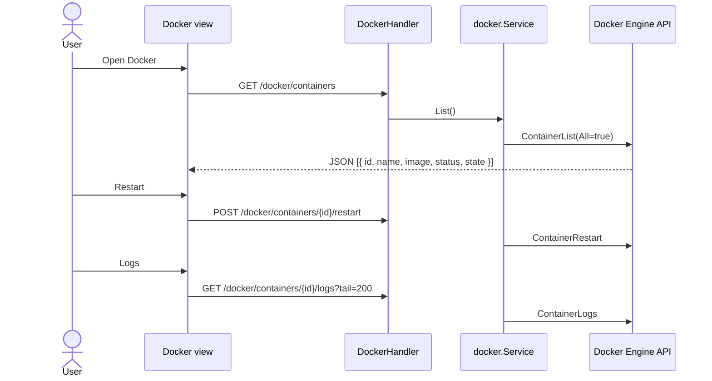
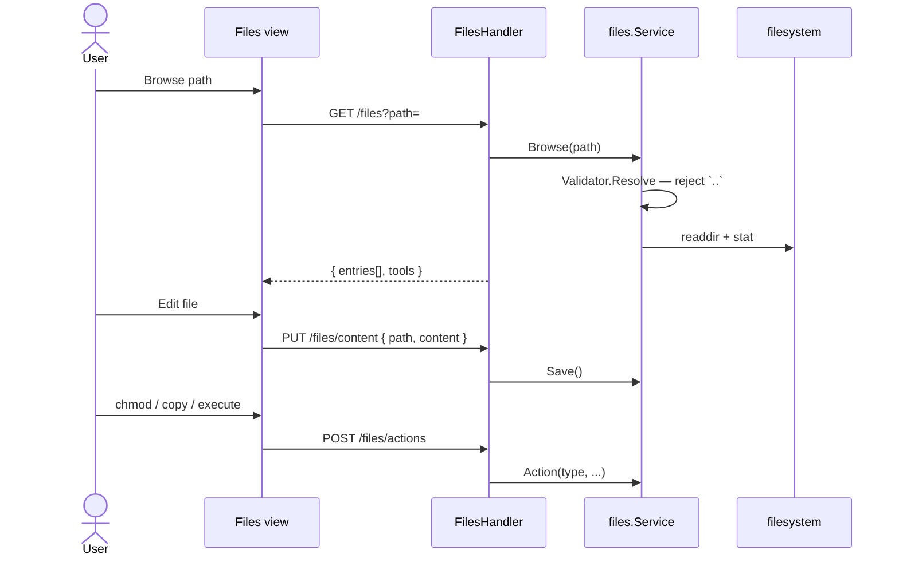
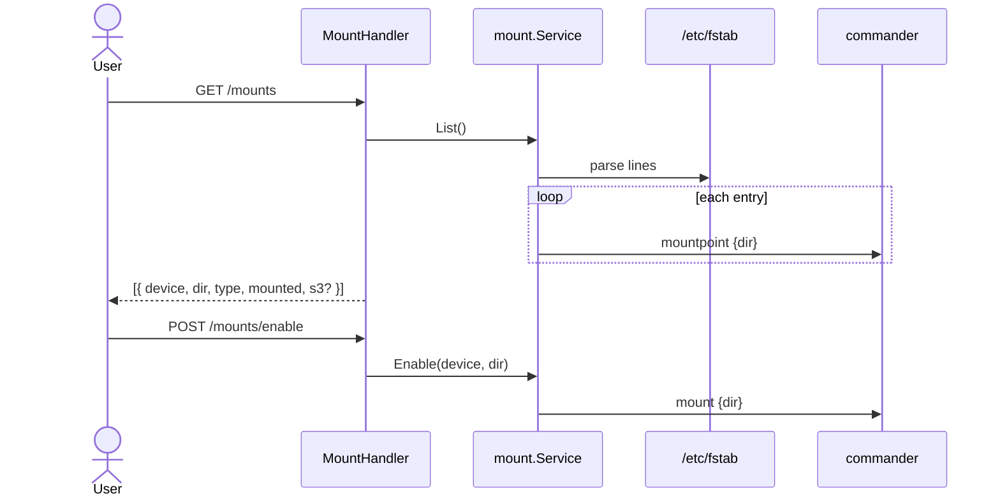
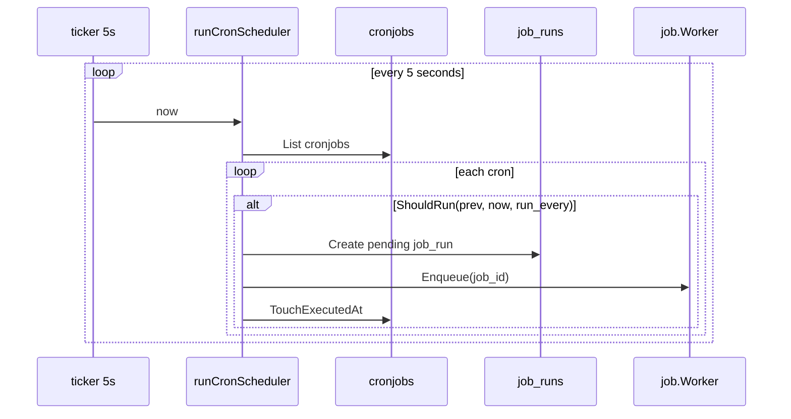
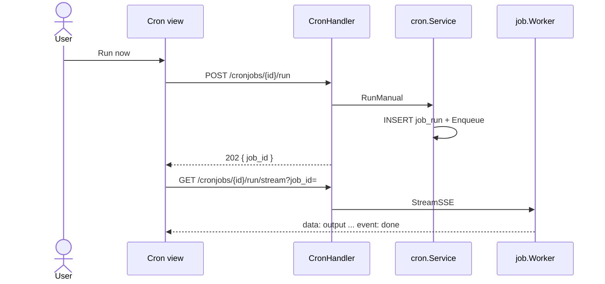
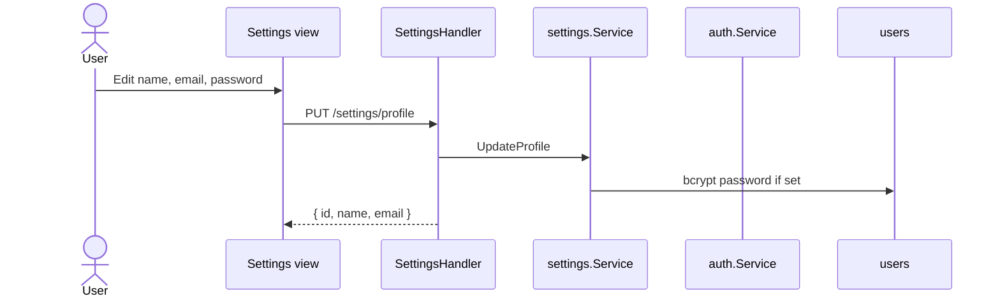
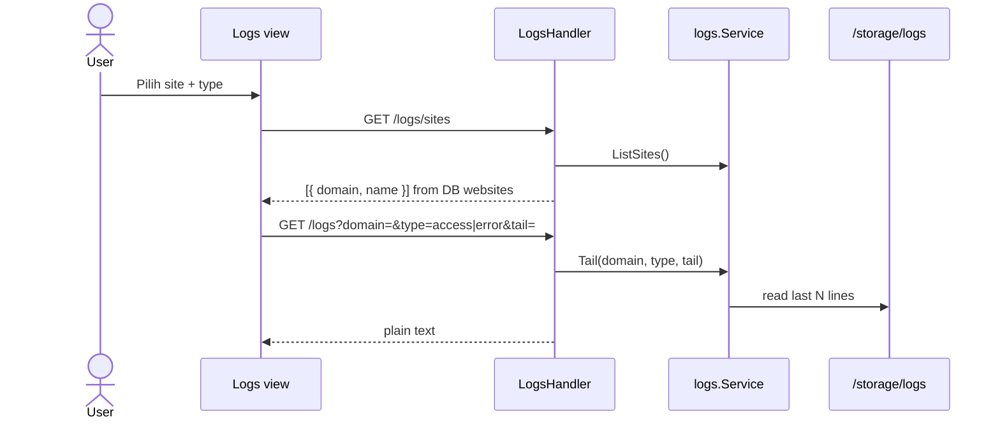
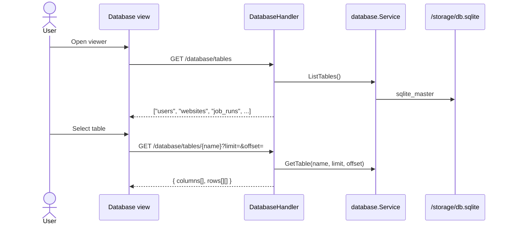

> **Bahasa Indonesia:** [Operations-id](Operations-id)

## Sequence: Docker Management

Manage containers via **Docker Engine API** (`/var/run/docker.sock`).

## GoSite (implementation)

**Package:** `internal/infra/docker` (official SDK) → `internal/service/docker`



### API

| Method | Path |
|--------|------|
| GET | `/api/v1/docker/containers` |
| POST | `/api/v1/docker/containers/{id}/restart` |
| POST | `/api/v1/docker/containers/{id}/stop` |
| GET | `/api/v1/docker/containers/{id}/logs?tail=` |

### Security

- Container ID is sanitized (`^[a-zA-Z0-9-]+$`)
- Destructive actions via **POST** (not legacy GET)
- Session + basic auth required
- When socket unavailable → `NoopClient` (empty list, no crash)

### Fallback

`dockerinfra.NoopClient` is used when `NewClient()` fails (dev without socket).

---


## Code

| File | Role |
|------|-------|
| `internal/infra/docker/client.go` | Engine API wrapper |
| `internal/delivery/http/handler/docker.go` | HTTP handlers |

---

## Sequence: File Manager

Browse and manipulate files within **allowlisted roots**.

## GoSite (implementation)

**Default roots:** `["/"]` (entire container filesystem — restrict in production via config)

**Package:** `internal/service/files` + `internal/infra/filesystem.Validator`



### API

| Method | Path | Purpose |
|--------|------|--------|
| GET | `/files?path=` | Listing + metadata (mime, editable, archive) |
| GET | `/files/content?path=` | Read text |
| GET | `/files/raw?path=` | Download binary |
| PUT | `/files/content` | Save text |
| POST | `/files` | Create file/dir, multipart upload, URL import |
| POST | `/files/actions` | `chmod`, `copy`, `execute` |
| POST | `/files/batch-save` | Multi-file save |
| POST | `/files/batch-delete` | Multi-file delete |
| DELETE | `/files?path=` | Delete file/dir |

### Actions

| type | Behavior |
|------|----------|
| `chmod` | `chmod` via command runner |
| `copy` | Copy to destination path |
| `execute` | Run script — only when `FILES_ALLOW_EXECUTE=true` |

### Security

- `filesystem.Validator` — resolve path, reject traversal outside roots
- Execute disabled by default (`FILES_ALLOW_EXECUTE=false`)
- Archive extract (zip/tar) when tools are available on the host

### Entry metadata

Each entry includes: `kind`, `mime_type`, `editable`, `viewable`, `archive`, `symlink`, `target`.

---


## Code

| File | Role |
|------|-------|
| `internal/infra/filesystem/pathutil.go` | Path validation |
| `internal/delivery/http/handler/files.go` | Multipart upload, batch ops |

---

## Sequence: Mount Manager

Manage `/etc/fstab` (symlink → `/storage/fstab`) dan mount/umount.

## GoSite (implementation)

**Package:** `internal/service/mount`



### API

| Method | Path |
|--------|------|
| GET | `/api/v1/mounts` |
| POST | `/api/v1/mounts` |
| PUT | `/api/v1/mounts` |
| DELETE | `/api/v1/mounts` |
| POST | `/api/v1/mounts/enable` |

### fstab & secrets

| Path | Role |
|------|-------|
| `/etc/fstab` | Symlink ke `/storage/fstab` |
| `/storage/mount-secrets/` | S3 credentials (for s3fs entry type) |

Entry JSON may include an `s3` block (endpoint, bucket, keys) — stored separately from the fstab line.

### Startup

`config/start.sh` → `/run/fstab_mounter.sh` mount all entries at boot.

### Validation

- Format fstab 6 kolom
- Device + dir required on create/update
- Umount before update/delete entry

---


## Code

| File | Role |
|------|-------|
| `internal/service/mount/service.go` | fstab CRUD, mount ops |
| `internal/delivery/http/handler/mount.go` | HTTP |

---

## Sequence: Cron Jobs

Automatic scheduler + manual run with **SSE stream**.

## GoSite (implementation)

### Scheduler (background)

**Lokasi:** `internal/app/scheduler.go` — goroutine di `gosite serve`



`ShouldRun` (`internal/service/cron/service.go`):

| run_every | Trigger |
|-----------|---------|
| `min` | Menit berganti |
| `hour` | Jam berganti |
| `day` | Hari berganti |
| `month` | Bulan berganti |

### Worker

Same as Certbot — `internal/infra/job/worker.go`:

1. `MarkRunningWithOutput`
2. `sh -c {payload}` with streaming stdout/stderr
3. `Complete` status `ok` / `failed`

2 worker goroutines (buffer 32).

### CRUD

| Method | Path |
|--------|------|
| GET | `/api/v1/cronjobs` |
| POST | `/api/v1/cronjobs` |
| PUT | `/api/v1/cronjobs/{id}` |
| DELETE | `/api/v1/cronjobs/{id}` |

### Manual run + SSE



Frontend: `web/src/lib/sse.ts` + `JobStreamModal`.

### Default seed

```text
certbot renew --post-hook 'nginx -s reload'
run_every: day
```

### Security

Payload runs as a shell command — consider an allowlist in production. Panel session required.

---


## Code

| File | Role |
|------|-------|
| `internal/app/scheduler.go` | Auto dispatch |
| `internal/infra/job/worker.go` | Exec + StreamSSE |
| `internal/delivery/http/handler/cron.go` | Run + RunStream |

---

## Sequence: Settings

GoSite only implements **user profile update**. Legacy PHP/FPM modules are not ported.

## GoSite (implementation)



### API

| Method | Path | Status |
|--------|------|--------|
| PUT | `/api/v1/settings/profile` | ✅ Implemented |

Current user profile is read via `GET /auth/me`.

### Validation

- Name & email required
- Password optional; minimum 6 characters when set
- bcrypt hash (compatible Laravel `$2y$` prefix)

---


## Code

| File | Role |
|------|-------|
| `internal/service/settings/service.go` | UpdateProfile |
| `internal/delivery/http/handler/settings.go` | HTTP |

UI hints: `GET /ui/meta` → section settings labels.

---

## Sequence: Log Viewer

Tail nginx access/error log per domain or globally.

## GoSite (implementation)

**Package:** `internal/service/logs`



### API

| Method | Path | Query |
|--------|------|-------|
| GET | `/logs/sites` | — |
| GET | `/logs` | `domain`, `type` (`access`\|`error`), `tail` (default 1000) |

### Path log

Format `main` from `config/nginx/custom.d/nginx-log.conf`.

| domain | Access | Error |
|--------|--------|-------|
| `default` | `/storage/logs/access.log` | `/storage/logs/error.log` |
| `{domain}` | `access-{domain}.log` | `error-{domain}.log` |

### Integrasi observability

- **Splunk Lite** — ingest + query log events ([17-splunk-lite.md](Observability))
- **Grafana Lite** — aggregate traffic from access log ([18-grafana-lite.md](Observability))
- **Dashboard fallback** — `GET /system/nginx-traffic` parse access log langsung

---


## Code

| File | Role |
|------|-------|
| `internal/service/logs/service.go` | Tail, list sites |
| `internal/delivery/http/handler/logs.go` | HTTP |

---

## Sequence: Database Viewer

Admin tool **read-only** for panel SQLite.

## GoSite (implementation)

**Package:** `internal/service/database`



### API

| Method | Path | Query |
|--------|------|-------|
| GET | `/database/tables` | — |
| GET | `/database/tables/{name}` | `limit`, `offset` |

### Batasan

- **Read-only** — no INSERT/UPDATE/DELETE from UI
- Hanya file `db.sqlite` panel
- Session + basic auth required
- Pagination via `limit` / `offset` (default limit 100)

### Schema relevan

| Table | Contents |
|-------|-----|
| `users` | Admin panel |
| `websites` | Vhost records |
| `cronjobs` | Scheduled commands |
| `job_runs` | Certbot, cron, manual runs |
| `sessions` | Auth sessions |
| `audit_logs` | Splunk Lite audit |
| `log_events` | Ingested nginx lines |
| `traffic_metrics` | Grafana Lite buckets |
| `saved_queries` | Splunk saved searches |

Migrasi: `migrations/*.sql` via `gosite migrate`.

---


## Code

| File | Role |
|------|-------|
| `internal/service/database/service.go` | Query tables |
| `internal/repository/sqlite` | Schema + migrations |
