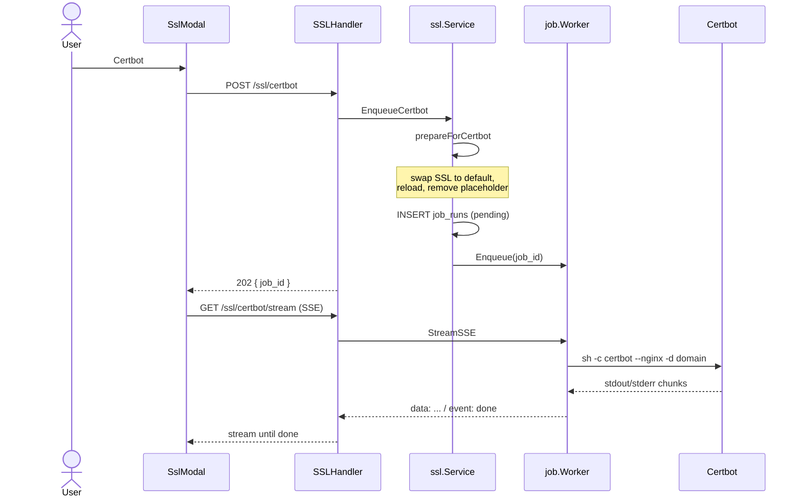
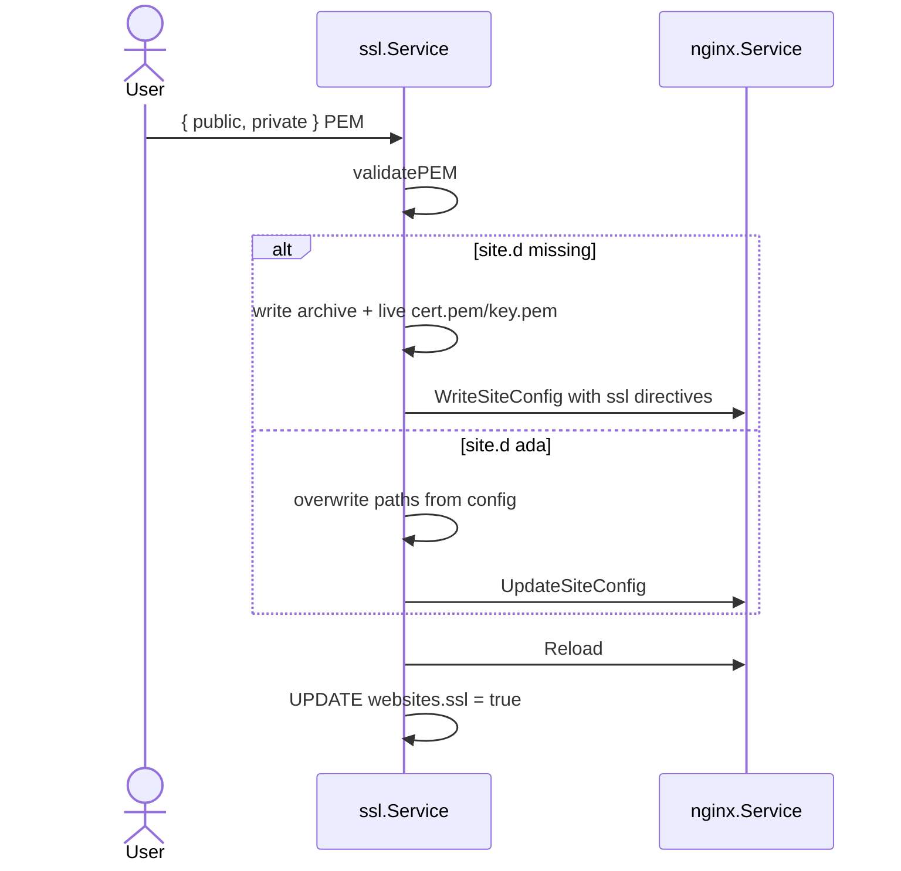

> **Bahasa Indonesia:** [SSL-and-Certbot-id](SSL-and-Certbot-id)


Two paths: **automatic Certbot** (job + SSE) and **manual upload**.

## SSL filesystem layout

```
/etc/letsencrypt  →  symlink to /storage/webconfig/ssl
```

| Path | Contents |
|------|-----|
| `ssl/live/default/cert.pem` | Self-signed boot default |
| `ssl/live/{domain}/cert.pem` | Placeholder on website create (Gosite) |
| `ssl/live/{domain}/fullchain.pem` | Let's Encrypt (after certbot) |
| `ssl/archive/{domain}/` | Manual archive / certbot |

**Common conflict:** placeholder Gosite (`cert.pem` + `key.pem` as regular files) blocks Certbot because `/etc/letsencrypt/live/{domain}/` already exists but is not an LE lineage (`CertStorageError: live directory exists`).

## A. Install SSL via Certbot (async)

**API:**

| Method | Path |
|--------|------|
| POST | `/api/v1/websites/{id}/ssl/certbot` |
| GET | `/api/v1/websites/{id}/ssl/certbot/stream?job_id=` |



### Command

```bash
certbot --non-interactive --agree-tos --register-unsafely-without-email --nginx -d {domain}
```

### `prepareForCertbot` (before job is queued)

So `nginx -t` and Certbot do not fail:

1. If `ssl/live/{domain}/` contains placeholder (`cert.pem` + `key.pem`, without LE `fullchain.pem`):
2. Replace `ssl_certificate` in `site.d` → path **default** self-signed
3. `UpdateSiteConfig` + `Reload`
4. Remove directory `ssl/live/{domain}/` placeholder
5. Then enqueue Certbot — LE lineage can be created cleanly

Without steps 2–3, removing the placeholder alone makes `nginx -t` fail (cert path points to a missing file).

### Job worker

Same as manual cron run (`internal/infra/job/worker.go`):

- `Enqueue(job_id)` after DB insert
- `StreamSSE` poll output sampai `status=ok|failed`
- Event SSE: `data:` lines + `event: done`

## B. Manual SSL upload

**API:** `PUT /api/v1/websites/{id}/ssl/manual`



## C. Status SSL

**API:** `GET /api/v1/websites/{id}/ssl`

Read paths from `site.d/{domain}.conf` (`ParseCertPaths`), load PEM from disk, compute expiry.

## Automatic renewal (default cron)

```
certbot renew --post-hook 'nginx -s reload'
```

Run by Go cron scheduler (`run_every: day`), not job queue.

## Troubleshooting

| Symptom | Cause | Action |
|--------|----------|----------|
| `CertStorageError: live directory exists` | Placeholder Gosite di `live/{domain}` | `prepareForCertbot` (automatic) or manual delete + run certbot again |
| Stream putus, `status=pending` | Job not enqueued to worker | Ensure latest build (fix `worker.Enqueue`) |
| `nginx -t` fails before certbot | Cert path points to deleted file | `prepareForCertbot` swap ke default dulu |
| Certbot sukses tapi browser warning | Masih self-signed / DNS salah | Check `ssl_certificate` path in site.d points to `fullchain.pem` |

## API summary

| Method | Path |
|--------|------|
| GET | `/websites/{id}/ssl` |
| PUT | `/websites/{id}/ssl/manual` |
| POST | `/websites/{id}/ssl/certbot` |
| GET | `/websites/{id}/ssl/certbot/stream?job_id=` |
