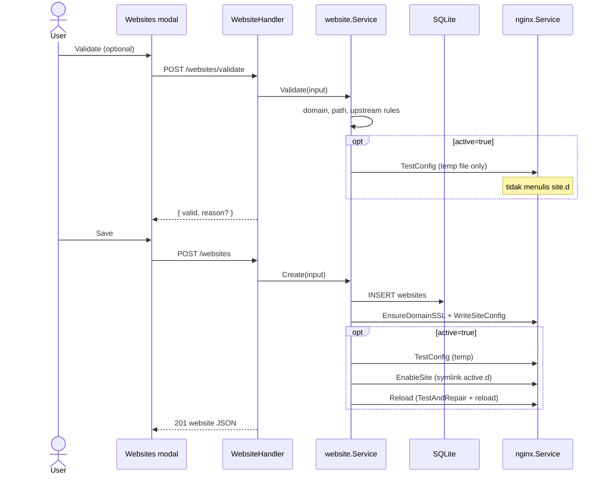

> **English:** [Website-create](Website-create)

Membuat entri website baru: validasi → simpan DB → provision nginx config → optional enable + reload.

## GoSite (implementasi)

**API:** `POST /api/v1/websites`  
**Validasi pre-flight:** `POST /api/v1/websites/validate`

### Provision site (`provisionSite`)

| Tipe | Side-effect |
|------|-------------|
| `static` | `mkdir` path, copy `index.html` default |
| `proxy` | Path auto (`/www/{slug}`) jika kosong |
| Semua | `EnsureDomainSSL` → copy self-signed ke `ssl/live/{domain}/cert.pem` |
| Semua | Render template → `site.d/{domain}.conf` |

Template:

| Tipe | File |
|------|------|
| static | `webconfig/site.conf` |
| proxy | `webconfig/site-proxy.conf` |

Placeholder: `<domain>`, `<path>`, `<ssl_cert>`, `<ssl_key>`, `<upstream>`.

### Validate — invariant penting

`POST /websites/validate` dengan `active: true` menjalankan `nginx -t` terisolasi **tanpa** menulis `site.d/`:

1. Render config ke file temp di `/tmp/`
2. Clone `webconfig/nginx.conf`, ganti include glob → path temp absolut
3. `nginx -t -c /tmp/nginx-test-*.conf`

Ini mencegah validate "menyimpan" draft yang mengganggu save/reload berikutnya.

### Validasi bisnis

| Check | Kode error |
|-------|------------|
| Domain format | `DOMAIN_INVALID` |
| Path unik | `PATH_DUPLICATE` |
| Path di dalam web root | `PATH_INVALID` / `PATH_TRAVERSAL` |
| Path adalah file | `PATH_IS_FILE` |
| Proxy butuh upstream | `VALIDATION` |

### Rollback on failure

Jika create dengan `active=true` gagal di `Reload`, service:

1. `DisableSite` — hapus symlink `active.d`
2. `RemoveSiteConfig` — hapus `site.d`
3. `DELETE` baris DB

---

## API

| Method | Path | Body |
|--------|------|------|
| POST | `/api/v1/websites/validate` | `{ domain, path, type, upstream?, active, id? }` |
| POST | `/api/v1/websites` | `{ name, domain, path, type, upstream?, active }` |
