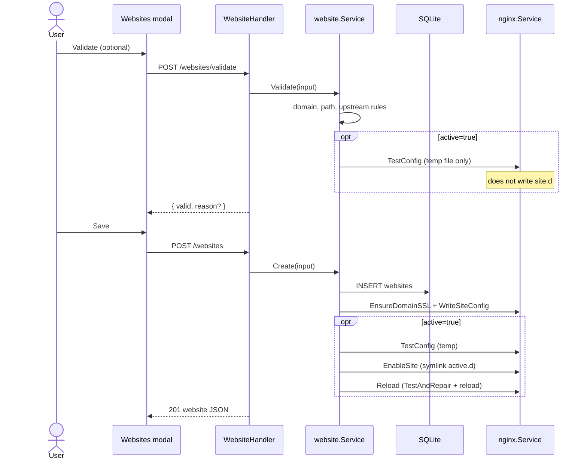

> **Bahasa Indonesia:** [Website-create-id](Website-create-id)

Create a new website entry: validate → save DB → provision nginx config → optional enable + reload.

## GoSite (implementation)

**API:** `POST /api/v1/websites`  
**Pre-flight validation:** `POST /api/v1/websites/validate`

### Provision site (`provisionSite`)

| Tipe | Side-effect |
|------|-------------|
| `static` | `mkdir` path, copy `index.html` default |
| `proxy` | Auto path (`/www/{slug}`) when empty |
| Semua | `EnsureDomainSSL` → copy self-signed ke `ssl/live/{domain}/cert.pem` |
| Semua | Render template → `site.d/{domain}.conf` |

Template:

| Tipe | File |
|------|------|
| static | `webconfig/site.conf` |
| proxy | `webconfig/site-proxy.conf` |

Placeholder: `<domain>`, `<path>`, `<ssl_cert>`, `<ssl_key>`, `<upstream>`.

### Validate — important invariant

`POST /websites/validate` dengan `active: true` runs isolated `nginx -t` **without** writing `site.d/`:

1. Render config ke file temp in `/tmp/`
2. Clone `webconfig/nginx.conf`, ganti include glob → path temp absolut
3. `nginx -t -c /tmp/nginx-test-*.conf`

This prevents validate from "persisting" a draft that breaks the next save/reload.

### Business validation

| Check | Error code |
|-------|------------|
| Domain format | `DOMAIN_INVALID` |
| Path unik | `PATH_DUPLICATE` |
| Path inside web root | `PATH_INVALID` / `PATH_TRAVERSAL` |
| Path is a file | `PATH_IS_FILE` |
| Proxy requires upstream | `VALIDATION` |

### Rollback on failure

If create with `active=true` fails at `Reload`, the service:

1. `DisableSite` — remove `active.d` symlink
2. `RemoveSiteConfig` — remove `site.d`
3. `DELETE` DB row

---

## API

| Method | Path | Body |
|--------|------|------|
| POST | `/api/v1/websites/validate` | `{ domain, path, type, upstream?, active, id? }` |
| POST | `/api/v1/websites` | `{ name, domain, path, type, upstream?, active }` |
