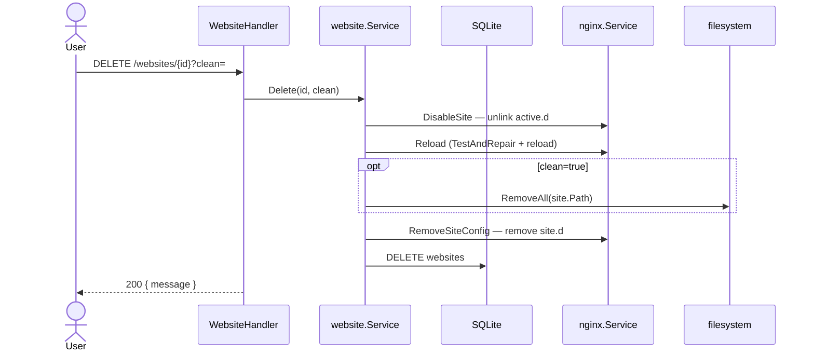

> **Bahasa Indonesia:** [Website-delete-id](Website-delete-id)

**API:** `DELETE /api/v1/websites/{id}?clean=true|false`

## GoSite (implementation)

### Parameter `clean`

| clean | Efek |
|-------|------|
| `true` | Hapus document root (`path`) rekursif |
| `false` / omitted | Keep `/www/...` folder, remove config + DB only |

UI shows confirmation before delete.

### What is removed

1. Symlink `active.d/{domain}.conf`
2. File `site.d/{domain}.conf`
3. Record SQLite

### Not removed automatically

- Sertifikat `ssl/live/{domain}/`
- File log `access-{domain}.log`, `error-{domain}.log`

### Safe order

1. Disable + reload nginx (vhost no longer active)
2. Hapus path jika `clean=true`
3. Hapus `site.d` config
4. Hapus baris DB

Reload uses [nginx auto-repair](Nginx-auto-repair) when other config is broken.

---

