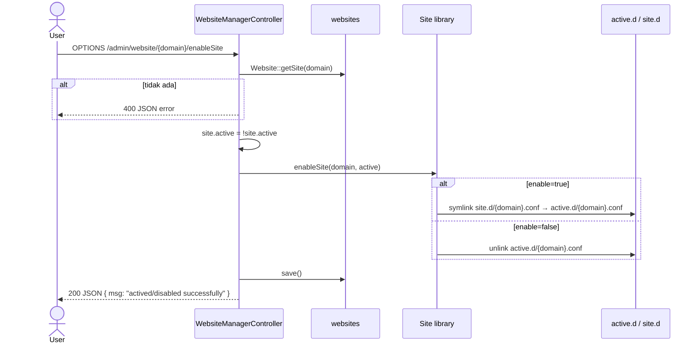

> **English:** [Website-enable-disable](Website-enable-disable)


Toggle website aktif dengan symlink antara `site.d` dan `active.d`, lalu nginx memuat vhost aktif.

**Route:** `OPTIONS /admin/website/{id}/enableSite` → `enableSite()`



## Bagaimana nginx memuat site aktif

```nginx
# nginx.conf
include /storage/webconfig/active.d/*.conf;
```

Hanya file di `active.d/` yang dilayani sebagai vhost tambahan.

## Catatan

- Toggle **memanggil `nginx reload`** (dengan test + auto-repair) — perbaikan dari legacy
- Lihat [nginx-repair.md](Nginx-auto-repair-id) untuk fallback jika config rusak

## GoSite

```
PATCH /api/v1/websites/{id}/toggle
```

Response:
```json
{ "id": 1, "active": true, "message": "Site actived successfully" }
```

Service:
1. Update DB `active`
2. Symlink/unlink `active.d`
3. `nginx.Service.Reload()` → `TestAndRepair` + `nginx -s reload`
